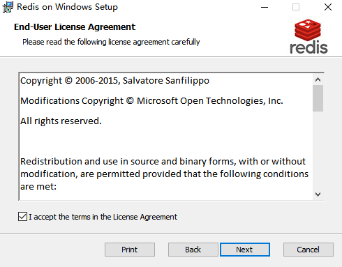
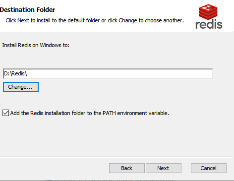
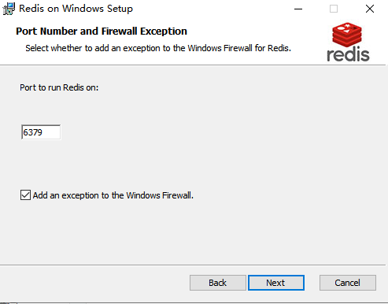
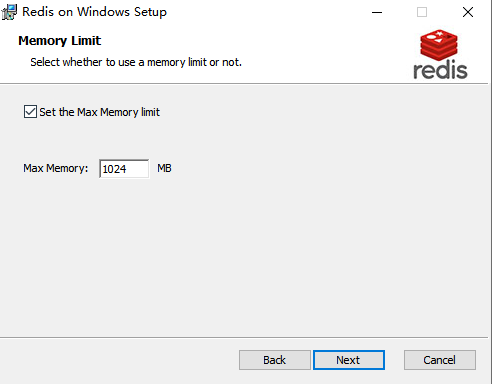
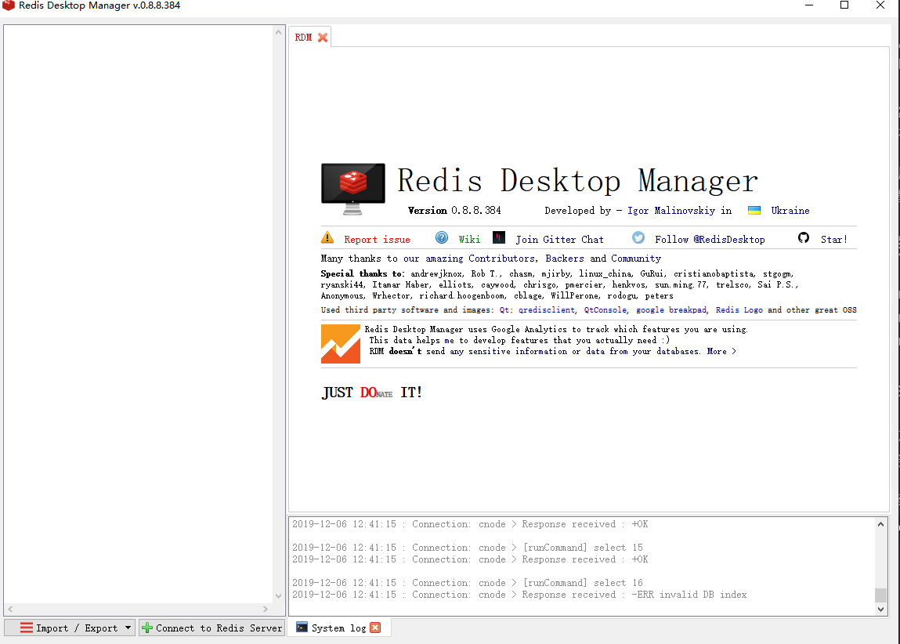
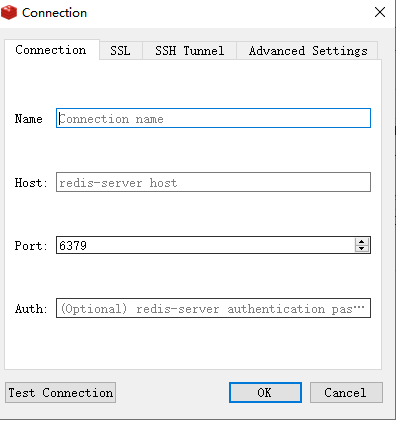
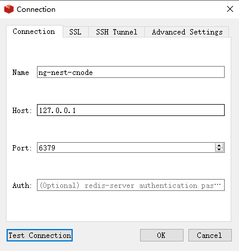
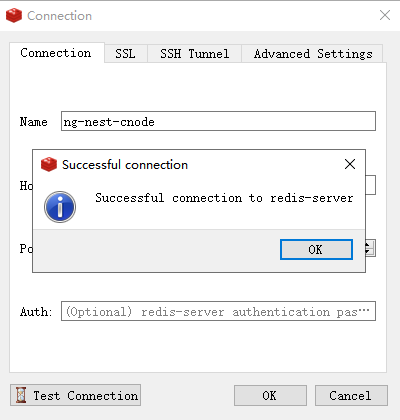
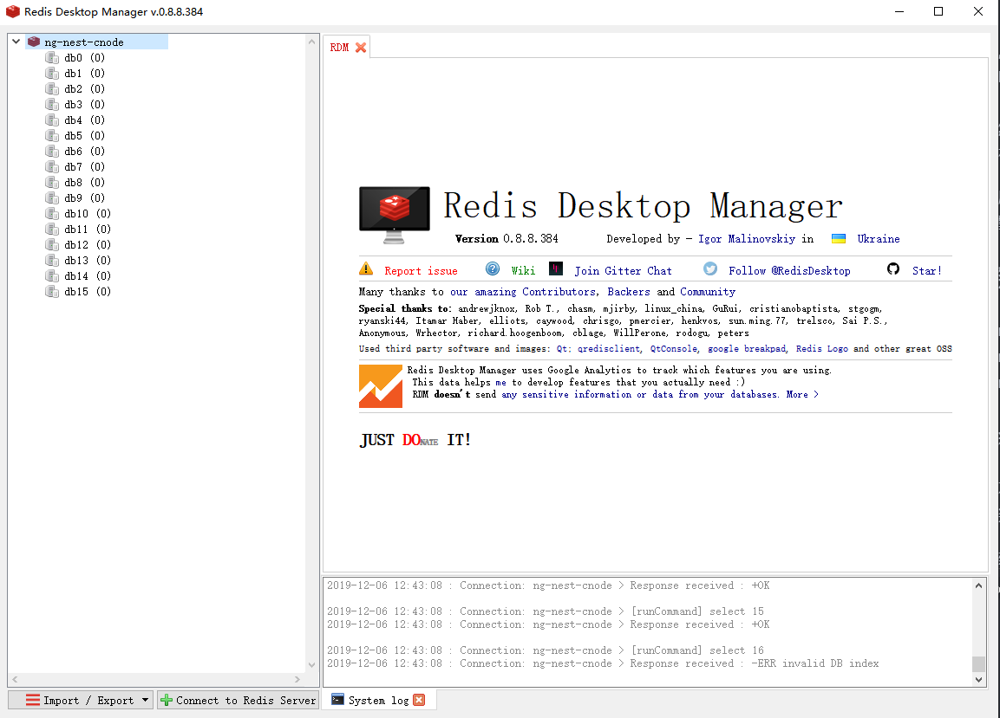

# Redis 安装

Redis（全称：Remote Dictionary Server 远程字典服务）是一个开源的使用 ANSI C 语言编写、支持网络、可基于内存亦可持久化的日志型、Key-Value 数据库，并提供多种语言的 API。获得安装包和查看详细的 API 可以访问官网网址 [https://redis.io](https://redis.io)。

## 安装

下载地址：[https://redis.io/download](https://redis.io/download)

github 下载地址：[https://github.com/microsoftarchive/redis/tags](https://github.com/microsoftarchive/redis/tags)

如果你是 `windows` 用户，请选择 `github` 下载，必备软件里面有安装包。官网下载地址只提供 `linux` 版本的下载。

下载完成`.msi`安装包，直接点击安装即可

选择同意，你不同意，就 game over。

选择路径：**注意**：不要把 Redis 安装在 C 盘目录下，如果你只有一个盘那跳过。

添加环境路径：并且打上勾（这个非常重要），添加到 path 是把 Redis 设置成 windows 下的服务，不然你每次都要在该目录下启动命令 redis-server redis.windows.conf，但是只要一关闭 cmd 窗口，redis 就会消失。

默认运行端口号，默认就好。

如果 redis 的应用场景是作为 db 使用，那不要设置这个选项，因为 db 是不能容忍丢失数据的。

如果作为 cache 缓存那就得看自己的需要（我这里设置了 1024M 的最大内存限制）

指定 Redis 最大内存限制，Redis 在启动时会把数据加载到内存中，达到最大内存后，Redis 会先尝试清除已到期或即将到期的 Key，当此方法处理 后，仍然到达最大内存设置，将无法再进行写入操作，但仍然可以进行读取操作。Redis 新的 vm 机制，会把 Key 存放内存，Value 会存放在 swap 区。

安装完成，默认就帮我们启动 redis。你可以在计算机管理 → 服务与应用程序 → 服务 看到 Redis 正在运行。

## 常用的 redis 服务命令

- 卸载服务：redis-server --service-uninstall
- 开启服务：redis-server --service-start
- 停止服务：redis-server --service-stop

## redis desktop manager

最新版需要付费订阅，也不直接支持 windows，如果你想要使用，必备软件里面有安装包。

下载后安装，一路 `next` 安装完成，`custom` 时候改变安装位置。

打开软件，会提示你去升级，忽略它。里面有导入/导出、连接

来为我们的项目创建一个连接

点击 `+ Connect to Redis Server`，就会弹出这个界面

只需要输入`name`和`host`即可，然后点击`Test Connection`。

显示这个画面就表示连接成功。

打开我们刚刚创建的连接。

以上就是 Redis 安装，至于使用，我们会用到。

> 一般线上部署都会使用 `linux` 版本，并且带上`Auth`配置。这块等我们后面部署章节在讲解。
