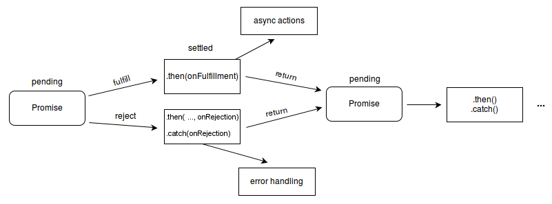

# Callback、Promise、async/await

惊闻大家已经很喜欢 javascript 编程方式，很多人都在异步里挣扎，说起回调，我就想起厄运金字塔，也就是回调地狱，文体两开花，各表一支。

javascript 是单线程的。 每个浏览器窗口中只有一个 javascript 线程在其中运行。 如果当时用户与网页交互时 javascript 引擎正在激活某些功能，则由于交互而点击事件并且 javascript 引擎正在忙于执行其他工作，此事件将在事件队列中排队。

处理事件队列的 javascript 看起来像：

```js
if (getData()) {
  processData();
}
```

`getData()` 等待在队列中同步获取数据，当它获取到数据时，就会处理该消息。 因此，如果有人说 javascript 是多线程的，则意味着可以操纵 javascript 以异步方式运行。

javascript 实现异步的方式最常用是回调(`callback`)。

## Callback

Callback 是异步工作的默认 javascript 技术。 在 javascript 函数中是第一类对象。 我们可以将对象作为参数传递给函数，我们也可以将函数作为参数传递给其他函数。

回调函数是在执行第一个函数后将被调用的函数，它将作为第二个函数运行。

```js
function loadImage(src, callback) {
  let img = document.createElement('img');
  img.src = src;
  img.onload = () => callback(img);
  document.body.appendChild(img);
}
loadImage('image.png', img => {
  console.log('image is loaded');
});
```

这很有效，但有一些问题没有明显的答案。 例如，我们如何处理回调中的错误？

最佳做法是假设任何操作都可能随时失败。 什么是图像加载失败？ 下面是 loadImage 的改进版本。

```js
loadImage('image.png', (error, img) => {
  if (error) {
    // 处理错误
  } else {
    console.log('image is loaded');
  }
});
```

> 错误放在回调函数第一个，是 nodejs 常用 Callback 处理方式

我们用于 loadImage 的代码实际上很常见，这会在 else 部分出错。 那么我们在这里通过另一个回调传递另一个函数。 这个情形看起来像：

```js
loadImage('first-image.png', (error, img) => {
   loadImage ('second-image.png', (error, img) => {
      loadImage ('farther-down.png', (error, img) => {
         loadImage ('last-image.png', (error, img) => {
            ...
        })
      })
   })
})
```

随着它变得更加嵌套，代码变得更加难以管理。 特别是如果我们有一个真正的代码而不是......，那就包含更多的嵌套。 这个情形导致结果被称为“回调地狱”或“厄运金字塔”。

## Promise

在处理多个异步操作时，Promise 易于管理，其中回调可以创建回调地狱导致无法管理的代码。

Promise 对象表示异步操作的最终完成或失败以及结果值。 Promise 对象将处于 3 种可能的状态：

- Fulfilled：与承诺相关的行动已成功。即 resolve（）被调用了。
- Rejected：与承诺相关的操作失败。即 reject（）被调用了。
- Pending：承诺仍在等待中。即： 承诺尚未履行或被拒绝。

如果承诺没有待决，承诺得到履行或拒绝，承诺将得到解决。 以下是承诺的语法：

```js
const myPromise = new Promise((resolve, reject) => {
   // 做一些异步操作
   resolve(some value);         //fulfilled
   //or
   reject();                    //rejected
});
```

带参数 resolve 和 reject 的函数传递给新的 Promise，称为 Executter。 执行函数在创建 promise 函数时立即调用。

;

Promise 对象有两个内部属性 state 和 result。 如果 state 最初处于 Pending，一旦承诺得到解决，其变为 Fulfilled 或 Rejected。 一旦承诺完成它总是得到结果或错误。

```js
new Promise(function(resolve, reject) {
  let img = document.createElement('img');
  img.src = 'image.jpg';
  img.onload = resolve();
  img.onerror = reject();
  document.body.appendChild(img);
})
  .then(finishLoading())
  .catch(showAlternateImage());
```

在此示例中，将图像标记加载器包装在 promise 中，因为我们将在页面上加载图像后进行一些工作。 图像标记的 onload 处理程序用于指定成功 onload 调用之后 `.then` 执行。 在这种情况下，它是有效的最后一项工作，它是函数的结束，但是，如果图像 onload 句柄无法解析，那么情况并非总是如此，那么 onerror 处理程序将执行。

当调用了 resolve 或 reject 时，promise 已经解决，链式语法的下一部分通常执行 `.then` 或 `.catch` ，只能有一个结果或错误。 执行程序应该只调用一个 resolve 或 reject。 承诺的 state 更改是最终的，所有下一步的 resolve 和 reject 调用都将被忽略。

### 错误处理策略

异步操作有时可能会失败。 到目前为止，错误处理已经以 `.catch` 的形式出现，如下所示：

```js
fetch('example.json')
  .then(resolveFunction())
  .catch(rejectFunction());
```

另一种处理错误的方法：

```js
fetch('example.json')
  .then(resolveFunction())
  .then(undefined, rejectFunction());
```

这两个代码块实际上是等价的 `.catch` 只是简化，resolve 是 undefined 占位参数，reject 是 rejectFunction 函数。 标准写法：

```js
fetch('example.json').then(resolveFunction(), rejectFunction());
```

如果函数为 resolve，则调用 resolveFunction 函数，如果函数为 reject，则调用 rejectFunction 函数。

```js
fetch('example.json').then(undefined, rejectFunction()).then(...);
```

promise 处理程序的代码有一个类似 `try…catch` 处理方式。 如果发生异常，它会被捕获并视为 Rejected。

```js
fetch('example.json')
  .then((data) => {
    updateView(data);
    return fetch(data.anotherUrl);
  })
  .catch((error) => {
    console.log(error);
    return recoverFromError();
  })
  .then(doSomething)
  .catch(error) {
    console.log(error)
  }
```

在所有情况下，只要 Promise Rejected 出现就会跳转到链中最近的 reject 处理程序。 捕获所有错误的最简单方法是将 `.catch` 附加到链式调用的末尾。

新版本的 promise 处理程序的代码有一个类似 `try…catch...finally` 处理方式，如果你想在 promise 执行完毕后无论其结果怎样都做一些处理或清理时，finally() 方法可能是有用的。

```js
let isLoading = true;

fetch(myRequest)
  .then(function(response) {
    var contentType = response.headers.get('content-type');
    if (contentType && contentType.includes('application/json')) {
      return response.json();
    }
    throw new TypeError("Oops, we haven't got JSON!");
  })
  .then(function(json) {
    /* 进一步处理JSON */
  })
  .catch(function(error) {
    console.log(error);
  })
  .finally(function() {
    isLoading = false;
  });
```

finally() 方法返回一个 Promise。在 promise 结束时，无论结果是 fulfilled 或者是 rejected，都会执行指定的回调函数。这为在 Promise 是否成功完成后都需要执行的代码提供了一种方式。
这避免了同样的语句需要在 then()和 catch() 中各写一次的情况。

> **注意**：由于无法知道 promise 的最终状态，所以 finally 的回调函数中不接收任何参数，它仅用于无论最终结果如何都要执行的情况。

没有处理错误时发生了什么？

```js
new Promise(() => {
  noSuchFunction(); //如果这里有错误
}).then(() => {
  // 做某事
});
// 没有 .catch 结束时
```

javascript 引擎跟踪此类拒绝并生成全局错误，未处理的拒绝事件用于捕获此类错误。

```js
window.addEventListener('unhandledrejection', e => {
  // 事件对象有两个特殊属性
  console.log(e.promise); // promise that generates error
  console.log(e.reason); // unhandled error object
});
```

### Promise 方法

promise 对象本身有四种静态方法：

- resolve()
- reject()
- all()
- race()

#### Promise.resolve()

此方法返回一个使用给定值 resolve 的 promise 对象。 如果值是承诺，则返回 promise。 如果为值，则返回的 promise 将包装该值。

```js
let promise = Promise.resolve(123);
promise.then(value => {
  console.log(value);
  //123
});
```

#### Promise.reject()

promise.reject() 方法与 promise.resolve() 类似，但返回一个立即被 reject 的 promise 对象。它接受一个参数可以传递给 `.catch()` 函数的错误。和下面一样：

```js
let promise = new Promise((resolve, reject) => reject(error));
```

#### Promise.all()

这种方法为我们提供了一种处理多个承诺的方法。 假设我们希望运行许多承诺并行执行，并等到所有这些都准备就绪。

如果成功解析了可迭代列表中的所有承诺。 它将返回由 `.then()` 函数读取的值为一个数组。

```js
let collectData = ['example1.json', 'example2.json', 'example3.json'];
let requests = collectData.map(data => get(data));
Promise.all(requests)
  .then(response =>
    response.forEach(response => {
      console.log(`${response.title} : ${response.status}`);
    }),
  )
  .catch(error => {
    console.log(error);
  });
```

#### Promise.race()

与 Promise.all 类似，它需要一个可迭代的 Promise，但不是等待所有完成，它只需要等待第一个结果或错误继续使用 `.then()` 来继续后续操作。

- Promise.all() 有点类似于并行型队列，必须同时到达才算完成。
- Promise.race() 有点类似竞价型队列，只需要第一个到达即可继续操作。

如果在多异步操作时候，Promise.all() 和 Promise.race() 是经常用到的方法。

## Async/Await

await 是一个新的运算符，用于等待 Promise 的 resolve 或 reject。 它只能在 async 函数中使用。 async 函数就像：

```js
async function myFunction() {
  try {
    const fulfilledValue = await Promise;
  } catch (rejectValue) {
    //...
  }
}
```

在函数定义之前使用的 async 关键字并等待一个 promise，该函数以一种非阻塞的方式传递，即 promise 所解决的。 如果 promise 执行了，我们将获得值，如果 reject 了 catch 块将记录错误。

```js
async function getData() {
   try {
      const resolve = await fetch('example.json');
      const data = await response.json();
      updateView(data);
   }
   catch((error) => {
      console.log(error);
   })
}
```

如果我们忘记添加 `try...catch` 块，那么我们会得到一个未处理的 promise 错误，我们可以使用全局事件处理程序 `unhandledrejection` 来捕获这样的错误。

看一个简单的栗子：

```js
const sleep = time => {
  return new Promise(resolve => {
    setTimeout(() => {
      resolve();
    }, time);
  });
};

const start = async () => {
  // 在这里使用起来就像同步代码那样直观
  console.log('start');
  await sleep(3000);
  console.log('end');
};

const startFor = async function() {
  for (var i = 1; i <= 10; i++) {
    console.log(`当前是第${i}次等待..`);
    await sleep(5000);
  }
};

start(); // 控制台先输出start，稍等3秒后，输出了end。

// startFor(); // 每过5秒输出一个`当前是第${i}次等待..`
```

看栗子也能知道 async/await 基本使用规则和条件：

- async 表示这是一个 async 函数，**注意**：await 必须在 async 函数的上下文中
- await 表示在这里等待 promise 返回结果了，再继续执行。
- await 后面跟着的应该是一个 promise 对象（ps：当然，其他返回值也没关系，只是会立即执行，不过那样就没有意义了…）
- await 等待的虽然是 promise 对象，但不必写 `.then(..)` ，直接可以得到返回值。
- 既然`.then(..)`不用写了，那么`.catch(..)`也不用写，可以直接用标准的 `try/catch` 语法捕捉错误。
- await 看起来就像是同步代码，所以可以理所当然的写在 for 循环里，不必担心以往需要闭包才能解决的问题。

### 使用异步函数处理程序在 reduce 中的问题

基于对 async / await 和 array reduce 的了解，您会认为它将继续将 pr 对象推到集合中并返回集合，以便 reduce 的下一次迭代可以使用它，并继续向集合中添加内容。

```js
const getNonSemverPatchPRs = async () => {
  const allOpenPrs = await getAllOpenPRs();

  return allOpenPrs.reduce(async (collection, pr) => {
    const allCommits = await getAllCommitsForaPR(pr.number);

    const isNotSemverPatchPR = checkCommitMessageForPatch(allCommits[0]);

    if (isNotSemverPatchPR) {
      collection.push(pr);
    }

    return collection;
  }, []);
};
```

遇到问题：reduce 回调函数是一个异步函数，所以它总是返回一个承诺。因为它返回一个承诺，所以集合参数的值不是一个数组，而是前一次执行的承诺。

```js
const getNonSemverPatchPRs = async () => {
  const allOpenPrs = await getAllOpenPRs();

  return allOpenPrs.reduce(async (previousPromise, pr) => {
    const collection = await previousPromise;
    const allCommits = await getAllCommitsForaPR(pr.number);

    const isNotSemverPatchPR = checkCommitMessageForPatch(allCommits[0]);

    if (isNotSemverPatchPR) {
      collection.push(pr);
    }

    return collection;
  }, Promise.resolve([]));
};
```

解决方案: 因为集合总是包含一个承诺，然后我们需要解析这个承诺，以获得最终成为我们的集合的响应，然后我们可以继续将东西推给它，然后作为函数的一部分返回。

- 使 reduce 的初始值为一个虚拟的已解析承诺，然后我们可以继续解析每个调用返回的承诺。
- 在函数内部做一个集合，该集合可以通过解析传入的 Promise 来提取。
