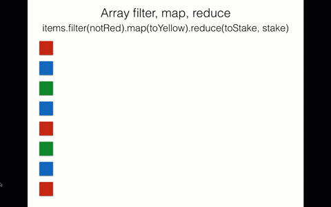
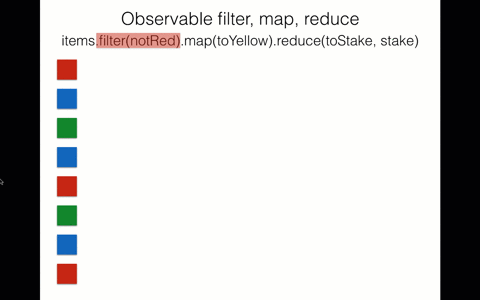

# Rxjs 操作符

Rxjs 拥有很多强大的 operators，比如说 map, filter, merge 等等。我们说它们强大，它们和数组 map, filter 方法有什么不同呢。

- 延迟运算
- 渐进式取值

延迟运算很好理解，所有 Observable 一定会等到订阅后才开始对元素做运算，如果没有订阅就不会有运算的行为。

数组的方法都必须完整的运算出每个元素的返回值并组成一个新的数组，再做下一个方法的运算。

```js
var source = [1, 2, 3];
var example = source
  .filter(x => x % 2 === 0) // 返回一个新数组
  .map(x => x + 1); // 返回一个新数组
```



Observable operator 的运算方式跟数组的是完全的不同，虽然 Observable 的 operator 也都返回一个新的 observable，但因为值是渐进式取得的关系，所以每次的运算是一个值运算到底，而不是运算完全部的值再返回。

```js
import { from } from 'rxjs';
import { filter, map } from 'rxjs/operators';
const example = from([1, 2, 3]).pipe(
  filter(x => x % 2 === 0),
  map(x => x + 1),
);
example.subscribe(console.log);
```



> 渐进式取值的观念在 Observable 中其实非常的重要，这个特性也使得 Observable 相较于 Array 的 operator 在做运算时来的高效很多，尤其是在处理大量资料的时候会非常明显。

操作符 operators 分为两种：

- instance operators 是存在于 observable 实例上的方法， 也就是实例方法；
- static operators 是存在于 Observable 这个类型上的方法，也就是静态方法。

对于操作符两个重点是我们一定要知道：

1. 每个 operator 都会返回一个新的 observable，而我们可以透过 create 的方法建立各种 operator。
2. 实例操作符都需要放在`.pipe`里，以`obs.pipe(op1(),op2(),op3(),op4())`参数形式添加。

导入方式：

- 静态操作符和 rxjs 核心类导入都是从'rxjs'
- 实例操作符导入都是从'rxjs/operators'

快速创建自定义操作符：

```js
import { filter, map } from 'rxjs/operators';
function customOperator() {
  return source =>
    source.pipe(
      filter(v => !(v % 2)),
      map(v => v + v),
    );
}
```

创建新的自定义操作符：

```js
import { Observable } from 'rxjs';

function customNewOperator(data) {
  return observable =>
    new Observable(observer => {
      // 处理订阅
      const subscription = observable.subscribe({
        next(value) {
          observer.next(value);
        },
        error(err) {
          observer.error(err);
        },
        complete() {
          observer.complete();
        },
      });
      // 处理取消订阅
      return () => {
        subscription.unsubscribe();
      };
    });
}
```

> **小提示**：[文档](https://rxjs.dev/api?type=function)里的 index 就是 static operators，operators 就是 instance operators。

[操作符分类](https://rxjs.dev/guide/operators)：

- 创建类（Creation）
- 合并类（Join Creation）
- 转化类（transformation）
- 过滤类（filtering）
- 多播类（multicasting）
- 错误处理类（error Handling）
- 辅助⼯具类（utility）
- 条件分⽀类（conditional&boolean）
- 数学和合计类（mathmatical&aggregate）

操作符很多，无法全部都列举到，这里只列举一些使用频次高的，其他的操作符大家可以自行看文档学习。

> 在 RxJS 中，创建类操作符是数据流的源头，其余所有操作符最重要的三类就是合并类、过滤类和转化类。我们使⽤ RxJS 解决问题绝⼤部分时间就是在使⽤这三种操作符。

## 创建类

所谓创建类操作符，就是⼀些能够创造出⼀个 Observable 对象的⽅法。所谓“创造”，并不只是说返回⼀个 Observable 对象，因为任何⼀个操作符都会返回 Observable 对象，这⾥所说的创造，是指这些操作符不依赖于其他 Observable 对象，这些操作符可以凭空或者根据其他数据源创造出⼀个 Observable 对象。

创建类操作符并不是不需要任何输⼊，很多创建型的操作符都接受输⼊参数，有的还需要其他的数据源，⽐如浏览器的 DOM 结构或者 WebSocket。重要的是，创建类操作符往往不会从其他 Observable 对象获取数据，在数据管道中，创建类操作符就是数据流的源头。正因为创建类操作符的这个特性，创建类操作符⼤部分（并不是全部）都是静态操作符。

> 上一章我们已经介绍常用的创建类操作符，这里不再介绍。

## 合并类

### concat

Observable 的 concat ⽅法和数组类似，能够把多个 Observable 中的数据内容依次合并。

```js
import { concat, interval, range } from 'rxjs';
import { take } from 'rxjs/operators';

const timer = interval(1000).pipe(take(4));
const sequence = range(1, 10);
const result = concat(timer, sequence);
result.subscribe(x => console.log(x));

// results in:
// 0 -1000ms-> 1 -1000ms-> 2 -1000ms-> 3 -immediate-> 1 ... 10
```

> 连接多个可观察对象，并顺序发出他们的值，一个可观察对象跟在另一个的后面，简单理解：串行

### merge

merge 和 concat 的⽤法很相似，merge 与 concat 不同，merge 会第⼀时间订阅所有的上游 Observable，然后对上游的数据采取“先到先得”的策略，任何⼀个 Observable 只要有数据推下来，就⽴刻转给下游 Observable 对象。

```js
import { merge, interval } from 'rxjs';
import { take } from 'rxjs/operators';

const timer1 = interval(1000).pipe(take(10));
const timer2 = interval(2000).pipe(take(6));
const timer3 = interval(500).pipe(take(10));
const concurrent = 2; // the argument
const merged = merge(timer1, timer2, timer3, concurrent);
merged.subscribe(x => console.log(x));

// 结果如下：
// - 第一个timer1和timer2将同时运行
// - timer1将每1000ms发出一个值，进行10次迭代
// - timer2将每2000ms发出一个值，进行6次迭代
// - 在timer1达到最大迭代次数之后，timer2将继续，并且timer3将开始与timer2同时运行
// - 当timer2达到最大迭代次数时，它将终止，并且timer3将继续每500ms发出一个值，直到完成为止
```

> 通过将多个观察者的值合并到一个观察者中进行发射。

### zip

zip 在这⾥的含义就是“拉链”，这个操作符的名字⾮常直观，相信大家⼀定⽤过拉链，拉链主要由拉⽚和两条有链齿的布带组成，当我们想要闭合拉链的时候，拉动拉⽚，两边的链齿被牵动，⼀对⼀咬合，拉链的⼀对链齿就合并上了。

```js
import { zip, from } from 'rxjs';
import { map } from 'rxjs/operators';

const numbers$ = from([1, 2, 3]);
const strings$ = from(['a', 'b', 'c', 'd']);

zip(numbers$, strings$).subscribe(([num, str]) => {
  console.log(`${num} - ${str}`);
});

// outputs
// 1-a
// 2-b
// 3-c
```

> zip 会交错两个可观察的结果，zip 操作符会订阅所有内部 observables，然后等待每个发出一个值。一旦发生这种情况，将发出具有相应索引的所有值。这会持续进行，直到至少一个内部 observable 完成。

### combineLatest

combineLatest 合并数据流的⽅式是当任何⼀个上游 Observable 产⽣数据 时，从所有输⼊ Observable 对象中拿最后⼀次产⽣的数据（最新数据）， 然后把这些数据组合起来传给下游。注意，这种⽅式和 zip 不⼀样，zip 对上 游数据只使⽤⼀次，⽤过⼀个数据之后就不会再⽤，但是 combineLatest 可 能会反复使⽤上游产⽣的最新数据，只要上游不产⽣新的数据，那 combineLatest 就会反复使⽤这个上游最后⼀次产⽣的数据。

```js
import { combineLatest, of } from 'rxjs';
import { delay, startWith } from 'rxjs/operators';

const observables = [1, 5, 10].map(n =>
  of(n).pipe(
    delay(n * 1000), // 发出0，然后在n秒后发出n
    startWith(0),
  ),
);
const combined = combineLatest(observables);
combined.subscribe(value => console.log(value));
// Logs
// [0, 0, 0] immediately
// [1, 0, 0] after 1s
// [1, 5, 0] after 5s
// [1, 5, 10] after 10s
```

> 如果至少一个 Observable 传递给 CombineLatest，并且所有传递的 Observable 发出某种东西，则所有组合流完成时，所得的 Observable 将完成。 因此，即使某些 Observable 完成了，而其他 Observable 进行合并时，CombineLatest 的结果仍将发出值。 在完成 Observable 的情况下，从现在开始的值将始终是最后发出的值。 另一方面，如果出现任何 Observable 错误，combineLatest 也将立即出错，所有其他 Observable 都将被取消订阅。

### withLatestFrom

withLatestFrom 运行方式跟 combineLatest 有点像，只是它有主从的关系，只有在主要的 observable 送出新的值时，才会执行 callback，附随的 observable 只是在后台下运行。

```js
import { fromEvent, interval } from 'rxjs';
import { withLatestFrom } from 'rxjs/operators';

const main = fromEvent(document, 'click');
const some = interval(1000);
const result = main.pipe(withLatestFrom(some));
result.subscribe(x => console.log(x));
```

combineLatest 会为输⼊ Observable 对象的每个 next 动作产⽣⼀个数据，很多情况下这是最理想的⼀种⽅式， 但是， 如果输⼊ Observable 对象之间
有依赖关系，就会发⽣多个输⼊ Observable 对象同时产⽣数据的情况， withLatestFrom 和 combineLatest 该如何选择：

- 如果要合并完全独⽴的 Observable 对象， 使⽤ combineLatest。
- 如何要把⼀个 Observable 对象“映射”成新的数据流，同时要从其他 Observable 对象获取“最新数据”，就是⽤ withLatestFrom。

### forkJoin

forkJoin 只有静态操作符的形式，可以接受多个 Observable 对象作为参数， forkJoin 产⽣的 Observable 对象也很有特点，它只会产⽣⼀个数据，因为它会等待所有参数 Observable 对象的最后⼀个数据，也就是说，只有当所有 Observable 对象都完结，确定不会有新的数据产⽣的时候，forkJoin 就
会把所有输⼊ Observable 对象产⽣的最后⼀个数据合并成给下游唯⼀的数据。

```js
import { forkJoin, of, timer } from 'rxjs';

const observable = forkJoin([of(1, 2, 3, 4), Promise.resolve(8), timer(4000)]);
observable.subscribe({
  next: value => console.log(value),
  complete: () => console.log('This is how it ends!'),
});

// Logs:
// 4秒后输出[4, 8, 0]
// 最后输出 "This is how it ends!"
```

> forkJoin 就是 RxJS 界的 Promise.all， Promise.all 等待所有输⼊的 Promise 对象成功之后把结果合并， forkJoin 等待所有输⼊的 Observable 对象完结之后把最后⼀个数据合并。需要同时到达才会执行订阅，如果某个输入可观察发送错误，forkJoin 也将发生错误，所有其他可观察到的将立即取消订阅。

### race

race 就是“竞争”，多个 Observable 对象在⼀起，看谁最先产⽣数据，不过这种竞争是⼗分残酷的，胜者通吃，败者则失去所有机会。

```js
import { race, interval } from 'rxjs';
import { mapTo } from 'rxjs/operators';

const obs1 = interval(1000).pipe(mapTo('fast one'));
const obs2 = interval(3000).pipe(mapTo('medium one'));
const obs3 = interval(5000).pipe(mapTo('slow one'));

race(obs3, obs1, obs2).subscribe(winner => console.log(winner));

// result:
// a series of 'fast one'
```

> race 就是 RxJS 界的 Promise.race， Promise.race 等待第一个输⼊的 Promise 对象成功之后把结果返回，race 第⼀个吐出数据的 Observable 对象就是胜者，race 产⽣的 Observable 就会完全采⽤胜者 Observable 对象的数据，其余的输⼊ Observable 对象则会被退订⽽抛弃。

### startWith

startWith 只有实例操作符的形式，其功能是让⼀个 Observable 对象在被订阅的时候，总是先吐出指定的若⼲个数据。下⾯是使⽤ startWith 的⽰例代码：

```js
import { of } from 'rxjs';
import { startWith } from 'rxjs/operators';

of('from source')
  .pipe(startWith('first', 'second'))
  .subscribe(x => console.log(x));

// first
// second
// from source
```

> startWith 所有参数都是同步吐出的，如果需要异步吐出参数，那需要利⽤ concat。

### endWith

endWith 只有实例操作符的形式，其功能是让⼀个 Observable 对象在被订阅结束的时候，总是吐出指定的若⼲个数据。下⾯是使⽤ endWith 的⽰例代码：

```js
import { of } from 'rxjs';
import { startWith } from 'rxjs/operators';

of('from source')
  .pipe(endWith('last', 'end'))
  .subscribe(x => console.log(x));

// from source
// last
// end
```

异步的 startWith 和 endWith

```js
import { of, timer } from 'rxjs';
import { concat, take } from 'rxjs/operators';
const original$ = timer(1000, 1000);
// 异步 startWith
const startWith$ = of('start').pipe(
  concat(original$),
  take(10),
);
// 异步 endWith
const endWith$ = original$.pipe(
  take(10),
  concat(of('end')),
);
startWith$.subscribe(x => console.log('startWith', x));
endWith$.subscribe(x => console.log('endWith', x));
```

### Higher Order Observable(高阶 Observable)

所谓的 Higher Order Observable 就是指一个 Observable 送出的元素还是一个 Observable，就像是二维数组一样，一个数组中的每个元素都是数组。如果用泛型来表达就像是`Observable<Observable<T>>`。

RxJS 擅长处理复杂的数据操作问题，这些问题往往需要涉及多个数据流，对于数据流内中流动的数据，使⽤ RxJS 提供的各种操作符配合处理当然得⼼应⼿。

数据流虽然管理的是数据，数据流⾃⾝也可以认为是⼀种数据，既然数据可以⽤ Observable 来管理，那么数据流本⾝也可以⽤ Observable 来管理，让需要被管理的 Observable 对象成为其他 Observable 对象的数据，⽤现成的管理 Observable 对象的⽅法来管理 Observable 对象，这就是⾼阶 Observable 的意义。

通常我们需要的是第二层 Observable 送出的数据，所以我们希望可以把二维的 Observable 摊平一维的，像是这样`Observable<Observable<T>> => Observable<T>`。

⾼阶 Observable 对象还有⼀个特点，就是产⽣的内部 Observable 对象可以是异步的，换句话说，当订阅⾼阶 Observable 对象的时候，并不确定何时会有内部 Observable 对象会产⽣。

- concatAll（concat 高阶）
- mergeAll（merge 高阶）
- zipAll（zip 高阶）
- combineAll（combineLatestAll 高阶）

> All 代表“全部”，这些操作符的功能有差异，但都是把⼀个⾼阶 Observable 的所有内部 Observable 都组合起来，所有这类操作符全部都只有实例操作符的形式。

#### concatAll

concat 是把所有输⼊的 Observable ⾸尾相连组合在⼀ 起，concatAll 做的事情也⼀样，只不过 concatAll 只有⼀个上游 Observable 对象，这个 Observable 对象预期是⼀个⾼阶 Observable 对象，concatAll 会对其中的内部 Observable 对象做 concat 的操作。

```js
import { fromEvent, interval } from 'rxjs';
import { map, take, concatAll } from 'rxjs/operators';

const clicks = fromEvent(document, 'click');
const higherOrder = clicks.pipe(map(ev => interval(1000).pipe(take(4))));
const firstOrder = higherOrder.pipe(concatAll());
firstOrder.subscribe(x => console.log(x));
// one click = 1000ms-> 0 -1000ms-> 1 -1000ms-> 2 -1000ms-> 3
```

> 当我们用 concatAll 之后会把二维的 observable 摊平成一维的 observable，但 concatAll 会一个一个处理，一定是等前一个 observable 完成(complete)才会处理下一个 observable，如果出现送出 observable 是无限的永远不会完成(complete)，就导致他永远不会处理第二个送出的 observable。

#### mergeAll

mergeAll 就是处理⾼阶 Observable 的 merge，只是所有的输⼊ Observable 来⾃于上游产⽣的内部 Observable 对象。

```js
import { fromEvent, interval } from 'rxjs';
import { take, map, mergeAll } from 'rxjs/operators';

const clicks = fromEvent(document, 'click');
const higherOrder = clicks.pipe(map(ev => interval(1000).pipe(take(10))));
const firstOrder = higherOrder.pipe(mergeAll(2));
firstOrder.subscribe(x => console.log(x));
```

> mergeAll 只要发现上游产⽣⼀个内部 Observable 就会⽴刻订阅，我们可以利用参数来决定要同时处理几个 observable，如果我们传入 1 其行为就会跟 concatAll 是一模一样的，这点在源码可以看到他们是完全相同的。

#### zipAll

zipAll 在官网文档基本没有介绍，如果能够理解 zip，也能够理解前⾯介绍的 concatAll 和 mergeAll，那么⾃然就能够理解 zipAll。

```js
import { interval } from 'rxjs';
import { take, map, zipAll } from 'rxjs/operators';
const higherOrder = interval(1000).pipe(
  take(2),
  map(x =>
    interval(1500).pipe(
      map(y => x + ':' + y),
      take(2),
    ),
  ),
);
const zipOrder$ = higherOrder.pipe(zipAll());
zipOrder$.subscribe(x => console.log(x));

// logs
// ["0:0", "1:0"]
// ["0:1", "1:1"]
```

> 如果 zipAll 的上游是⼀个永不完结的 Observable，当它拿到 2 个内部 Observable 的时候，⽆法确定是不是还有新的内部 Observable 产⽣，⽽根据“拉链”的⼯作⽅式，来⾃不同数据源的数据要⼀对⼀配对，这样⼀来，zipAll 就只能等待，等待上游⾼阶 Observable 完结，这样才能确定内部 Observable 对象的数量。如果上游的⾼阶 Observable 不完结，那么 zipAll 就不会开始⼯作。

#### combineAll

combineAll 就是处理⾼阶 Observable 的 combineLatest

```js
import { fromEvent, interval } from 'rxjs';
import { map, combineAll, take } from 'rxjs/operators';

const clicks = fromEvent(document, 'click');
const higherOrder = clicks.pipe(
  map(ev => interval(Math.random() * 2000).pipe(take(3))),
  take(2),
);
const result = higherOrder.pipe(combineAll());

result.subscribe(x => console.log(x));
```

> combineAll 必须上游⾼阶 Observable 完结之后才能开始给下游产⽣数据，因为只有确定了作为输⼊的内部 Observable 对象的个数，才能拼凑出第⼀个传给下游的数据。 如果 combineAll 的上游⾼阶 Observable 永不完结，即使部分内部 Observable 已经产⽣了数据，combineAll 也不会有机会产⽣任何数据。

#### switchAll

switchAll 的含义就是“切换”（为什么 all 结尾，这是因为版本升级原因，v6 版本以前叫 switch），总是切换到最新的内部 Observable 对象获取数据。每当 switchAll 的上游⾼阶 Observable 产⽣⼀个内部 Observable 对象， switchAll 都会⽴刻订阅最新的内部 Observable 对象上，如果已经订阅了之前的内部 Observable 对象，就会退订那个过时的内部 Observable 对象，这个“⽤上新的，舍弃旧的”动作，就是切换。

```js
import { fromEvent, interval } from 'rxjs';
import { switchAll, map, tap } from 'rxjs/operators';

const clicks = fromEvent(document, 'click').pipe(tap(() => console.log('click')));
const source = clicks.pipe(map(ev => interval(1000)));

source.pipe(switchAll()).subscribe(x => console.log(x));
/* Output
 click
 1
 2
 3
 4
 ...
 click
 1
 2
 3
 ...
 click
 ...
*/
```

> switchAll 最重要的就是它会在新的 observable 送出后直接处理新的 observable 不管前一个 observable 是否完成，每当有新的 observable 送出就会直接把旧的 observable 退订(unsubscribe)，永远只处理最新的 observable。**注意**：switchAll 和 race 有区别，并不是和 race ⼀样抢到第⼀个输出数据就赢了，switchAll 更像是抢⼭头的游戏，谁抢到了⼭头，就⼀直占着⼭头，直到⼭头被其他对⼿抢占。

#### exhaust

exhaust 的含义就是“耗尽”，这个操作符的意思是，在耗尽当前内部 Observable 的数据之前不会切换到下⼀个内部 Observable 对象。

```js
import { fromEvent, interval } from 'rxjs';
import { exhaust, map, take } from 'rxjs/operators';

const clicks = fromEvent(document, 'click');
const higherOrder = clicks.pipe(map(ev => interval(1000).pipe(take(5))));
const result = higherOrder.pipe(exhaust());
result.subscribe(x => console.log(x));

/* Output
 click
 0
 1
 2
 3
 4
 click
 0
 1
 2
 3
 4
 click
 ...
*/
```

> exhaust 的 策略和 switchAll 相反，当内部 Observable 对象在时间上发⽣重叠时，情景就是前⼀个内部 Observable 还没有完结，⽽新的 Observable 又已经产⽣，到底应该选择哪⼀个作为数据源？switchAll 选择新产⽣的内部 Observable 对象，exhaust 则选择前⼀个内部 Observable 对象。

## 转化类

### map

这是最简单的⼀个转化类操作符，和 JavaScript 的数组类型就同名的函数类似，同样也是接受⼀个函数作为参数，这个函数通常称为 project， 指定了数据映射的逻辑。

```js
import { fromEvent } from 'rxjs';
import { map } from 'rxjs/operators';

const clicks = fromEvent(document, 'click');
const positions = clicks.pipe(map(ev => ev.clientX));
positions.subscribe(x => console.log(x));
```

> 我们实际工作中会大量使⽤ map，map 除了必须要有的函数参数 project，还有⼀个可选参数 thisArg，⽤于指定函数 project 执⾏时的 this 值，为了保持函数式编程风格，尽量不要使用它。

### mapTo

功能和 map 一样，唯一不一样它总是返回是一个固定的值。

```js
import { fromEvent } from 'rxjs';
import { mapTo } from 'rxjs/operators';

const clicks = fromEvent(document, 'click');
const greetings = clicks.pipe(mapTo('Hi'));
greetings.subscribe(x => console.log(x));
```

> mapTo 可以直接通过 map 完成，`map(() => 'Hi')`，如果你需要返回固定值时候，你可以选择它。

### pluck

pluck 的含义是“拔”，可以这么理解，pluck 就是把上游数据中特定字段的值“拔”出来，所以 pluck 的参数就是字段的名字。

```js
import { fromEvent } from 'rxjs';
import { pluck } from 'rxjs/operators';

const clicks = fromEvent(document, 'click');
const tagNames = clicks.pipe(pluck('target', 'tagName'));
tagNames.subscribe(x => console.log(x));
```

> pluck 和 `lodash#get` 很像，根据属性获取值。 pluck 缺点就是只能“拔”出⼀个值。如果 pluck 发现某⼀层字段为空，对应就会给下游传递 undefined，不会出错。

### scan

scan 其实就是 Observable 版本的 reduce 只是命名不同。如果熟悉数组操作的话，应该会知道原生的 JS Array 就有 reduce 的方法，使用方式如下：

```js
import { fromEvent } from 'rxjs';
import { scan, mapTo } from 'rxjs/operators';

const clicks = fromEvent(document, 'click');
const ones = clicks.pipe(mapTo(1));
const seed = 0;
const count = ones.pipe(scan((acc, one) => acc + one, seed));
count.subscribe(x => console.log(x));
```

> scan 跟 reduce 最大的差别就在 scan 一定会返回一个 observable 实例，而 reduce 最后返回的值有可能是任何数据类型，必须看使用者传入的 callback 才能决定 reduce 最后的返回值。

### ⾼阶的 map

map 是 RxJS 中很好懂的⼀个操作符，因为有 JavaScript 原⽣的 map 来对应，也是 rxjs 里面使用频率很高的一个操作符。

⾼阶 map 的操作符都有⼀个函数参数 project，但是和普通 map 不同，普通 map 只是把⼀个数据映射为另⼀个数据，⽽⾼阶 map 的函数参数 project 把⼀个数据映射为⼀个 Observable 对象。

- concatMap
- mergeMap
- switchMap
- exhaustMap

> 很多人看的这个 4 个高阶 map 都会懵逼，我当时是学习也是一脸懵逼，这里我们一起来学习它们常用使用场景。

#### concatMap

concatMap 其实就是 map 加上 concatAll 的简化写法，我们直接来看栗子：

```js
import { fromEvent, interval } from 'rxjs';
import { concatAll, map, take } from 'rxjs/operators';

const source = fromEvent(document.body, 'click');

const example = source.pipe(
  map(e => interval(1000).pipe(take(3))),
  concatAll(),
);

example.subscribe(x => console.log(x));
```

concatMap 写法：

```js
import { fromEvent, interval } from 'rxjs';
import { concatMap, take } from 'rxjs/operators';

const source = fromEvent(document.body, 'click');

const example = source.pipe(concatMap(e => interval(1000).pipe(take(3))));

example.subscribe(x => console.log(x));
```

concatMap 适合处理需要顺序连接不同 Observable 对象中数据的操作， 有⼀个特别适合使⽤ concatMap 的应⽤例⼦，就是⽹页应⽤中的拖拽操作。

```js
import { fromEvent, interval } from 'rxjs';
import { concatMap, take, merge, takeUntil, map } from 'rxjs/operators';

const box = document.createElement('div');
box.style.width = '100px';
box.style.height = '100px';
box.style.border = '1px solid #333';
box.style.position = 'absolute';
document.body.appendChild(box);

const mouseDown$ = fromEvent(box, 'mousedown');
const mouseUp$ = fromEvent(box, 'mouseup');
const mouseOut$ = fromEvent(box, 'mouseout');
const mouseMove$ = fromEvent(box, 'mousemove');

const drag$ = mouseDown$.pipe(
  concatMap(startEvent => {
    const initialLeft = box.offsetLeft;
    const initialTop = box.offsetTop;
    const stop$ = mouseUp$.pipe(merge(mouseOut$));
    return mouseMove$.pipe(
      takeUntil(stop$),
      map(moveEvent => {
        return {
          x: moveEvent.x - startEvent.x + initialLeft,
          y: moveEvent.y - startEvent.y + initialTop,
        };
      }),
    );
  }),
);

drag$.subscribe(event => {
  box.style.left = event.x + 'px';
  box.style.top = event.y + 'px';
});
```

在来一个 HTTP request 栗子，如果我们快速的连续点击，大家可以在开发者工具的 network 看到每个 request 是等到前一个 request 完成才会送出下一个 request。

```js
import { fromEvent, from } from 'rxjs';
import { concatMap } from 'rxjs/operators';

function getPostData() {
  return fetch('https://jsonplaceholder.typicode.com/posts/1').then(res => res.json());
}
const source = fromEvent(document.body, 'click');

const example = source.pipe(concatMap(e => from(getPostData()), (e, res, eIndex, resIndex) => res.title));

example.subscribe(x => console.log(x));
```

> concatMap 在内部 observable 还没有结束的时候，外部 observable 还在发射数据，外部 observable 会先把发射的数据缓存起来，等内部 observable 结束后立即响应外部 observable 的数据从而引发新一轮的内部 observable 发射，这有些类似与 js 的消息队列机制。所以我们看到它的输出流响应是连续的。 这个方法很适合在内部 observable 要获取的值跟前一个事件或者顺序有关时。

#### mergeMap

mergeMap 其实就是 map 加上 mergeAll 简化写法，我们直接来看栗子：

```js
import { fromEvent, interval } from 'rxjs';
import { concatMap, map, take, mergeAll } from 'rxjs/operators';

const source = fromEvent(document.body, 'click');

const example = source.pipe(
  map(e => interval(1000).pipe(take(3))),
  mergeAll(),
);
example.subscribe(x => console.log(x));
```

mergeMap 写法：

```js
import { fromEvent, interval } from 'rxjs';
import { mergeMap, take } from 'rxjs/operators';

const source = fromEvent(document.body, 'click');

const example = source.pipe(mergeMap(e => interval(1000).pipe(take(3))));
example.subscribe(x => console.log(x));
```

mergeMap 和 concatMap 不同之处，在于对 project 参数函数产⽣的 Observable 对象的处理，mergeMap 对于每个内部 Observable 对象直接合并， 也就是任何内部 Observable 对象中的数据，来⼀个给下游传⼀个，不做任何等待。

mergeMap 可以并行处理多个 observable，以上面例子来说当我们快速点按两下，值发送的时间点是有机会重叠的，这个部份的细节大家可以看 merge 的部分。

mergeMap 能够解决异步操作的问题，最典型的应⽤场景就是对于 AJAX 请求的处理。在⼀个⽹页应⽤中，⼀个很典型的场景，每点击某个 元素就需要发送⼀个 AJAX 请求给服务器端，同时还要根据返回结果更新⽹页中的状态，AJAX 的处理当然是⼀个异步过程，使⽤传统的⽅法来解决这样的异步过程代码会⼗分繁杂。

```js
import { fromEvent, from } from 'rxjs';
import { mergeMap } from 'rxjs/operators';

function getPostData() {
  return fetch('https://jsonplaceholder.typicode.com/posts/1').then(res => res.json());
}
const source = fromEvent(document.body, 'click');

const example = source.pipe(mergeMap(e => from(getPostData()), (e, res, eIndex, resIndex) => res.title, 3));

example.subscribe(x => console.log(x));
```

mergeMap 也能传入第二个参数 selector callback 这个 selector callback 跟 concatMap 第二个参数也是完全一样的，但 mergeMap 的重点是我们可以传入第三个参数，來限制并行处理的数量。

> mergeMap 在外部 observable 中发射的每一个数据，它既不会忽略也不会缓存，这就导致在外部 observable 中数据对应的内部 observable 产生了叠加。 这个方法很适合限制同时发送的内部 observable 数量。

#### switchMap

switchMap 其实就是 map 加上 switchAll 简化的写法，我们直接来看栗子：

```js
import { fromEvent, interval } from 'rxjs';
import { switchAll, map, take } from 'rxjs/operators';

const source = fromEvent(document.body, 'click');

const example = source.pipe(
  map(e => interval(1000).pipe(take(10))),
  switchAll(),
);

example.subscribe(x => console.log(x));
```

switchMap 写法：

```js
import { fromEvent, interval } from 'rxjs';
import { switchMap, take } from 'rxjs/operators';

const source = fromEvent(document.body, 'click');

const example = source.pipe(switchMap(e => interval(1000).pipe(take(10))));

example.subscribe(x => console.log(x));
```

请求网页来栗子：

```js
import { fromEvent, from } from 'rxjs';
import { switchMap } from 'rxjs/operators';

function getPostData() {
  return fetch('https://jsonplaceholder.typicode.com/posts/1').then(res => res.json());
}
const source = fromEvent(document.body, 'click');

const example = source.pipe(switchMap(e => from(getPostData()), (e, res, eIndex, resIndex) => res.title));

example.subscribe(x => console.log(x));
```

switchMap 依然在上游产⽣数据的时候去调⽤函数参数 project，但它和 concatMap 和 mergeMap 都不⼀样的是，后产⽣的内部 Observable 对象优先级总是更⾼，只要有新的内部 Observable 对象产⽣，就⽴刻退订之前的内部 Observable 对象，改为从最新的内部 Observable 对象拿数据。就像 switch 的含义⼀样，switchMap 做的是⼀个“切换”，只要有更新的内部 Observable 对象，就切换到最新的内部 Observable 对象。

> switchMap 在外部 observable 每发射一次触发了内部 observable 的发射，但是在内部 observable 发射的过程中，如果外部 observable 又一次发射了数据，switchMap 会截断上一次的内部 observable，响应本次的外部 observable，从而开启新的一段的内部 observable 发射。使用场景比如自动完成(auto complete)，我们只需要显示使用者最后一次输入在页面上的文字。

#### exhaustMap

exhaustMap 其实就是 map 加上 exhaust 简化的写法，我们直接来看栗子：

```js
import { fromEvent, interval } from 'rxjs';
import { exhaust, map, take } from 'rxjs/operators';

const source = fromEvent(document.body, 'click');

const example = source.pipe(
  map(e => interval(1000).pipe(take(5))),
  exhaust(),
);

example.subscribe(x => console.log(x));
```

exhaustMap 写法：

```js
import { fromEvent, interval } from 'rxjs';
import { exhaustMap, take } from 'rxjs/operators';

const clicks = fromEvent(document, 'click');
const result = clicks.pipe(exhaustMap(ev => interval(1000).pipe(take(5))));
result.subscribe(x => console.log(x));
```

exhaustMap 对数据的处理策略和 switchMap 正好相反，先产⽣的内部 Observable 优先级总是更⾼，后产⽣的内部 Observable 对象被利⽤的唯⼀机会，就是之前的内部 Observable 对象已经完结。

需要注意的是，exhaustMap 的实现是，前⼀次 project 调⽤返回的内部 Observable 对象完结之前，上游推送下来⼀个数据，这时候 exhaustMap 根本不会去调⽤ project 函数，因为 project 会同步产⽣ Observable 对象，既然这时 候 exhaustMap 根本不会订阅这个 Observable 对象，⼲脆根本不去调⽤ project 函数。

特定于⽹页中 AJAX 请求这种场景，如果某种 AJAX 请求要维持现存的 AJAX 请求，那就⽤得上 exhaustMap，这种喜欢“旧”请求胜过“新”请求的例 ⼦不多，但并不是不存在。⽐如，如果利⽤ AJAX 建⽴服务器和浏览器之 间的长连接，让服务器可以沿着 AJAX 通道推送消息下来，那么只要有这 样长连接的 AJAX 存在，就没有必要建⽴新的 AJAX 连接，exhaustMap 适合这样的场景。

> exhaustMap 在内部 observable 还没有结束的时候如果外部 observable 仍然有数据在发射，它会忽略此时外部 observable 发射的数据，而在内部 observable 结束以后才会去响应外部 observable 中发射的数据。这个方法适合映射成内部 observable，忽略其他值直到该 observable 完成。

#### 总结

这个四个 operators 作用都是存在一个主流和一个从流，主流上每发射一次数据都会触发从流开始发射数据，最后数据都被打平到同一个输出流中。都有一个共同的特性，第一个参数可以把 promise 直接转成 observable 这样我们就不用再用 from 转一次。

至于如果使用这个 4 个 operators？其实都还是看使用情况而定，这里简单给大家列出部分使用场景：

- concatMap 用在可以确定内部的 observable 结束时间比外部 observable 发送时间来的快的情况，并且不希望有任何并行处理行为，适合少数要一次一次完成到底的 Ui 动画或者特别 HTTP request 行为。
- mergeMap 用在并行处理多个 observable，适合需要并行处理的行为，像是多个 I/O 的并行处理。
- switchMap 用在只要最后一次行为的结果，适合绝大多数的是有情况。
- exhaustMap 当我们希望最小化从浏览器发出的 HTTP request 调用的数量时，这可能会很有用。

> 如果你还不知道选择哪一个时候，推荐你是有 switchMap，在我工作中这个操作符使用频次最高。 **注意**：在使用 concatAll 或 concatMap 时，请注意內部的 observable 一定要能夠的結束，且外部的 observable 发送值的速度不能比內部的 observable 結束时间快太多，不然会有内存泄漏问题。

### buffer

buffer 看名字就大概意思“缓存”。buffer 是一整个家族，总共有五个相关的 operators：

- buffer
- bufferTime
- bufferCount
- bufferWhen
- bufferToggle

我们先来看 buffer 示例：

```js
import { fromEvent, interval } from 'rxjs';
import { buffer } from 'rxjs/operators';

const clicks = fromEvent(document, 'click');
const intervalEvents = interval(1000);
const buffered = intervalEvents.pipe(buffer(clicks));
buffered.subscribe(x => console.log(x));
```

buffer 要传入一个 observable 参数， 它会把原本的 observable 送出的值缓存在队列中，等到传入的 observable 参数送出值时，就会触发把缓存值送出。

```js
import { fromEvent } from 'rxjs';
import { bufferTime } from 'rxjs/operators';

const clicks = fromEvent(document, 'click');
const buffered = clicks.pipe(bufferTime(1000));
buffered.subscribe(x => console.log(x));
```

bufferTime 产⽣的是普通的 Observable 对象，其中的数据是数组形式，bufferTime 会把时间区块内的数据缓存，在时间区块结束的时候把所有缓存的数据放在⼀个数组⾥传给下游。

```js
import { fromEvent } from 'rxjs';
import { bufferTime } from 'rxjs/operators';

const clicks = fromEvent(document, 'click');
const buffered = clicks.pipe(bufferTime(2000, 5000));
buffered.subscribe(x => console.log(x));
```

bufferTime 支持二个时间参数，如果第⼀个参数⽐第⼆个参数⼤，那么就有可能出现数据重复，如果第⼀个参数⽐第⼆个参数⼩，那么就有可能出现上游数据的丢失。之所以说“有可能”，是因为丢失或者重叠的时间区块中可能上游没有产⽣数据，所以也就不会引起上游数据的丢失和重复。从这个意义上说来，bufferTime 如果⽤上了第⼆个参数，也未必是“⽆损”的回压控制。

> bufferTime 在某些特殊的需求中非常的好用，也能用在分批处理來降低 request 传送的次数。

```js
import { fromEvent } from 'rxjs';
import { bufferCount } from 'rxjs/operators';

const clicks = fromEvent(document, 'click');
const buffered = clicks.pipe(bufferCount(2));
buffered.subscribe(x => console.log(x));
```

除了用时间來作缓存外，更常用数量來做缓存。

```js
import { fromEvent } from 'rxjs';
import { bufferCount } from 'rxjs/operators';

const clicks = fromEvent(document, 'click');
const buffered = clicks.pipe(bufferCount(2, 1));
buffered.subscribe(x => console.log(x));
```

bufferCount 还⽀持可选的第⼆个参数 startBufferEvery，如果不使⽤ 第⼆个参数，那么所有的时间区间没有重叠部分；如果使⽤了第⼆个参数，那么第⼀个参数依然是时间区间的长度，但是每间隔第⼆个参数 startBufferEvery 的毫秒数，就会新开⼀个时间区间。

> **注意**：第⼆个参数⽐第⼀个参数更⼤，这样就会丢弃部分上游的数据。

```js
import { fromEvent, interval } from 'rxjs';
import { bufferWhen } from 'rxjs/operators';

const clicks = fromEvent(document, 'click');
const buffered = clicks.pipe(bufferWhen(() => interval(1000 + Math.random() * 4000)));
buffered.subscribe(x => console.log(x));
```

bufferWhen 接受⼀个函数作为参数，这个参数名为 closingSelector，closingSelector 应该返回⼀个 Observable 对象，⽤于控制上游的数据分割，每当返回的 Observable 对象产⽣数据或者完结时，bufferWhen 就认为是⼀个缓冲区块的结束，重新开启⼀个缓冲窗口。

```js
import { fromEvent, interval, EMPTY } from 'rxjs';
import { bufferToggle } from 'rxjs/operators';

const clicks = fromEvent(document, 'click');
const openings = interval(1000);
const buffered = clicks.pipe(bufferToggle(openings, i => (i % 2 ? interval(500) : EMPTY)));
buffered.subscribe(x => console.log(x));
```

toggle 的含义就是两个状态之间的切换，bufferToggle 也是利⽤ Observable 来控制缓冲窗⼜的开和关。相⽐于 bufferWhen 靠⼀个⽆参数 closingSelector 函数来控制开关，bufferToggle 提供更加简单的功能。bufferToggle 需要两个参数，第⼀个参数 opening$是⼀ 个Observable对象，每当opening$产⽣⼀个数据，代表⼀个缓冲窗口的开 始，同时，第⼆个参数 closingSelector 也会被调⽤，⽤来获得缓冲窗口结束的通知。

> 比较常用到的是 buffer, bufferCount 和 bufferTime, bufferToggle 这 4 个 operators

### window

window 看名字就大概意思“窗口”。window 是一整个家族，总共有五个相关的 operators：

- window
- windowTime
- windowCount
- windowWhen
- windowToggle

window 很类似 buffer 可以把一段时间內送出的数据拆出來，只是 buffer 是把元素拆分到队列中变成`Observable<T> => Observable<Array<T>>`

而 window 则是会把元素拆分出來放到新的 observable 变成 `Observable<T> => Observable<Observable<T>>`。

```js
import { fromEvent, interval } from 'rxjs';
import { window, mergeAll, map, count } from 'rxjs/operators';

const clicks = fromEvent(document, 'click');
const sec = interval(1000);
const result = clicks.pipe(
  window(sec),
  map(win => win.pipe(count())), // each window has at most 2 emissions
  mergeAll(), // flatten the Observable-of-Observables
);
result.subscribe(x => console.log(x));
```

首先 window 要传入一个 observable，每当这个 observable 送出数据时，就会把正在处理的 observable 所送出的数据放到新的 observable 中并送出。

> 我們把部分数据放到新的 observable 中，就可以利用 Observable 的方法做更灵活的操作。单纯使用 window 没什么意义，必须配合其他操作符使用。

windowTime 比 bufferTime 多一个参数，第三个参数相当于 take 操作

```js
import { fromEvent } from 'rxjs';
import { windowTime, map, mergeAll, take } from 'rxjs/operators';

const clicks = fromEvent(document, 'click');
const result = clicks.pipe(
  windowTime(1000),
  map(win => win.pipe(take(2))), // each window has at most 2 emissions
  mergeAll(), // flatten the Observable-of-Observables
);
result.subscribe(x => console.log(x));
```

```js
import { fromEvent } from 'rxjs';
import { windowTime, map, mergeAll, take } from 'rxjs/operators';

const clicks = fromEvent(document, 'click');
const result = clicks.pipe(
  windowTime(1000, 5000),
  map(win => win.pipe(take(2))), // each window has at most 2 emissions
  mergeAll(), // flatten the Observable-of-Observables
);
result.subscribe(x => console.log(x));
```

```js
import { fromEvent } from 'rxjs';
import { windowTime, mergeAll } from 'rxjs/operators';

const clicks = fromEvent(document, 'click');
const result = clicks.pipe(
  windowTime(1000, 5000, 2), // each window has still at most 2 emissions
  mergeAll(), // flatten the Observable-of-Observables
);
result.subscribe(x => console.log(x));
```

windowTime 把上游数据传递出去是不需要延迟的，⽽ bufferTime 则需要缓存上游的数据，这也就是其 名字中带 buffer（缓存）的原因。

```js
import { fromEvent } from 'rxjs';
import { windowCount, map, mergeAll, skip } from 'rxjs/operators';

const clicks = fromEvent(document, 'click');
const result = clicks.pipe(
  windowCount(3),
  map(win => win.pipe(skip(1))), // skip first of every 3 clicks
  mergeAll(), // flatten the Observable-of-Observables
);
result.subscribe(x => console.log(x));
```

```js
import { fromEvent } from 'rxjs';
import { windowCount, mergeAll } from 'rxjs/operators';

const clicks = fromEvent(document, 'click');
const result = clicks.pipe(
  windowCount(2, 3),
  mergeAll(), // flatten the Observable-of-Observables
);
result.subscribe(x => console.log(x));
```

windowCount 还⽀持可选的第⼆个参数 startWindowEvery，如果不使⽤第⼆个参数，那么所有的时间区间没有重叠部分；如果使⽤了第⼆个参数，那么第⼀个参数依然是时间区间的长度，但是每间隔第⼆个参数 startWindowEvery 的毫秒数，就会新开⼀个时间区间。

```js
import { fromEvent, interval } from 'rxjs';
import { windowWhen, map, mergeAll, take } from 'rxjs/operators';

const clicks = fromEvent(document, 'click');
const result = clicks.pipe(
  windowWhen(() => interval(1000 + Math.random() * 4000)),
  map(win => win.pipe(take(2))), // each window has at most 2 emissions
  mergeAll(), // flatten the Observable-of-Observables
);
result.subscribe(x => console.log(x));
```

windowWhen 接受⼀个函数作为参数，这个参数名为 closingSelector，closingSelector 应该 返回⼀个 Observable 对象，⽤于控制上游的数据分割，每当返回的 Observable 对象产⽣数据或者完结时，windowWhen 就认为是⼀个缓冲区块的结束，重新开启⼀个缓冲窗口。

closingSelector 之所以没有参数，是因为调⽤ closingSelector 的时机和上游数据的产⽣没有任何关系，windowWhen 并不是在上游产⽣数据的时候调⽤ closingSelector，⽽是在被订阅的那个时刻或者缓冲区间结束时就调⽤ closingSelector。

```js
import { fromEvent, interval, EMPTY } from 'rxjs';
import { windowToggle, mergeAll } from 'rxjs/operators';

const clicks = fromEvent(document, 'click');
const openings = interval(1000);
const result = clicks.pipe(
  windowToggle(openings, i => (i % 2 ? interval(500) : EMPTY)),
  mergeAll(),
);
result.subscribe(x => console.log(x));
```

windowToggle 不像 window 只能控制內部 observable 的結束，windowToggle 可以传入两个参数，第一个是开始的 observable，第二个是一个 callback 可以返回一个結束的 observable。

> 比较常用到的是 window, windowCount 和 windowTime, windowToggle 这 4 个 operators

### groupBy

groupBy 的输出是⼀个⾼阶 Observable 对象，每个内部 Observable 对象包含上游产⽣的满⾜某个条件的数据，即某个分组的数据。

最后我们来讲一个比较常用的 operators，groupBy 可以帮我们把相同条件的元素拆分成一个 Observable，其实就跟平常使用 SQL 是一样个概念，我们先来看个简单的例子：

```js
import { of } from 'rxjs';
import { groupBy, map, mergeMap, reduce } from 'rxjs/operators';

of(
  { id: 1, name: 'JavaScript' },
  { id: 2, name: 'Parcel' },
  { id: 2, name: 'webpack' },
  { id: 1, name: 'TypeScript' },
  { id: 3, name: 'TSLint' },
)
  .pipe(
    groupBy(p => p.id, p => p.name),
    mergeMap(group$ => group$.pipe(reduce((acc, cur) => [...acc, cur], [`${group$.key}`]))),
    map(arr => ({ id: parseInt(arr[0], 10), values: arr.slice(1) })),
  )
  .subscribe(p => console.log(p));

// displays:
// { id: 1, values: [ 'JavaScript', 'TypeScript' ] }
// { id: 2, values: [ 'Parcel', 'webpack' ] }
// { id: 3, values: [ 'TSLint' ] }
```

可以把 groupBy 看作⼀个分发器，对于上游推送下来的任何数据，检查 这个数据的 key 值，如果这个 key 值是第⼀次出现，就产⽣⼀个新的内部 Observable 对象，同时这个数据就是内部 Observable 对象的第⼀个数据；如 果 key 值已经出现过，就直接把这个数据塞给对应的内部 Observable 对象。

> groupBy 和 window/buffer 有⼀个⼤区别就是，上游的数据可以交叉传递给下游的内部 Observable 对象，⽽对 window 和 buffer 来说，上游的数据肯定是连续地归属于下游的某个内部 Observable 对象或者数组，不会出现交叉的情况。

## 过滤类

很多时候，上游 Observable 对象吐出的数据，并不都是下游关⼼的， 这时我们需要过滤掉下游不关⼼的数据，只保留下游感兴趣的数据，实现 这类功能的⼯具就是过滤类操作符。

### filter

过滤类操作符怎么可能少得了名字就叫 filter（过滤）的操作符，filter 是最简单最常⽤的⼀个过滤类操作符。也是我们工作中使用频率过滤操作符之一。

```js
import { of } from 'rxjs';
import { filter } from 'rxjs/operators';

const source = of(1, 2, 3, 4, 5);
// 允许值发出直到 source 中的值大于4，然后便完成
const example = source.pipe(filter(val => val <= 4));
// 输出: 1,2,3,4
const subscribe = example.subscribe(val => console.log(val));
```

使⽤ filter 产⽣的 Observable 对象，产⽣数据的时机和上游是⼀致的，当上游产⽣数据的时候，只要这个数据满⾜判定条件，就会⽴刻被同步传给下游。

> filter 在使用上也跟数组的 filter 相同，我们要传入一个 callback function，这个 function 会传入每个被送出的数据，并且返回一个 boolean 值，如果为 true 的话就会保留，如果为 false 就会被滤掉。

### first

发出第一个值或第一个通过给定表达式的值。

```js
import { from } from 'rxjs';
import { first } from 'rxjs/operators';

const source = from([1, 2, 3, 4, 5]);
// 没有值通过的话则发出默认值
const example = source.pipe(first(val => val > 5, 'Nothing'));
// 输出: 'Nothing'
const subscribe = example.subscribe(val => console.log(val));
```

> 如果不携带参数就是取的数据流第一个值，有 2 个参数，第一个参数是表达式，这个和 filter 一样，第二个参数是默认值，如果第一个参数找不到匹配结果，走第二个参数。

### last

根据提供的表达式，在源 observable 完成时发出它的最后一个值。

```js
import { from } from 'rxjs';
import { last } from 'rxjs/operators';

const source = from([1, 2, 3, 4, 5]);
// 没有值通过的话则发出默认值
const exampleTwo = source.pipe(last(v => v > 5, 'Nothing!'));
// 输出: 'Nothing!'
const subscribeTwo = exampleTwo.subscribe(val => console.log(val));
```

> last 这个操作符做的事情和 first 正相反，找的是⼀个 Observable 中最后 ⼀个判定条件的数据。

### take

take 就是“拿”，从上游 Observable 拿数据，拿够了就完结，⾄于怎么算“拿够”，由 take 的参数来决定，take 只⽀持⼀个参数 count，也就是限定拿上游 Observable 的数据数量。

对于 take 我们前面栗子已经用了很多次了。

```js
import { interval } from 'rxjs';
import { take } from 'rxjs/operators';

const intervalCount = interval(1000);
const takeFive = intervalCount.pipe(take(5));
takeFive.subscribe(x => console.log(x));
// 0,1,2,3,4
```

> take 在完成前发出 N 个值(N 由参数决定)，take(1) 效果和 first() （**注意**：first 没有带参数）。take 的作⽤是获取上游的数据，只要没有超过给定的数量限制，上游产⽣⼀个数据，take 都会⽴刻转⼿给下游。

take 扩展：

- takeLast
- takeWhile
- takeUntil

take 相当于⼀个可以获取多个数据的 first，那么 takeLast 相当于⼀个可以获取多个数据的 last。和 last ⼀样，takeLast 只有在上游数据完结的时候才能决定“最后”的数据是哪些，在吐出这些数据之后⽴刻完结。

```js
import { range } from 'rxjs';
import { takeLast } from 'rxjs/operators';

const many = range(1, 100);
const lastThree = many.pipe(takeLast(3));
lastThree.subscribe(x => console.log(x));
// 98 99 100
```

> takeLast(1) 效果和 last() （**注意**：last 没有带参数），takeLast 只有确定上游数 据完结的时候才能产⽣数据，⽽且是⼀次性产⽣所有数据，即 takeLast 在 take 产⽣的 Observable 对象完结时把数据集合⼀次性传给下游。

take 虽然能够获取上游的多个数据，但是不⽀持判定函数作为参数， 只能简单地取上游 Observable 中排在前⾯的指定个数数据。takeWhile 弥补了这个缺点，takeWhile 接受⼀个判定函数作为参数，这个判定函数有两个参数，分别代表上游的数据和对应的序号，takeWhile 会吐出上游数据，直到判定函数返回 false，只要遇到第⼀个判定函数返回 false 的情况， takeWhile 产⽣的 Observable 就完结。

```js
import { of } from 'rxjs';
import { takeWhile } from 'rxjs/operators';

// 发出 1,2,3,4,5
const source = of(1, 2, 3, 4, 5);
// 允许值发出直到 source 中的值大于4，然后便完成
const example = source.pipe(takeWhile(val => val <= 4));
// 输出: 1,2,3,4
const subscribe = example.subscribe(val => console.log(val));
```

大家可以看到，takeWhile 和 filter 栗子一样，表现的结果也一样，真的是这样吗？

```js
import { of } from 'rxjs';
import { takeWhile, filter } from 'rxjs/operators';

// 发出 3, 3, 3, 9, 1, 4, 5, 8, 96, 3, 66, 3, 3, 3
const source = of(3, 3, 3, 9, 1, 4, 5, 8, 96, 3, 66, 3, 3, 3);

// 允许值通过直到源发出的值不等于3，然后完成
// 输出: [3, 3, 3]
source.pipe(takeWhile(it => it === 3)).subscribe(val => console.log('takeWhile', val));

// 输出: [3, 3, 3, 3, 3, 3, 3]
source.pipe(filter(it => it === 3)).subscribe(val => console.log('filter', val));
```

> 通过栗子可以看出，如果把 filter 和 takeWhile 比喻常用的 for 循环，filter 相当于是 continue，takeWhile 相当于是 break。

takeUntil 的神奇特点就是其参数是另⼀个 Observable 对象 notifier，由这个 notifier 来控制什么时候结束从上游 Observable 拿数据，因为 notifier 本⾝又是⼀个 Observable，吐出数据可以⾮常灵活，这就意味着可以利⽤⾮常灵活的规则⽤ takeUntil 产⽣下游 Observable。

```js
import { fromEvent, interval } from 'rxjs';
import { takeUntil } from 'rxjs/operators';

const source = interval(1000);
const clicks = fromEvent(document, 'click');
const result = source.pipe(takeUntil(clicks));
result.subscribe({
  next: value => {
    console.log(value);
  },
  error: err => {
    console.log('Error: ' + err);
  },
  complete: () => {
    console.log('complete');
  },
});
```

> takeUntil 最常用的技巧停止流，就跟上面这个栗子一样，深入一点就是取消订阅，前面讲过，如果不取消订阅，可能会引起内存泄漏，一般都是使用`unsubscribe`，也可以使用 takeUntil 来取消订阅。

```js
import { fromEvent, interval, Subject } from 'rxjs';
import { take, takeUntil } from 'rxjs/operators';
const destroy$ = new Subject();

const source = interval(1000);
const clicks = fromEvent(document, 'click');
const result = source.pipe(
  take(100),
  takeUntil(destroy$),
);

result.subscribe({
  next: value => {
    console.log(value);
  },
  error: err => {
    console.log('Error: ' + err);
  },
  complete: () => {
    console.log('complete');
  },
});

clicks.subscribe(() => {
  destroy$.next();
  destroy$.complete();
});
```

### skip

从上游 Observable 获取多个数据，除了“只拿满⾜条件的前 N 个”这种⽅式，还有“跳过前 N 个之后全拿”这种场景，满⾜这种场景要求的就是 skip 操作符，skip 接受⼀个 count 参数，会默默忽略上游 Observable 吐出的前 count 个 数据，然后，从第 count+1 个数据开始，就和上游 Observable 保持⼀致了， 上游 Observable 吐出什么数据，skip 产⽣的 Observable 就吐出什么数据，上 游 Observable 完结，skip 产⽣的 Observable 跟着完结。当然，如果上游吐出 的数据不够 count 个，那 skip 产⽣的 Observable 就会在上游 Observable 完结的 时候⽴刻完结。

```js
import { interval } from 'rxjs';
import { skip } from 'rxjs/operators';

// 每1秒发出值
const source = interval(1000);
// 跳过前5个发出值
const example = source.pipe(skip(5));
// 输出: 5...6...7...8........
const subscribe = example.subscribe(val => console.log(val));
```

skip 和 take 采⽤的是正好相反的两种过滤策略，和 take ⼀样，skip 也有三个兄弟。

skip 扩展：

- skipLast
- skipWhile
- skipUntil

```js
import { range } from 'rxjs';
import { skipLast } from 'rxjs/operators';

const many = range(1, 5);
const skipLastTwo = many.pipe(skipLast(2));
skipLastTwo.subscribe(x => console.log(x));

// Results in:
// 1 2 3
```

> 使用 SkipLast 操作符，你可以忽略原始 Observable 发射的后 N 项数据，只保留之前的数据。

```js
import { interval } from 'rxjs';
import { skipWhile } from 'rxjs/operators';

// 每1秒发出值
const source = interval(1000);
// 当源 observable 发出的值小于5的时候，则跳过该值
const example = source.pipe(skipWhile(val => val < 5));
// 输出: 5...6...7...8........
const subscribe = example.subscribe(val => console.log(val));
```

> 只要某个数据让判定函数返回 false，之后 skipWhile 就不做跳过的动作，所有的上游数据都转⼿给下游。

```js
import { interval, fromEvent } from 'rxjs';
import { skipUntil } from 'rxjs/operators';

const intervalObservable = interval(1000);
const click = fromEvent(document, 'click');

const emitAfterClick = intervalObservable.pipe(skipUntil(click));
// clicked at 4.6s. output: 5...6...7...8........ or
// clicked at 7.3s. output: 8...9...10..11.......
const subscribe = emitAfterClick.subscribe(value => console.log(value));
```

> skipUntil 丢弃原始 Observable 发射的数据，直到第二个 Observable 发射了一项数据

### debounce/debounceTime 和 throttle/throttleTime

基本上每次看到 debounce 就会看到 throttle，它们两个的作用都是要降低事件的触发频率，但行为上有很大的不同。throttle 翻译成“节流”，debounce 翻译成“防抖”，这个两个东西非常常见，网上各种博客网站里面写的最多文章之一。

像 jQuery 和 lodash 在内的很多函数库有 throttle 和 debounce 这两个函数，它们效果与 throttleTime 和 debounceTime 这两个操作符相关，和 throttle 和 debounce 的两个操作符很不⼀样。

先理解一下 throttle 和 debounce 这两个函数：

- throttle 是限制流量，输入再多，短时间内有效也只有一个。throttle 就像怀孕一样，一段时间只能换一胎。
- debounce 是防止手抖，连续点了多次，也只能最后一次有效。debounce 就像下班一样，只要新活来就不能下班。

throttleTime 和 debounceTime 和这 2 个操作符都包含 time，它们都是接收一个时间毫秒作为单位。

- throttleTime 的作⽤是限制在 duration 时间范围内，从上游传递给下游数据的个数；
- debounceTime 的作⽤是让传递给下游的数据间隔不能⼩于给定的时间 dueTime。

使用场景：

```js
import { fromEvent } from 'rxjs';
import { debounce } from 'rxjs/operators';

const h1$ = fromEvent(document.querySelector('h1'), 'click');
const p$ = fromEvent(document.querySelector('p'), 'click');
const result = p$.pipe(debounce(() => h1$));
result.subscribe(x => console.log(x));
```

debounce 会在收到元素后等待一段时间，这很适合用来处理间歇行为，间歇行为就是指这个行为是一段一段的，例如要做 Auto Complete 时，我们要打字搜寻不会一直不断的打字，可以等我们停了一小段时间后再送出，才不会每打一个字就送一次 request。

```js
import { fromEvent } from 'rxjs';
import { debounceTime } from 'rxjs/operators';

const clicks = fromEvent(document, 'click');
const result = clicks.pipe(debounceTime(1000));
result.subscribe(x => console.log(x));
```

```js
import { fromEvent } from 'rxjs';
import { throttle } from 'rxjs/operators';

const h1$ = fromEvent(document.querySelector('h1'), 'click');
const p$ = fromEvent(document.querySelector('p'), 'click');
const result = p$.pipe(throttle(() => h1$));
result.subscribe(x => console.log(x));
```

throttle 更适合用在连续性行为，比如说 UI 动画的运算过程，因为 UI 动画是连续的，像我们在做拖拽时，就可以加上 throttleTime(12) 让 mousemove event 不要发送的太快，避免画面更新的速度跟不上样式的切换速度。

```js
import { fromEvent } from 'rxjs';
import { throttleTime } from 'rxjs/operators';

const clicks = fromEvent(document, 'click');
const result = clicks.pipe(throttleTime(1000));
result.subscribe(x => console.log(x));
```

### distinct

distinct 的含义就是“不同”，这个操作符的作⽤就是只返回从没出现过的数据，上游同样的数据只有第⼀次产⽣时会传给下游，其余的都被舍弃掉了。简单理解数组去重。

```js
import { of } from 'rxjs';
import { distinct } from 'rxjs/operators';

of(1, 1, 2, 2, 2, 1, 2, 3, 4, 3, 2, 1)
  .pipe(distinct())
  .subscribe(x => console.log(x)); // 1, 2, 3, 4
```

distinct 判断两个数据是否相同就是⽤ JavaScript 的===操作符，对于普通的数值和字符串数据，distinct 默认的⽐较⽅式⾜够，但是对于普通 JavaScript 对象，===操作符就没有什么意义了，所以 distinct 提供了⼀个函数参数 keySelector，⽤于定制 distinct 应该⽐对什么样的属性。

> **注意**：如果上游产⽣的不同数据很多，那么可能会造成内存泄露。可以想象⼀下 distinct 的实现⽅式，它肯定先订阅上游的 Observable 对象，然后⾃⼰维护⼀个“唯⼀数据集合”记录上游推送下来的所有唯⼀的数据，每当上游产⽣⼀个数据，distinct 就查看⼀下这个数据是否在“唯⼀数据集合”中，如果存在，那就直接舍弃掉；如果不存在，就把这个数据添加到“唯⼀数据集合”中，然后把这个数据传给下游。这样⼀种实现⽅式下，如果上游不同的数据有多少，那么 distinct 需要 维护的“唯⼀数据集合”也就有多⼤，如果上游 Observable 对象不同的数据很多⽽且总不完结，那么 distinct 就要持续维持庞⼤的数据集合，这就会造成不必要的数据压⼒。 为了克服这个缺点，distinct 还提供第⼆个可选的参数 flush，第⼆个参数可以是⼀个 Observable 对象，每当这个 Observable 对象产⽣数据时， distinct 就清空“唯⼀数据集合”，⼀切重来，这样就避免了内存泄露。

distinctUntilChanged 的⼯作和 distinct 类似，也是淘汰掉重复的数据，但 distinctUntilChanged 拿到⼀个数据不是和⼀个“唯⼀数据集合”⽐较，⽽是直接和上⼀个数据⽐较，也就是说，这个操作符要保存上游产⽣的上⼀个数据就⾜够。

```js
import { of } from 'rxjs';
import { distinctUntilChanged } from 'rxjs/operators';

of(1, 1, 2, 2, 2, 1, 1, 2, 3, 3, 4)
  .pipe(distinctUntilChanged())
  .subscribe(x => console.log(x)); // 1, 2, 1, 2, 3, 4
```

> distinctUntilChanged 的 keySelector 接收是一个上一个数据和本次数据 2 个参数，返回的是一个布尔值，和 distinct 是有区别的。

如果是一个字典对象集合，那么 distinctUntilKeyChanged 这个操作符可以认为 distinctUntil-Changed 的⼀个简化写法，直接根据数据的某些字段来进⾏⽐较。

```js
import { of } from 'rxjs';
import { distinctUntilKeyChanged } from 'rxjs/operators';

of({ age: 4, name: 'Foo1' }, { age: 7, name: 'Bar' }, { age: 5, name: 'Foo2' }, { age: 6, name: 'Foo3' })
  .pipe(distinctUntilKeyChanged('name', (x: string, y: string) => x.substring(0, 3) === y.substring(0, 3)))
  .subscribe(x => console.log(x));

// displays:
// { age: 4, name: 'Foo1' }
// { age: 7, name: 'Bar' }
// { age: 5, name: 'Foo2' }
```

### elementAt

elementAt 把上游数据当数组，只获取指定下标的那⼀个数据，就这个简单功能，使⽤ first 配合函数参数也⼀样能够实现。不过 elementAt 还有⼀ 个附加功能体现了⾃⼰的存在价值，它的第⼆个参数可以指定没有对应下标数据时的默认值。

```js
import { fromEvent } from 'rxjs';
import { elementAt } from 'rxjs/operators';

const clicks = fromEvent(document, 'click');
const result = clicks.pipe(elementAt(2));
result.subscribe(x => console.log(x));

// Results in:
// click 1 = nothing
// click 2 = nothing
// click 3 = MouseEvent object logged to console
```

> 如果不使⽤ elementAt 的第⼆个参数，那么因为找不到第 4 个数据， 会产⽣⼀个出错事件`Cannot parse given Error object`；如果 elementAt 有第⼆个参数，那么在找不到对应数据的情况下，就把第⼆个参数当做默认数据传递给下游。

## 多播类

我们前面介绍了各种 Subject，可以实现多播，我们介绍几个多播操作符。

### multicast

multicast 是个实例操作符，能够以上游的 Observable 为数据源产⽣⼀个新的 Hot Observable 对象。在上一篇已经介绍过，通过 Subject 实现 Cold Observable 到 Hot Observable 的转化，所以 multicast 也毫不奇怪地利⽤了 Subject 类型。

```js
import { interval, ReplaySubject } from 'rxjs';
import { take, multicast, tap, mapTo } from 'rxjs/operators';

// 每2秒发出值并只取前5个
const source = interval(2000).pipe(take(5));

// 使用 ReplaySubject 的示例
const example = source.pipe(
  // 因为我们在下面进行了多播，所以副作用只会调用一次
  tap(_ => console.log('Side Effect #2')),
  mapTo('Result Two!'),
);
// 可以使用任何类型的 subject
const multi = example.pipe(multicast(() => new ReplaySubject(5)));
// 使用 subject 订阅 source
multi.connect();
setTimeout(() => {
  /* 因为使用的是 ReplaySubject，订阅者会接收到 subscription 中的之前所有值。*/
  const subscriber = multi.subscribe(val => console.group('group', val));
}, 5000);
```

如果把 multicast 返回的 ConnectableObservable ⽐喻为⼀个连接多个管道的阀门，那么 connect 就是这个阀门上的开关，不调⽤ connect ⽔是不会流过阀门的。

> 为什么要引⼊ ConnectableObservable 这个概念呢？为什么需要把事情搞复杂要求使⽤者主动去调⽤ connect 函数呢？为什么不⼲脆就让 multicast 直接 subscribe 上游的 Cold Observable 呢？ 答案是：要控制开始多播的时机。在⼀个多播场景中，到底什么时候让“中间⼈”Subject 开始 subscribe 上游 Cold Observable，并没有⼀个唯⼀答案，只能根据实际场景来决定。要知道，上游的 Cold Observable ⼀旦被 subscribe，就会开始往 Subject 对象推送数据，这时候，如果 multicast 产⽣的 Hot Observable 并没有注册 Observer，这些数据没有接受者，就会被丢弃掉。

虽然用了 multicast 感觉会让我们处理的对象少一点，但必须搭配 connect 一起使用还是让代码有点复杂，通常我们会希望有 observer 订阅时，就立即执行并发送元素，而不要再多执行一个方法(connect)，这时我们就可以用 refCount。

### refCount

refCount 必须搭配 multicast 一起使用，他可以建立一个只要有订阅就会自动 connect 的 observable。

当第⼀个 Observer 添加的时候，就让作为中间⼈的 Subject 对象去订阅上游 Cold Observable 之后，如果再有新的 Observer 添加，因为 Hot Observable 的特性，之前吐出的数据是收不到了，但是之后吐出的数据可以接收到。当 Observer 退订 Hot Observable 的时候，其他还在订阅的 Observer 不受影响，但是，当最后⼀个 Observer 退订的时候，代表上游数据源不再有⼈关⼼了，这时候就应该让中间⼈ Subject 退订上游 Cold Observable。

```js
import { interval, ReplaySubject } from 'rxjs';
import { take, multicast, tap, mapTo, refCount } from 'rxjs/operators';

// 每2秒发出值并只取前5个
const source = interval(2000).pipe(take(5));

// 使用 ReplaySubject 的示例
const example = source.pipe(
  // 因为我们在下面进行了多播，所以副作用只会调用一次
  tap(_ => console.log('Side Effect #2')),
  mapTo('Result Two!'),
);
// 可以使用任何类型的 subject
const multi = example.pipe(
  multicast(() => new ReplaySubject(5)),
  refCount(),
);

setTimeout(() => {
  /*
   因为使用的是 ReplaySubject，订阅者会接收到 subscription 中的之前所有值。
   */
  const subscriber = multi.subscribe(val => console.group('group', val));
}, 5000);
```

> 上⾯这种⾏为，显然需要对 Observer 的个数进⾏跟踪，当 Observer 数量 ⼤于 1 时订阅上游，当 Observer 数量减少为 0 时退订上游，⽽这正是 refCount 函数的作⽤。

### publish

publish 英⽂就是“发布”的意思，从字⾯意义看就是⼀个多播效果，其实，publish 也是完全通过使⽤ multicast 来实现的，因为 multicast(new Subject()) 很常用到，我们有一个简化的写法那就是 publish，publish 相当于封装了 multicast 和创建⼀个新 Subject 对象这两个动作，让代码更加简洁，最终返回的是⼀个 ConnectableObservable 对象。下面这两段代码是完全等价的：

```js
import { interval, ReplaySubject } from 'rxjs';
import { take, publish, tap, mapTo, refCount } from 'rxjs/operators';

// 每2秒发出值并只取前5个
const source = interval(2000).pipe(take(5));

// 使用 ReplaySubject 的示例
const example = source.pipe(
  // 因为我们在下面进行了多播，所以副作用只会调用一次
  tap(_ => console.log('Side Effect #2')),
  mapTo('Result Two!'),
);
// 可以使用任何类型的 subject
const multi = example.pipe(
  publish(),
  refCount(),
);

setTimeout(() => {
  const subscriber = multi.subscribe(val => console.group('group', val));
}, 5000);
```

对应 Subject 三种变形：

- publishReplay(1) => new ReplaySubject(1)
- publishBehavior(0) => new BehaviorSubject(0)
- publishLast() => new AsyncSubject(1)

publish 实现源码：

```js
function publish(selector) {
  if (selector) {
    return this.multicast(() => new Subject(), selector);
  } else {
    return this.multicast(new Subject());
  }
}
```

### share

publish 翻译为“发布”，share 翻译为“分享”，都能够和“⼀对多”扯上联系。其实 share 是 multicast + refCount 的简写。

```js
import { interval, ReplaySubject } from 'rxjs';
import { take, share, tap, mapTo } from 'rxjs/operators';

// 每2秒发出值并只取前5个
const source = interval(2000).pipe(take(5));

// 使用 ReplaySubject 的示例
const example = source.pipe(
  // 因为我们在下面进行了多播，所以副作用只会调用一次
  tap(_ => console.log('Side Effect #2')),
  mapTo('Result Two!'),
);
// 可以使用任何类型的 subject
const multi = example.pipe(share());

setTimeout(() => {
  /*
   因为使用的是 ReplaySubject，订阅者会接收到 subscription 中的之前所有值。
   */
  const subscriber = multi.subscribe(val => console.group('group', val));
}, 5000);
```

share 实现源码：

```js
function share() {
  return this.multicast(new Subject()).refCount();
}
```

share 返回的就是⼀个 ConnectableObservable 对象，⽽且是⼀个调⽤了 refCount 的 ConnectableObservable 对象，可以⾃动根据 Observer 的多少来对上游进⾏ subscribe 和 unsubscribe。

通常啊，当有副作用或繁重的计算时，你不希望在多个订阅者之间重复执行时，会使用 shareReplay。当你知道流的后来订阅者也需要访问之前发出的值，shareReplay 在这种场景下也是有价值的。这种在订阅过程中重放值的能力是区分 share 和 shareReplay 的关键。

例如，你有一个发出最后访问 url 的 observable 。我们将使用 share:

```js
import { interval, Subject } from 'rxjs';
import { take, share, tap, pluck } from 'rxjs/operators';

// 使用 subject 模拟 url 的变化
const routeEnd = new Subject<{data: any, url: string}>();

// 提取 url 并与后来订阅者共享
const lastUrl = routeEnd.pipe(
  pluck('url'),
  share()
);

// 起始订阅者是必须的
const initialSubscriber = lastUrl.subscribe(console.log);

// 模拟路由变化
routeEnd.next({data: {}, url: 'my-path'});

// 没有任何输出
const lateSubscriber = lastUrl.subscribe(console.log);
```

上面的示例中，lateSubscriber 订阅源 observable 后没有任何输出。 现在我们想要访问订阅中的最新发出值，可以通过 shareReplay 来完成:

```js
import { interval, Subject } from 'rxjs';
import { take, shareReplay, tap, pluck } from 'rxjs/operators';


// 使用 subject 模拟 url 的变化
const routeEnd = new Subject<{data: any, url: string}>();

// 提取 url 并与后来订阅者共享
const lastUrl = routeEnd.pipe(
  tap(_ => console.log('executed')),
  pluck('url'),
  // 默认为所有值，因此我们将其设置为仅保留并重放最后一个值
  shareReplay(1)
);

// 起始订阅者是必须的
const initialSubscriber = lastUrl.subscribe(console.log);

// 模拟路由变化
// 输出: 'executed', 'my-path'
routeEnd.next({data: {}, url: 'my-path'});

// 输出: 'my-path'
const lateSubscriber = lastUrl.subscribe(console.log);
```

> 注意，如果使用 ReplaySubject 订阅 lastUrl 流，然后再订阅 ReplaySubject，这种行为与使用 shareReplay 类似。

## 错误处理类

到⽬前为⽌，讨论的⼤部分场景中数据流转没有错误异常发⽣，也就是数据在管道中从上游流到下游，期间经过各种操作符的过滤或者转换，最后触发 Observer 的 next ⽅法，整个过程⼀帆风顺。然⽽，在真实的应⽤中，数据的流转未必就这么顺利，异常错误往往是不可避免的。

产⽣错误异常的⼀个典型因素就是外界环境。程序⾃⾝的代码在我们的控制中，程序的运⾏过程也可以把控，但是，和程序相关的外界环境因素不在我们的控制范围之内，这些外界环境可能由于各种各样的原因产⽣错误异常，从⽽导致程序运⾏时产⽣异常错误。

这些异常错误可能发⽣在任何⼀个时间，可能创建 TCP 连接的时候就失败，可能读取了 HTTP 响应的报⽂头部却没有内容，可能数据读取了⼀半的时候连接中断……正常的情况也许只有⼀种，但是异常的情况却千奇百怪。程序中产⽣异常还有可能是代码⾃⾝造成的，⽐如访问⼀个可能是 null 或者 undefined 的对象的属性，就会导致⼀个异常发⽣。所以，要对这些可能抛出异常的 API 调⽤进⾏特殊处理，JavaScript 中处理异常的⽅式就是 try/catch。

在浏览器中的 JavaScript 程序，如果没有捕获到异常，那么对应的事件处理就会中断，之后的指令不会执⾏；对于在 Node.js 环境中运⾏的 JavaScript 程序，如果异常没有被捕获，那么默认情况下会让 Node.js 应⽤崩溃退出。可见，异常处理是真实应⽤开发中必须要考虑的⽅⾯。

异常处理虽然必要，但是有⼀个很不好的影响，就是让代码更加复杂，因为需要考虑各种可能的情况，所以程序代码中就会出现各种分⽀。 为了做到更好的异常处理，最好先让异常处理的⽅式不要太⿇烦。

我们第一节也说了，try/catch 只⽀持同步运算，很可惜，JavaScript ⾃带的 try/catch ⽅式就很⿇烦。当错误发⽣的时候，JavaScript 运⾏环境会中⽌当前指令，创建⼀个指向产⽣错误指令的栈跟踪信息（Stack Trace），包含错误信息、代码⾏号和代码所在⽂件名，把这些信息封在 Error 对象中，然后沿着执⾏栈⼀层⼀层往上找 catch 区块，如果找不到，那就只能交给 JavaScript 运⾏环境⽤默认⽅法处理。很明显，try/catch ⽅式只适⽤于同步代码指令，对于异步操作，try/catch 就完全⽆⽤武之地。我们只能靠回调来处理异常，使⽤回调函数的参数能够解决 try/catch 只能⽀持同步操作的问题，但是也有⾃⼰的局限，最臭名昭著的⼀点，就是嵌套使⽤会造成“回调函数地 狱”（callback hell）。

### catchError

```js
import { of } from 'rxjs';
import { map, catchError } from 'rxjs/operators';

of(1, 2, 3, 4, 5)
  .pipe(
    map(n => {
      if (n === 4) {
        throw 'four!';
      }
      return n;
    }),
    catchError(err => of('I', 'II', 'III', 'IV', 'V')),
  )
  .subscribe(x => console.log(x));
// 1, 2, 3, I, II, III, IV, V
```

如果让⼀个 Observer 直接去订阅这个流，最后这个 Observer 的 error 函数会被调⽤。但是，我们不想因为这点事劳烦 Observer，所以通过在 map 的下游再增加⼀个 catchError 来捕获错误。 catchError 这个操作符接受⼀个函数作为参数，这个函数⼀般命名为 selector，它有两个参数，第⼀个参数是 error，也就是被捕获的错误，第⼆个参数 caught，代表上游紧邻的那个 Observable 对象，在上⾯的例⼦中， caught 应⽤的就是变量 of->map 内容。

```js
import { of } from 'rxjs';
import { map, catchError, take } from 'rxjs/operators';

of(1, 2, 3, 4, 5)
  .pipe(
    map(n => {
      if (n === 4) {
        throw 'four!';
      }
      return n;
    }),
    catchError((err, caught) => caught),
    take(30),
  )
  .subscribe(x => console.log(x));
// 1, 2, 3, 1, 2, 3, ...
```

> selector 参数的第⼆个参数被命名为 caught，但是，它实际上是⼀个 Observable 对象，selector 函数返回⼀个 Observable 对象，当 catchError 捕获上游传来的错误时，调⽤参数 selector 这个函数，返回的 Observable 中吐出的数据会被当做“恢复”现场⽤的数据传递给下游。

### retry

上⾯介绍的 catchError 主要⽤于“恢复”，但是这种恢复只是往数据流管道⾥塞另外的数据，让数据流得以继续，很多时候，这样还是不够的，毕竟塞进去的数据并不是真正预期的数据，这时候，如果重来⼀次有可能获得正 确结果，就应该⽤上“重试”，retry 就是⽤来重试的操作符之⼀。

retry 这个操作符的作⽤就是让上游的 Observable 重新⾛⼀遍，达到重试 的⽬的。这个操作符接受⼀个数值参数 number，number ⽤于指定重试的次数， 如果 number 为负数或者没有 number 参数，那么就是⽆限次 retry，直到上游 不再抛出错误异常为⽌。

```js
import { interval, of, throwError } from 'rxjs';
import { mergeMap, retry } from 'rxjs/operators';

const source = interval(1000);
const example = source.pipe(
  mergeMap(val => {
    if (val > 5) {
      return throwError('Error!');
    }
    return of(val);
  }),
  //retry 2 times on error
  retry(2),
);

const subscribe = example.subscribe({
  next: val => console.log(val),
  error: val => console.log(`${val}: Retried 2 times then quit!`),
});
```

> 这种处理方式很适合用在 HTTP request 失败的场景中，我们可以设定重新发送几次后，再抛出错误信息。

Promise 不能重试，这是 Promise 的⼀个劣势，但是 RxJS 的 Observable 可以重试，所以能够更好地处理现实场景。

但是，retry 也有⼀个问题，当上游传下错误时，retry 会⽴即开始重试，⽽现实中这种处理⽅式未必合理，还是以访问服务器 API 为例，服务器返回⼀个错误，⽴刻重新访问这个 API，很可能还是返回⼀个错误，因为我们都知道服务器要是因为崩溃出问题，不⼤能瞬间恢复正常，最好的策略是稍微等待⼀段时间之后再重新尝试。显然，retry 这个操作符还不满⾜延时重试的要求，所以，还需要另外⼀个操作符，那就是 retryWhen。

retryWhen 接受⼀个函数作为参数，这个参数称为 notifier，⽤于控制“重试”的节奏和次数，这⽐ retry 单纯只能控制重试次数要前进⼀步。

```js
import { timer, interval } from 'rxjs';
import { map, tap, retryWhen, delayWhen } from 'rxjs/operators';

// 每1秒发出值
const source = interval(1000);
const example = source.pipe(
  map(val => {
    if (val > 5) {
      // 错误将由 retryWhen 接收
      throw val;
    }
    return val;
  }),
  retryWhen(errors =>
    errors.pipe(
      // 输出错误信息
      tap(errors => console.log(`Value ${val} was too high!`)),
      // 5秒后重启
      delayWhen(val => timer(val * 1000)),
    ),
  ),
);
/*
  输出:
  0
  1
  2
  3
  4
  5
  "Value 6 was too high!"
  --等待5秒后然后重复此过程
*/
const subscribe = example.subscribe(val => console.log(val));
```

retryWhen 拥有⽐ retry 更强⼤的定制功能，可以实现各种复杂的控制:

1. 延时重试 借助 delay 操作符，每⼀次出错，都在指定毫秒之后触发重试，达到了延时的⽬的。
2. ⽤ retryWhen 实现 retry 借助 scan 操作符是⼀个很好的选择，对于 errors 中吐出的所有错误对象，scan 可以累积错误对象个数。
3. 延时并有上限的重试 借助 scan 来统计出错的次数，不过在 scan 之后接上了⼀个 delay，每当⼀个错误发⽣，errors 就会吐出⼀个数据给 scan，scan 统计完错误之后也会⽴即吐出结果，但是，delay 的存在会让 scan 吐出的结果延时往下游传递。
4. 递增延时重试 从上游 scan 得到的数据是重试的次数，根据重试次数计算出延时时间，这样就让重试延时不局限于⼀个固定时间。

因为⽆论是 retryWhen 还是 retry，所谓的“重试”，其实就是重新订阅 （subscribe）⼀遍上游 Observable 对象的过程，在订阅上游的同时，会退订 上⼀次的订阅，所以，如此⼀来，上⾯代码中上游只有 0 才有机会被吐出， 之后的数据都因为退订⽽没有出头之⽇了。 理解“重试”其实就是退订加上订阅的操作⾮常重要，如果上游 Observable 是⼀个 Hot 数据流，可能结果并不是⼀次“重试”。对于 Hot 数据流，即使使⽤了 retry 和 retryWhen，也并不是“重试”，只不过是重新订阅⽽已。

### repeat

我们有时候可能会想要 retry 一直重复订阅的效果，但没有错误发生，这时就可以用 repeat 来做到这件事。repeat 翻译叫“重复”，与重试类似，重复对于创建具有某些重复模式或节奏的可观察对象很有用。

```js
import { of } from 'rxjs';
import { repeat, delay } from 'rxjs/operators';

const source = of('Repeat message');
const example = source.pipe(repeat(3));
example.subscribe(x => console.log(x));

// Results
// Repeat message
// Repeat message
// Repeat message
```

> 注意：repeat(0)返回一个可观察的空值，并且 repeat()将永远重复

repeat 也有一个高阶 repeatWhen

```js
import { of, fromEvent } from 'rxjs';
import { repeatWhen } from 'rxjs/operators';

const source = of('Repeat message');
const documentClick$ = fromEvent(document, 'click');

source.pipe(repeatWhen(() => documentClick$)).subscribe(data => console.log(data));
```

repeat和retry区别：

- 当repeat()接收到completed()事件后触发重订阅。
- 当retry()接收到error()事件后触发重订阅。

repeatWhen()和retryWhen()的要点，我们应该牢记于心。

- .repeatWhen()与.retryWhen()非常相似，只不过不再响应 completed 作为重试条件，而是 error。因为 completed 没有类型，所有输入变为`Observable<Void>`。
- 每一次事件流的订阅 notificationHandler（也就是 Func1）只会调用一次。这也是讲得通的，因为你有一个可观测的`Observable<Throwable>`，它能够发送任意数量的 error。
- 输入的 Observable 必须作为输出 Observable 的源。你必须对`Observable<Throwable>`做出反应，然后基于它发送事件；你不能只返回一个通用泛型流。
- 输入Observable只在终止事件发生的时候才会触发（对于repeatWhen()来说是completed,而对于retryWhen()来说是error）。它不会从源中接收到任何next的通知，所以你不能通过观察被发送的事件来决定重订阅。如果你真的需要这样做，你应该添加像takeUntil()这样的操作符，来拦截事件流。

### finalize

在JavaScript中，除了try和catch两个关键字⽤来⽀持同步异常处理之 外，还有⼀个finally，⽤于执⾏⽆论出错还是不出错都要做的事情。Promise新的版本里面也支持finally，不过在老的rxjs版本也叫finally，rxjs6版本为了前端打包优化，防止关键词冲突，改成了finalize。

finalize和tap操作符很像，它们传⼊的函数⽆法影响数据流，所以要做点事只能通过其他副作⽤，⽐如释放数据流之外的资源，输出⼀个⽇志信息之类。

finalize和tap也有很⼤的不同，finalize的参数只在上游数据完结或者出错的时候才执⾏，⼀个数据流中finalize只会发挥⼀次作⽤；⽽tap是对上游吐出的每个数据均执⾏。

> finally和tap这⼆者配合使⽤可以覆盖数据流上可能发⽣的所有事件。

```js
import { of } from 'rxjs';
import { finalize } from 'rxjs/operators';

of({})
  .pipe(
    finalize(() => console.info('finalize 1')),
    finalize(() => console.info('finalize 2'))
  )
  .pipe(
    finalize(() => console.info('finalize 3')),
    finalize(() => console.info('finalize 4'))
  )
  .subscribe(
    () => console.info('onNext'),
    () => console.info('onError'),
    () => console.info('onComplete')
  );

// logs
// onNext
// onComplete
// finalize 4
// finalize 3
// finalize 2
// finalize 1
```

> 传递给finalize的回调将按照取消订阅的顺序进行调用，这就是初始控制台日志中显示的顺序。顺序不正确。可能不是您期望的那样，但这不是不正确的。 在任何情况下，行为都无法更改，因为这样做可能会破坏现有代码。

## 辅助⼯具类

有⼀些⽐较特殊的操作符，这些操作符并没有其他种类操作符那么风光，实际上，这些操作符都可以⽤其他操作符来实现，但是在合适的场合，直接使⽤这些操作符⽆疑更加省事。

### tap

tap可用于调试Observable的正确值或执行其他副作用。

```js
import { fromEvent } from 'rxjs';
import { tap, map } from 'rxjs/operators';

const clicks = fromEvent(document, 'click');
const positions = clicks.pipe(
  tap(ev => console.log(ev)),
  map(ev => ev.clientX),
);
positions.subscribe(x => console.log(x));
```

> 注意：这与Observable的订阅不同。 如果未订阅tap返回的Observable，则Observer指定的副作用将永远不会发生。 因此，tap只是监视现有执行，不会像subscribe那样触发执行。

### delay

UI 大概是所有异步行为中最不好处理的，不只是因为它直接影响了用户体验，更大的问题是 UI 交互常常是高频率触发的事件，而且多个组件间的时间顺序可能不一致，要做到这样的 UI 交互就不太可能用 Promise 或 async/await，但是用 RxJS 仍然能轻易地处理。

delay 可以延迟 observable 一开始发送元素的时间点。

```js
import { fromEvent } from 'rxjs';
import { delay } from 'rxjs/operators';

const clicks = fromEvent(document, 'click');
const delayedClicks = clicks.pipe(delay(1000));
delayedClicks.subscribe(x => console.log(x));
```

> delay 参数支持时间，可以是毫秒数，可以是一个时间对象。

delayWhen 的作用跟 delay 很像，最大的差别是 delayWhen 可以影响每个元素，而且需要传一个 delayDurationSelector 并返回一个 observable。

```js
import { fromEvent, interval } from 'rxjs';
import { delayWhen } from 'rxjs/operators';

const clicks = fromEvent(document, 'click');
const delayedClicks = clicks.pipe(
  delayWhen(event => interval(Math.random() * 5000)),
);
delayedClicks.subscribe(x => console.log(x));
```

### timeout

timeout翻译叫“超时”，表面看起来和delay一样，参数也是一样。但是实际不一样，delay是延迟后开始发生数据流，timeout超过指定时间直接抛出异常错误。

```js
import { of } from 'rxjs';
import { concatMap, timeout, catchError, delay } from 'rxjs/operators';

// 模拟请求
function makeRequest(timeToDelay) {
  return of('Request Complete!').pipe(delay(timeToDelay));
}

of(4000, 3000, 2000)
  .pipe(
    concatMap(duration =>
      makeRequest(duration).pipe(
        timeout(2500),
        catchError(error => of(`Request timed out after: ${duration}`))
      )
    )
  )
  .subscribe(val => console.log(val));
  /*
    *  "Request timed out after: 4000"
    *  "Request timed out after: 3000"
    *  "Request Complete!"
    */
```

timeoutWith是timeout的高阶。它的行为完全相同，仍然接受毫秒或日期作为第一个参数，它们分别控制何时应发出源Observable的值或何时完成。唯一的区别是它接受第二个必需参数。此参数应该是一个Observable，当源Observable在任何超时检查中失败时将被订阅。因此，每当常规超时发出错误时，timeoutWith就会开始从第二个Observable中重新发出值。请注意，不会检查此后备Observable本身是否存在超时，因此它可以发出值并在任意时间点完成。从第二次订阅的那一刻起，从timeoutWith返回的Observable只需镜像回退流。当该流完成时，它也将完成。

```js
import { of } from 'rxjs';
import { timeoutWith, delay, concatMap } from 'rxjs/operators';

const fakeRequest = delayTime => of('!response!').pipe(delay(delayTime));
const requestTimeoutLogger = of('logging request timeout');
const timeoutThreshold = 1000;

of(timeoutThreshold + 1, timeoutThreshold - 1, timeoutThreshold + 3)
  .pipe(
    concatMap(e =>
      fakeRequest(e).pipe(timeoutWith(timeoutThreshold, requestTimeoutLogger))
    )
  )
  .subscribe(console.log);
```

### toArray

toArray将等到源Observable完成之前，才发出包含所有发射的数组。 当源可观察到错误时，将不会发出任何数组。

```js
import { interval } from 'rxjs';
import { toArray, take } from 'rxjs/operators';

const source = interval(1000);
const example = source.pipe(
  take(10),
  toArray()
);

const subscribe = example.subscribe(val => console.log(val));

// output: [0, 1, 2, 3, 4, 5, 6, 7, 8, 9]
```

## 条件分⽀类

这⼀类操作符根据上游Observable对象的某些条件产⽣⼀个新的 Observable对象，涉及⼀个概念“判定函数”（predicate function）。 ⼀个判定函数有⼀个参数，返回⼀个布尔类型的结果，所以，实际上 ⼀个判定函数的功能就是判定输⼊参数是否满⾜某个条件。有点类似filter。

在RxJS中，应⽤于操作符的“判定函数”还有⼀些特殊性，因为每⼀个被判定的值都是上游Observable传下来的，所以还有⼀个序号属性，也就是这个数据是上游Observable吐出的第⼏个数；另外，有时候判定的功能还需要依赖于上游Observable本⾝的属性，所以，在RxJS中的“判定函 数”实际上有三个参数，除了第⼀个参数代表被判定的数据，还有序号参数和上游Observable参数。

### defaultIfEmpty

在了解empty之后，再理解defaultIfEmpty就容易了。defaultIfEmpty做 的事情⽐empty更进⼀步，除了检测上游Observable对象是否为“空的”，还 要接受⼀个默认值（default）作为参数，如果发现上游Observable对象 是“空的”，就把这个默认值吐出来给下游；如果发现上游Observable不 是“空的”，就把上游吐出的所有东西原样照搬转交给下游。

```js
import { defaultIfEmpty } from 'rxjs/operators';
import { of } from 'rxjs';

const exampleOne = of().pipe(defaultIfEmpty('Observable.of() Empty!'));
//output: 'Observable.of() Empty!'
const subscribe = exampleOne.subscribe(val => console.log(val));
```

> 如果遇到上游数据流为空的情况，defaultIfEmpty() 没有给默认值，就吐出⼀个null。defaultIfEmpty还有⼀个缺点，是只能产⽣包含⼀个值的Observable对 象，假如我们希望在上游为空的情况下产⽣⼀个包含多个数据的 Observable对象，defaultIfEmpty做不到

### every

every要求⼀个判定函数作为参数，上游Observable吐出的每⼀个数据 都会被这个判定函数检验，如果所有数据的判定结果都是true，那么在上 游Observable对象完结的时候，every产⽣的新Observable对象就会吐出⼀个 ⽽且是唯⼀的布尔值true；反之，只要上游吐出的数据中有⼀个数据检验 为false，那么也不⽤等到上游Observable完结，every产⽣的Observable对象 就会⽴刻吐出false。

```js
import { of } from 'rxjs';
import { every } from 'rxjs/operators';

of(1, 2, 3, 4, 5, 6).pipe(
    every(x => x < 5),
)
.subscribe(x => console.log(x)); // -> false
```

> ⽆论最后吐出的是true或者false，every产⽣的Observable对象在吐出这个唯⼀结果之后⽴刻完结。通常不要对⼀个永不完结的Observable对象使⽤every这个操作符，因为很可能产⽣的新Observable对象也是永不完结的，⽽我们使⽤every的语义往往是想要有⼀个明确结果，这就带来了⿇烦。

### find和findIndex

find和findIndex在es6的数组中也有这个2个方法，find是查找数组满⾜判定条件的的第⼀项，findIndex是索引。find和findIndex的功能都是找到上游Observable对象中满⾜判定条件的第⼀个数据，产⽣的Observable对象在吐出数据之后会⽴刻完结，两者不同之处是，find会吐出找到的上游数据，⽽findIndex会吐出满⾜判定条件的数据序号。

```js
import { of } from 'rxjs';
import { find, findIndex } from 'rxjs/operators';

const source$ = of(3, 1, 4, 1, 5, 9);
const  find$ = source$.pipe(find(x => x % 2 === 0));
find$.subscribe(x => console.log('find$', x));
// find$ 4
const findIndex$ = source$.pipe(findIndex(x => x % 2 === 0));
findIndex$.subscribe(x => console.log('findIndex$',x));
// findIndex$ 2
```

如果在上游Observable中始终没有出现满⾜判定条件的数据，find会吐出undefined后完结，findIndex则会吐出-1后完结。

### isEmpty

isEmpty⽤于检查⼀个上游Observable对象是不是“空的”，所谓“空 的”Observable是指没有吐出任何数据就完结的Observable对象。

```js
import { empty } from 'rxjs';
import { isEmpty } from 'rxjs/operators';

const result = empty().pipe(isEmpty());
result.subscribe(x => console.log(x));
// Results in:
// true
```

我们已经知道创建类操作符中有三个看起来没啥⽤的empty、throwError和never，这三个操作符⾄少可以⽤来验证isEmpty的⾏为:

- 对于empty产⽣的Observable对象作为isEmpty的上游，得到的会是true
- 对于throwError，就是上游Observable直接吐出error的情况，isEmpty并 不会处理error，⽽是直接把这个error丢给了下游。
- 对于never产⽣的上游Observable对象，isEmpty将不会产⽣任何结果， 因为它的上游Observable对象既不会吐出任何数据证明它不是“空的”，也不 会完结，所以isEmpty也就会⼀直等待下去。

> 值得注意的是，只有上游Observable对象吐出⼀个数据的时候， isEmpty才能知道它“不空”，所以isEmpty产⽣的Observable对象吐出true的 时机，要延迟到上游吐出数据的时刻。

## 数学和合计类

数学类操作符是体现数学计算功能的⼀类操作符，这些操作符都是实例操作符，还有⼀个共同特点，就是这些操作符必定会遍历上游Observable对象中吐出的所有数据才给下游传递数据，也就是说，它们只有在上游完结的时候，才给下游传递唯⼀数据。

### count

count的作⽤是统计上游Observable对象吐出的所有数据个数。

```js
import { range } from 'rxjs';
import { count } from 'rxjs/operators';

const numbers = range(1, 7);
const result = numbers.pipe(count(i => i % 2 === 1));
result.subscribe(x => console.log(x));
```

> 要想统计⼀个Observable对象中产⽣的所有数据个数，只能等到它结 束，⾮常合理。

### max和min

max和min的⽤法相同，唯⼀区别就是max是取得上游Observable吐出所有数据的“最⼤值”，⽽min是取得“最⼩值”。和js的Math对象上面max和min方法一样。

要取得“最⼤值”或者“最⼩值”，需要能够判断任意两个值的⼤⼩关系。如果Observable吐出的数据类型为数值类型，“最⼤值”或者“最⼩值”的定义很清楚，就是通过数值⽐较判断出最⼤的那⼀个数，但是，如果 Observable吐出的数据类型是复杂数据类型，⽐如⼀个对象，那必须指定⼀个⽐较这种复杂类型⼤⼩的⽅法，所以，max和min这两个操作符都可以 接受⼀个⽐较函数作为参数。

```js
import { of } from 'rxjs';
import { max } from 'rxjs/operators';

of(5, 4, 7, 2, 8).pipe(
  max(),
)
.subscribe(x => console.log(x)); // -> 8
```

```js
import { of } from 'rxjs';
import { min } from 'rxjs/operators';

of(5, 4, 7, 2, 8).pipe(
  min(),
)
.subscribe(x => console.log(x)); // -> 2
```

> 和count在上游Observable完结之前不知道数据总个数⼀样，max和min 也只有等到上游的Observable对象完结才能产⽣结果，因为不⾛到最后， 谁也不知道是不是会有更⼤或者更⼩的数据产⽣。

### reduce

如果需要对上游Observable吐出的所有数据进⾏更加复杂的统计运算，就该⽤reduce这个操作符了。reduce的意思是“归并”，这是⼀种⼗分强⼤的运算⽅式，在JavaScript中的数组也有reduce这个函数，和RxJS中的reduce功能类似，只是处理的对象变成了Observable。⽆论是JavaScript数组原⽣⽀持的reduce，还是RxJS中的reduce操作 符，都接受⼀个函数参数，这个函数参数就是“归并函数”。

```js
import { of } from 'rxjs';
import { reduce } from 'rxjs/operators';

const source = of(1, 2, 3, 4);
const example = source.pipe(reduce((acc, val) => acc + val));
// 输出: Sum: 10'
const subscribe = example.subscribe(val => console.log('Sum:', val));
```

reduce的功能就是对⼀个集合中所有元素依次调⽤这个归并函数，这个归并函数可以返回⼀个“累积”的结果，然后这个“累积”的结果会作为参 数和数据集合的下⼀个元素⼀起成为归并函数下次被调⽤的参数，如此遍 历集合中所有的元素，因为归并函数可以任意定义，所以最后得到的“累积”结果也就完全可定制。

除了归并函数，reduce还有⼀个可选参数seed，这是归并过程中“累 计”的初始值，如果不指定seed参数，那么数据集合中的第⼀个数据就充当 初始值，当然，这样第⼀个数据不会作为current参数调⽤归并函数，⽽是 直接作为accumulation参数传递给归并函数的第⼀次调⽤。

> 数学类操作符有⼀个reduce就⾜够了，因为上⾯说的count、 max和min的功能都可以通过reduce来实现。

如果我们要实现一个average操作符怎么办？

以上讲解大部分常用的操作符，灵活应用，自由组合，如果自带的操作符无法满足你的需要，你可以轻松定制自己的操作符。
