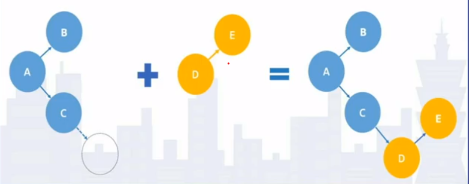
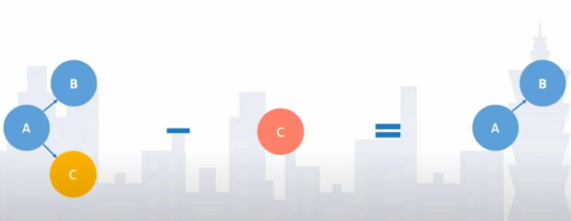
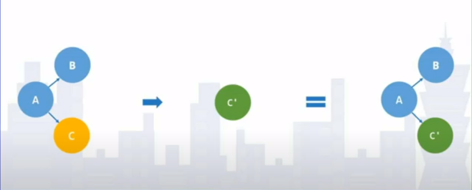

# Schematics 入门

> 本来没有打算这节内容，但是考虑到项目中会使用到一些自定义 Schematics。

`Angular 2+` 从问世以来，依赖 `Angular-Cli` 工具，当时有人吐槽它难用，现在它是真香，里面有几个独立的可以完全和 `Angular` 没有关系的功能，`ng_packagr`、`Schematics` 和 `Dgeni`。

[ng_packagr](https://github.com/ng-packagr/ng-packagr) 是一个第三方开源的 `ts` 专用库打包工具。一开始作者只是为了 `Angular` 库服务，`Angular 6` 以后被集成到 `Angular-Cli` ，成为`Angular-Cli` 的标准库打包工具，这点可以搜索 github ，大部分 `Angular 6` 以后标准生态库都是依靠 `ng_packagr` 打包。它冠名了 `ng`， 很多人以为只能打包 `Angular` 库，其实不是的，它还可以打包`React`（有专门的配置），当然 `Vue`、`sdk` 等任何 `ts` 库都可以完全可以的，这些需要你自己去集成而已，只需要你会点 `Nodejs` 知识即可。

[Dgeni](https://github.com/angular/dgeni) 是一个 Angular 开源的灵活的 JavaScript 文档生成器。Angular 官网和 Material 组件官网都是用它生成的。

我会会在[博客](https://github.com/jiayisheji/blog)分享 `ng_packagr` 和 `Dgeni` 使用技巧。

我们来介绍我们主角 `Schematics`（原理图）。

> `Schematics` 虽然比较厉害也不是万能，它主要是对文件操作，简单理解就是模板生成和自动化批处理，但是对文件细节操作并不是它的强项，比如写代码时，需要使用编辑器的 `snippets`。

需要技术储备：

1. 对文件处理 `Schematics` 为我们封装了文件处理方式，我们不需要去了解 `fs` 的 API，但是需要了解对 `path` 的 API 简单用法。

2. 对于 `*.ts` 文件 `Schematics` 有一种特殊的处理方式，这样我们可以实现很多看起来不可能的事情，需要你了解 `AST` ，不过对这个不熟悉也不要紧，笨办法，找到代码一点一点调试，就是麻烦点。

3. 对于非 `*.ts` 文件 `Schematics` 以普通字符串处理方式 如果是 `*.json` 你可以使用 `JSON.stringify()` 和 `JSON.parse()` 处理，其他的文件，如果你正则表达式不错，那很好，如果不行你只能用 `String` 方法去弄了。

4. 对你要编写的自定义模板有一定的了解，知道它们做什么，满足什么样的需求，这点很重要。

> **注意**：需要 `Node 6.9` 或以上版本

## 什么是 Schematics

`Schematics` 是现代Web的工作流程工具，它可以对我们的项目进行转换，例如创建一个新组件，或者更新项目的代码以修复依赖项中的破坏更改。再或者可能想向现有项目添加新的配置选项或框架。可以帮我们减少一些重复性劳动的工具，它可以协助我们创建一些模版代码，并且可以使用 Cli 进行创建一个模版的实例代码，并且添加到项目代码中。

对开发人员来说，以一种组织良好、定义良好的方式自动生成和更新代码库，听起来是多么开心的事情。在 `Schematics` 的帮助下，很多东西都是可能的。

> `Schematics` 强调一个词 `规范`。可以生成规范模板，你可能觉得`snippets`不是可以完成吗，但是你有想过`snippets`可以创建文件，重命名文件，移动文件，删除文件，动态更新已有规范文件的内容吗，`snippets`做不到。正所谓术业有专攻，`Schematics`专攻的是文件系统处理，`snippets`专攻的是代码提示和代码块生成。`Schematics`可以做代码块生成，但是灵活度没有`snippets`高。这些你有疑惑在接下的内容中都会涉及到。

`Schematics` 最早出现在 `Angular-Cli` 中，在 `Angular-Cli` 从创建项目骨架和生成模板文件都是靠 `Schematics` ，还有 `ng-add`、`ng-update` 也是借助它实现。

> 实际上，`Schematics` 的实现机制完全与 `Angular` 无关，其它项目也可以通过 `Schematics CLI` 来使用。我们现在用的 `Nx` 也是大量依靠 `Schematics` 来创建项目骨架和生成模板文件。

## 为什么会有 Schematics

一. 快速初始化项目骨架

在 `Angular`、`React`、`Vue` 等 `Cli` 还没有大火之前，有一个项目骨架生成工具 [Yeoman](https://yeoman.io)。它会生成各种项目骨架工程，主要用 [Gulp](https://gulpjs.com) 来自动化构建项目。到今天 [Webpack](https://webpack.js.org) 盛行，`Gulp` 虽然不及，但也有它存在的意义。

> 项目骨架最大特性之一是文件结构约定

二. 重复建立相同的文件模板

现在流行组件化，一个组件有特定的模板，比如：模板、样式和行为等内容。写一两个组件还行，如果是一个大型项目，几十上百个组件需要编写，单靠 CV工程师 操作肯定效率低下。

在我还不知道 `Schematics` 之前，我借助 `Nodejs` 的一些特性，比如命令行提示，模板引擎等操作去自动生成一些文件模板套件。

三. 统一团队项目架构与文档内容

我们项目会随着需求不断变化，会依赖各种 `Libs`，如果这些 `Libs` 有改动，比如一个组件，之前属性名为 `A`，后面升级为 `B`。这个我们可以用编辑器全局替换来处理，如果是一段代码了，这个就比较麻烦了。

四. 开发人员是懒惰的

一个懒惰的开发人员才能创新更多的效率工具。像我们用的工具，比如 `Yeoman`、`Gulp`、`Webpack`等。

`Schematics` 的任务是提高开发效率。我们需要一个更强大，更通用的工具来支持 `CLI` 脚手架，我们实现了以下四个主要目标：

1. **易于使用和开发**：对于开发人员来说，它必须具有简单直观的概念，并且感觉自然。此外，所开发的代码需要同步，以便更容易开发。

2. **可扩展性和可重用性**：通过考虑可重用性，我们能够设计一个简单但功能强大的可伸缩接口。可以将逻辑 `Schematics` 添加为其他逻辑 `Schematics` 的输入或输出。例如，可以使用组件和模块原理图创建应用程序。

3. **原子性**：我们在CLI蓝图中有许多错误，这些错误是我们蓝图产生的副作用的直接结果。当我们创建 `Schematics` 时，我们决定从代码中完全消除副作用。所有的更改都记录在内存中，只有在它们被重新确认为有效时才应用它们。例如，创建一个已经存在的文件是一个错误，并且将丢弃到目前为止应用的所有其他更改。

4. **异步**: 许多工作流程本质上是异步的（例如，访问Web服务器），因此 `Schematics` 必须支持这些用例。这似乎与使调试过程同步的第一个目标相矛盾，但是我们来到了一个使一切都能协同工作的设计。 `Schematics` 的输入是同步的，但输出可以是异步的，库将等待所有工作完成后才开始下一步。通过这种方式，开发人员可以重复使用，甚至无需知道`Schematics` 是异步的。

以上 4 个主要目标的所有 `Schematics` 设计思想。`Schematics` 目标是一个综合构建的工作流工具。

## 基本概念

在使用 `Schematics` 之前我们要先理解一些概念，我们会在下文中用到它们。

新增



删除



更新



1. **Schematics**：顾名思义，就是按照一系列的步骤来做完一些事情。一个 `Schematics` 就是对代码文件一系列操作的合集
2. **Collection**：一个 `Collection` 是数个 `Schematics` 合集，因此 `Collection` 又被称作 `Schematics Collection`
3. **Tool**：使用 `Schematics` 库的工具库
4. **Tree**：在 `Schematics` 中，`Tree` 将真实文件目录（项目中的代码文件）数据拷贝进一个树状结构里，你对代码文件的所有操作都会被缓存在 `Tree` 中，而不会对文件进行实时操作。你可以将它理解成一个沙盒。`Tree` 有两个部分，一个是 `base`（真实文件目录），一个是 `staging area`（沙盒），你的变动都会发生在 `staging area`，除非你写入了 `base` 部分。
5. **Rule**：一个 `Rule` 是一个方法。它获取一个 `Tree`，并返回经过改变的一个新的 `Tree`。因此我们对 `Tree` 的操作也基本上在 `Rule` 中发生。所以可以说，一个 `Schematic` 就是一个 `Rule`
6. **Source**：用来从真实文件目录创建 `Tree`
7. **Action**：对 `Tree` 的具体操作。 `Action` 是由 `Schematics` 创建的
8. **Sink**：所有 `Action` 的最终目的地

> 由此看来，一个 `Schematics` 工程由 `Collection` 组成，一个 `Collection` 中有若干个 `Schematics` ，每一个 `Schematics` 又会有若干个 `Rule` 去处理一个或多个 `Tree`。这些就是 `Schematics` 你需要了解的所有基本概念。

Tree 常见方法：

- `branch(): Tree`：复制当前 `Tree` 对象
- `merge(other: Tree, strategy?: MergeStrategy): void`：合并 2 个 `Tree`，可设定合并冲突时规则
- `read(path: string): Buffer | null`：读取文件内容以 `Buffer` 呈现
- `exists(path: string): boolean`：检查文件是否存在
- `create(path: string, content: Buffer | string): void`: 创建文件并填入内容
- `delete(path: string): void`：删除文件
- `visit(visitor: FileVisitor): void`：列出 `Tree` 下所有的文件
- `rename(from: string, to: string): void`：文件重命名
- `overwrite(path: string, content: Buffer | string): void`: 文件写入内容
- `beginUpdate(path: string): UpdateRecorder`：文件返回一个新的 `UpdateRecorder` 实例
- `commitUpdate(record: UpdateRecorder): void`：提交 `UpdateRecorder` 中的动作，简单理解就是更新指定文件内容

Source 常见方法：

- `empty()`：创建返回空 `Tree` 的 `Source`
- `source(tree: Tree): Source`：将 `Tree` 转换成 `Source`
- `url(url: string)`：从给定的URL加载文件列表，并返回一个`Tree`
- `apply(source: Source, rules: Rule[])`：套用 `Rule` 到 `Source` 上并返回已套用 `Rule` 的 `Source`
- `Source = (context: SchematicContext) => Tree`：将 `Source` 转换成 `Source`

Rule 常见方法：

```typescript
type Rule =  (tree: Tree, context: SchematicContext) => Tree | Observable<Tree> | Rule | void
```

定义改变 `Tree` 状态的规则，多个规则间可以合并

- `noop()`：按原样返回输入 `Rule`
- `chain(rules: Rule[])`：返回一个连接其他 `Rule` 的 `Rule`
- `forEach(op: FileOperator)`：返回一个 `Rule` ，该规则对输入 `Tree` 的每个文件应用操作符。
- `move(root: string)`：将所有文件从输入移动到子目录
- `merge(other: Tree)`：合并输入 `Tree` 和另一个 `Tree`
- `contentTemplate<T>(options: T)`：将内容模板(参见 Template 系统)应用于整个 `Tree`
- `pathTemplate<T>(options: T)`：将内容模板(参见 Template 系统)应用于整个 `Tree`
- `template<T>(options: T)`：将内容模板(参见 Template 系统)应用于整个 `Tree`
- `filter(predicate: FilePredicate<boolean>)`：返回输入 `Tree`，其中包含不传递 `FilePredicate` 的文件。

Template 系统：

一些函数基于文件模板系统，该系统由路径和内容模板组成

系统操作在文件中定义的占位符或在 `Tree` 中加载的文件路径，并使用传递到应用模板的 `Rule`中的值(即`template<T>(options: T)`)。

模板路径：

- `__variable__`：替换为 `variable` 的值
- `__variable@function__`： 替换为调用 `function(variable)` 的结果。可以链接到 `__variable@function1@function2__ `

模板语法：

- `<%= expression %>`：替换为调用给定表达式的结果。它只支持直接表达式，不支持`JavaScript` 代码。
- `<%- expression %>`： 和上面一样，但是结果的值会在插入时被转义为HTML(例如，用`&lt;`替换`<`)
- `<% inline code %>`：将给定代码插入到模板结构中，允许插入 `JavaScript` 代码
- `<%# text %>`： 注释

内置的模板变量方法：

内置的模板方法主要命名转换，提供使用的 `dasherize` 和 `decamelize` 等方法

> 更多模板变量: `node_modules\@angular-devkit\core\src\utils\strings.d.ts`

自己定义模板变量方法：

```ts
const utils = {
  // ...自定义方法
}

`applyTemplates({utils: utils})`
```

> `applyTemplates` 传递模板可以使用的变量方法并生成文件

## 安装和使用

`Schematics` 提供了一个 CLI

```bash
npm install -g @angular-devkit/schematics-cli
```

创建一个空白 `Schematics` 项目

```bash
schematics blank --name=schematics-name
```

创建一个复杂 `Schematics` 项目

```bash
schematics schematic --name=schematics-name
```

执行 `Schematics`

```bash
schematics .:schematics-name
```

安装 `Schematics` 到本地

```bash
npm install ../schematics-name
```

执行 `Schematics` 自定义模块

```bash
schematics schematics-name:schematics-name
```

在 `Angular-cli` 执行 `Schematics`

```bash
ng generate schematics-name:schematics-name
```

在 `Angular-cli` 设定预设 `Schematics`

```bash
ng config defaults.schematics.collection schematics-name
```

在 `Nx` 只需要安装 [Nx console](https://github.com/nrwl/nx-console) 即可

## Schematics 项目文件说明

我们不需要全局安装 `schematics-cli`，只需要本地安装即可：

```bash
npm install --save-dev @angular-devkit/schematics-cli
```

新建一个空白项目：

```bash
npx schematics blank --name=hello-world
```

就会在根目录生成一个文件夹 `hello-world`，我们把文件夹重命名为 `schematics`。

```bash
cd schematics && npm install
```

我们看一下目录结构：

```text
├─ package.json npm 包管理
├─ tsconfig.json tsc 编译配置
└─ src 源文件
    ├─ collection.json Collection 配置
    └─ hello-world schematics
        ├─ schema.json schema 配置
        ├─ schema.ts schema 接口类型
        └─ index.ts schematics 入口
```

我们来介绍几个重要的文件

collection.json

```json
{
  "$schema": "../node_modules/@angular-devkit/schematics/collection-schema.json",
  "schematics": {
    "hello-world": {
      "aliases": [   // 需要自己添加
        "helloWorld"
      ],
      "description": "A blank schematic.",
      "factory": "./hello-world/index#helloWorld",
      "schema": "./hello-world/schema.json" // 需要自己添加
    }
  }
}
```

> 空项目没有 `aliases` 和 `schema`

- $schema => 定义该 collection 架构的 url 地址.
- schematics => 这是你的 schematics 定义.
  - hello-world => 以后使用这个 schematics 的 cli 名称.
    - aliases => 别名.
    - factory => schematics 工厂的文件夹或文件路径
    - description => schematics 的描述
    - schema => schematics 的schema.json 文件的位置

schema.json

`JSON Schema` 是一种基于 `JSON` 格式定义 `JSON` 数据结构的规范。它被写在 `IETF` 草案下并于 `2011` 年到期。`JSON Schema`：

- 描述现有数据格式。
- 干净的人类和机器可读的文档。
- 完整的结构验证，有利于自动化测试。
- 完整的结构验证，可用于验证客户端提交的数据。

`JSON Schema` 最外层包含以下几个字段:

$schema | 描述 | 类型
---- | ---- | ----
$schema | $schema 关键字状态，表示这个模式与 v4 规范草案书写一致。| `string`
id | 标识 | `string`
title | 标题，用来描述结构 | `string`
description | 描述 | `string`
type | 类型 `object` | `string`
properties | 定义属性 | `{}`
required | 必需属性 | `string[]`

> `properties` 所有的定义都在这个属性里面

我们可以借助 [https://www.jsonschema.net](https://www.jsonschema.net/home) 工具来生成 `properties`，就像平常写 `json` 方便。

properties | 描述 | 类型
---- | ---- | ----
description | 描述 | `string`
type | 类型 | `string | boolean | array | number`
x-prompt | 输入提示 | `string`
alias | 属性别名 | `string`
enum | 提供可选的列表 | `string[]`
default | 默认值 | `any`
$default | 配置文件默认值 | `{}`
format | 格式化 | `path | html-selector`
x-deprecated | 不推荐使用 | `string`
items | 列表 | `{enum: string[], type: string}`
minItems | 最小列表 | `number`
uniqueItems | 唯一列表 | `boolean`

配置文件默认值：

- 获取项目名字

```json
$default {
  $source: "projectName"
}
```

- 获取输入参数

```json
$default {
  "$source": "argv",
  "index": 0
}
```

交互提示：

x-prompt

提示文字

```json
{
  "type": "string",
  "x-prompt": "输入提示",
  "$default": {
    "$source": "argv",
    "index": 0
  }
}
```

Y/N 选择

```json
{
  "type": "boolean",
  "x-prompt": "输入 Y/N 选择"
}
```

列表选择

```json
{
  "type": "string",
  "x-prompt": {
    "message": "列表选择",
    "type": "list",
    "items": [
      { "value": "css",  "label": "CSS" },
      { "value": "scss", "label": "SCSS   [ https://sass-lang.com/documentation/syntax#scss                ]" },
      { "value": "sass", "label": "Sass   [ https://sass-lang.com/documentation/syntax#the-indented-syntax ]" },
      { "value": "less", "label": "Less   [ http://lesscss.org                                             ]" },
      { "value": "styl", "label": "Stylus [ http://stylus-lang.com                                         ]" }
    ]
  }
}
```

下一篇我们开始实战
