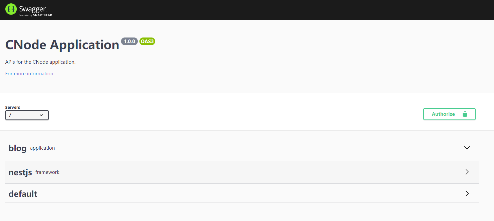
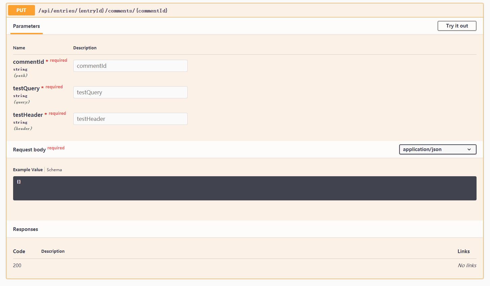
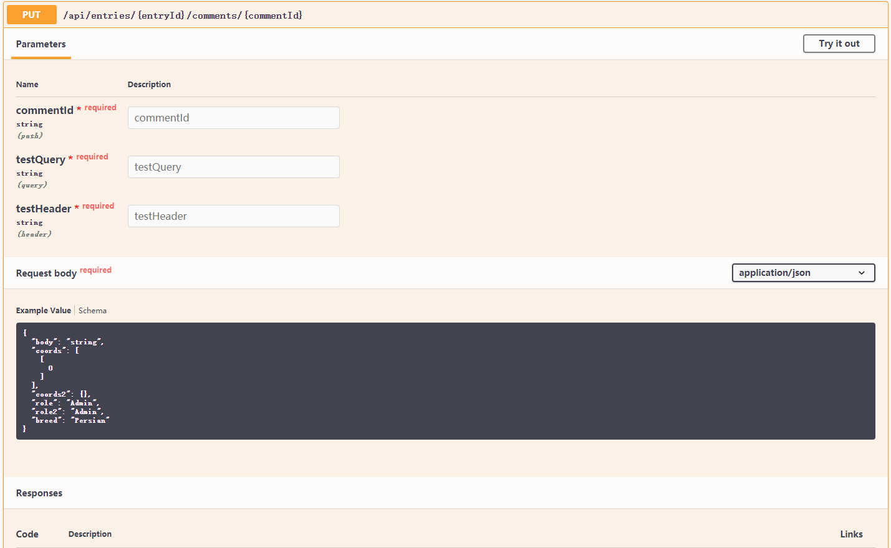
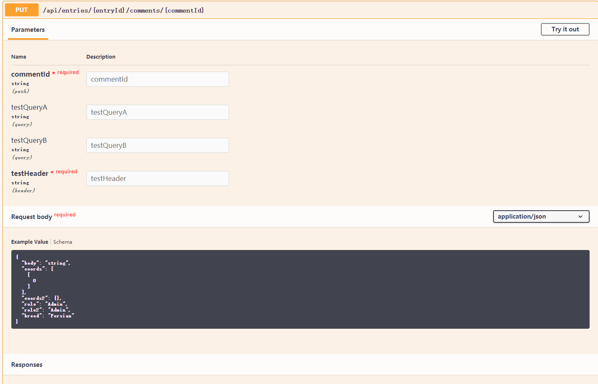
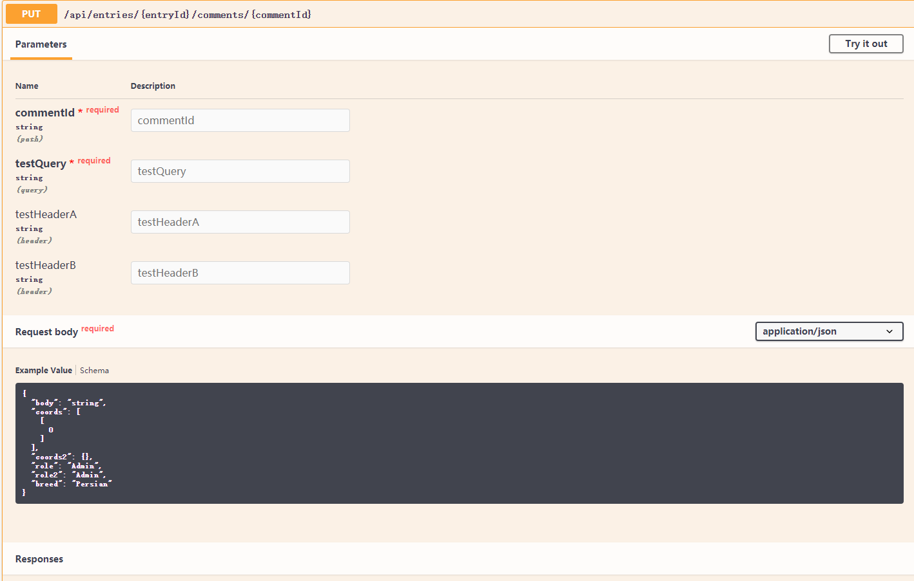
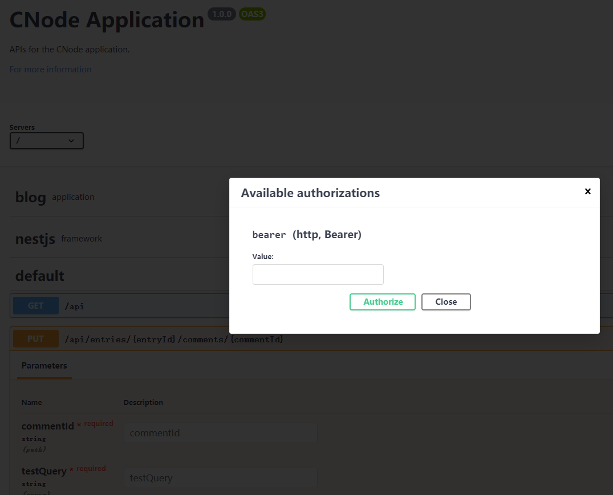
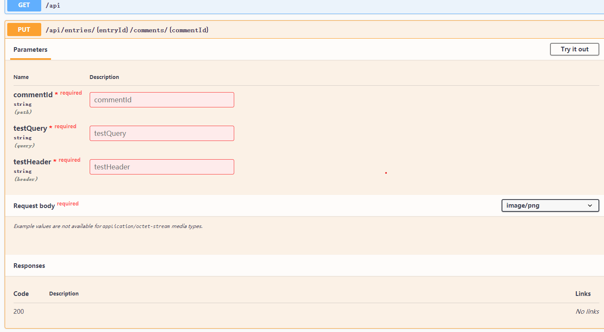
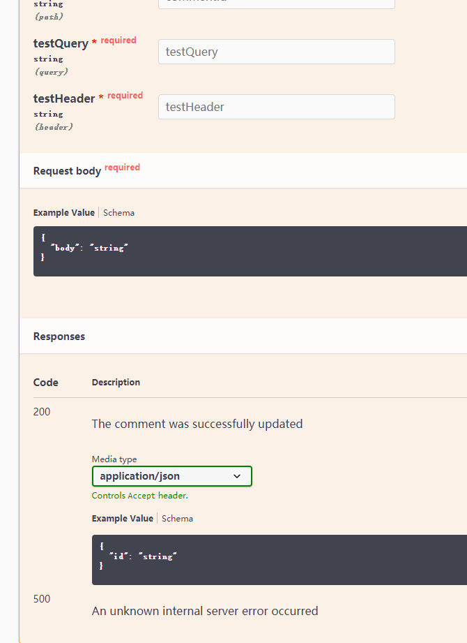
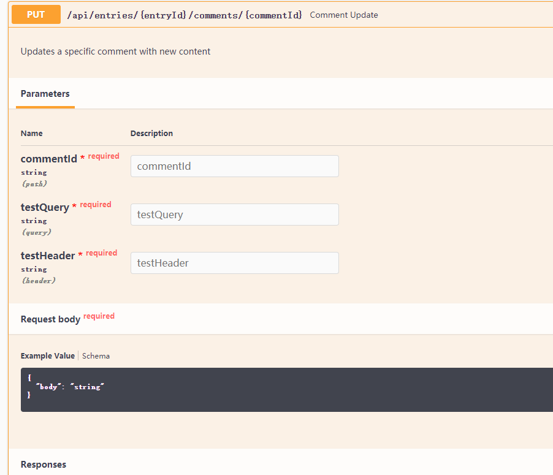
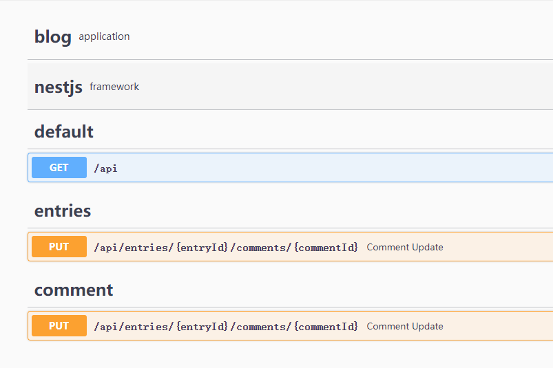

# OpenAPI (Swagger)

`OpenAPI` 规范（以前最著名的名称是[Swagger](https://swagger.io)）是一种`JSON`模式，可用于构造一组静态`API`的`JSON`或`YAML`定义。 `OpenAPI`本身与语言无关，这意味着可以使用开发人员想要的任何工具或框架以任何语言构造基础`API`。 `OpenAPI`文档的唯一关注点是描述`API`端点的输入和输出。在这方面，`OpenAPI`文档充当文档工具，使开发人员能够以众所周知，理解和支持的格式轻松描述其公共API。

但是，`OpenAPI`文档不仅限于文档。 已经开发了许多工具，这些工具能够使用`OpenAPI`文档自动生成客户端项目，服务器存根，用于直观检查`OpenAPI`文档的API资源管理器UI，甚至服务器生成器。 开发人员可以在[https://swagger.io](https://swagger.io)上找到`Swagger Editor`，`Codegen`和`UI`等工具。

尽管存在一些生成`OpenAPI`文档的工具，但许多开发人员都将这些文档维护为单独的`JSON`或`YAML`文件。他们可以使用`OpenAPI`参考机制将文档分解为较小的部分。 在`Nest.js`中，开发人员可以使用一个单独的模块来为其应用程序生成`OpenAPI`文档。`Nest.js`会使用您在控制器中提供的装饰器来生成尽可能多的有关项目内API的信息，而不是手动编写`OpenAPI`文档。 当然，它并不能提供所有可用的功能。为此，`Nest.js`专门提供了`swagger`模块附带很多用于用于生成文档的装饰器，我们可以使用它们来填补空白。

我们将探索使用`Nest.js`的`Swagger`模块（目前最新版本4.x）。我们将从配置`Nest.js`的`Swagger`模块开始。我们将设置我们的博客示例应用程序，以使用`Swagger UI`公开`swagger`文档，并开始探索您惯常使用的`Nest.js`装饰器如何影响`swagger`文档。我们还将探索`swagger`模块提供的各种有趣装饰器。让你完全了解`Nest.js`如何生成庞大的文档。

`Nest.js`一直不断完善`OpenAPI`功能，现在`OpenAPI`单独为一个菜单[文档](https://docs.nestjs.com/openapi/introduction)。

在开始之前，我们先安装依赖：

```bash
npm install @nestjs/swagger swagger-ui-express --save
```

## Document Settings

每个`Swagger`文档都包含一组基本属性，例如应用程序的标题。可以使用`DocumentBuilder`类上的各种公共方法来配置此信息。这些方法都返回文档实例，允许根据需要链式许多方法。在调用`build`方法之前，请确保完成配置。一旦调用了`build`方法，就不能再修改文档设置。

```ts
const swaggerOptions = new DocumentBuilder()
    .setTitle('Blog Application')
    .setDescription('APIs for the example blog application.')
    .setVersion('1.0.0')
    .setTermsOfService('http://swagger.io/terms/')
    .setContact('jiayi', 'https//github.com/jiayisheji', 'jiayi@example.com')
    .setLicense('Apache 2.0', 'http://www.apache.org/licenses/LICENSE-2.0.html')
    .build();
```

这些方法用于配置`Swagger`文档的`info`部分。 `swagger`规范要求提供`title`和`version`字段，但是`Nest.js`会将这些值分别默认为`""`和`1.0.0`。 如果项目具有服务条款和许可证，则可以使用`setTermsOfService`和`setLicense`为应用程序中的那些资源提供URL。可以使用`setContact`设置联系人。

`Swagger`文档还可以包含服务器信息。用户，开发人员和UI可以使用此信息来了解如何访问文档描述的API。

```ts
const swaggerOptions = new DocumentBuilder()
  .addServer('http://')
  .build();
```

`swagger`规范使用`addServer`来描述API使用的传输协议。尽管`swagger`规范支持`ws`和`wss`协议以及多个值，但`Nest.js`将该值限制为`http`或`https`。还可以添加元数据和外部文档，以向`swagger`文档的用户提供有关API如何有效。

```ts
const swaggerOptions = new DocumentBuilder()
  .setExternalDoc('For more information', 'http://swagger.io')
  .addTag('blog', 'application')
  .addTag('nestjs', 'framework')
  .build();
```

使用`setExternalDoc`的第一个参数描述外部文档，并使用文档的URL作为第二个参数。 可以使用`addTag`将无数个标签添加到文档中。唯一的要求是`addTag`的第一个参数必须唯一。 第二个参数应描述标签。最后一个文档设置是用户如何通过API进行身份验证。

`swagger`规范支持三种身份验证类型：

- [basic](https://swagger.io/docs/specification/authentication/basic-authentication/)
- [bearer](https://swagger.io/docs/specification/authentication/bearer-authentication/)
- [API key](https://swagger.io/docs/specification/authentication/api-keys/)
- [cookie](https://swagger.io/docs/specification/authentication/cookie-authentication/)
- [Oauth2](https://swagger.io/docs/specification/authentication/oauth2/)

`Nest.js`提供了几种不同的方法，可用于自动配置`swagger`文档身份验证信息，并可能会覆盖某些设置。请记住，这是在描述用户如何对应用程序进行身份验证。

```ts
const swaggerOptions = new DocumentBuilder()
  .addBearerAuth()
  .build();
```

如果应用程序使用基本身份验证，用户名和密码作为base64编码的字符串或`JSON Web Token`（JWT），则将使用`addBearerAuth`配置方法。上面的示例使用默认值（如果未传递任何参数），则`Nest.js`将使用默认值，并确定API使用`headers`的属性`Authorization`的API密钥（如JWT）。我们项目就使用这种方式。

`Nest.js`提供三种对应方法：

- addBasicAuth()
- addApiKey()
- addCookieAuth()
- addOAuth2()

> 验证方法内部都是使用`addSecurity()`实现，如果上述快捷方法，无法满足我们的需求，我们可以使用它来扩展。

以上所有的方法都接受一个主要配置参数，`options?: SecuritySchemeObject`，具体每个参数意思可以参考`Swagger`文档。

`addOAuth2`方法的第一个参数是API用于身份验证的[OAuth2 flows](https://swagger.io/docs/specification/authentication/oauth2/):

- authorizationCode- 授权码流程（以前accessCode在OpenAPI 2.0中调用）
- implicit - 隐式流
- password - 资源所有者密码流
- clientCredentials- 客户端凭证流程（以前application在OpenAPI 2.0中调用）

注意：该`flows`对象可以指定多个流程，但每个类型只能有一个。

每个流程都包含以下信息：

- authorizationUrl 用于此流的授权URL。可以是相对于API服务器的URL。
- tokenUrl 用于此流程的令牌URL。可以是相对于API服务器的URL。
- refreshUrl 可选的。用于获取刷新令牌的URL。可以是相对于API服务器的URL。
- scopes OAuth2安全方案的可用范围。范围名称和简短描述之间的映射。

对于我们应用程序，将使配置保持简单，并将配置存储在`core/setup/swagger/options.ts`的文件中。具有中心位置将使我们一次编写配置并实现多次。

```ts
export const swaggerOptions = new DocumentBuilder()
  .setTitle('CNode Application')
  .setDescription('APIs for the CNode application.')
  .setVersion('1.0.0')
  .addServer('/')
  .setExternalDoc('For more information', 'http://swagger.io')
  .addTag('blog', 'application')
  .addTag('nestjs', 'framework')
  .addBearerAuth()
  .build();
```

## Swagger UI

`Swagger`模块不同于大多数其他`Nest.js`模块。无需将导入到应用程序的主应用程序模块(AppModule)中，而是在应用程序的主引导程序`bootstrap()`中配置`swagger`模块。

```ts
import { INestApplication } from '@nestjs/common';
import { SwaggerModule } from '@nestjs/swagger';

async function bootstrap() {
  const app = await NestFactory.create(AppModule);
  const document = SwaggerModule.createDocument(app, swaggerOptions);
  SwaggerModule.setup('/swagger', app, document);
  await app.listen(process.env.PORT || 3000);
}
```

在声明`Nest`应用程序之后，在调用`listen`方法之前，我们使用在前面配置的`swagger`文档选项和`SwaggerModule`.`createDocument`创建`swagger`文档。`swagger`模块将检查应用程序内的所有控制器，并使用装饰器在内存中构造`swagger`文档。

一旦创建了`swagger`文档，我们将设置并指示`swagger`模块在指定路径`SwaggerModule.setup('/swagger', app, document)`中提供`swagger UI`。在后台，`swagger`模块利用`swagger-ui-express` `NodeJS`模块将`swagger`文档转换为完整的`Web UI`应用程序。

```bash
npm run serve server
```



上图显示了使用示例我们应用程序的基本`Swagger UI`应用程序。通过将json附加到我们为UI配置的路径中，也可以使用用于生成UI的JSON。在我们的示例中，访问`http://localhost:3333/swagger`将返回`swagger`文档。 可以与`Swagger Codegen`等代码生成器一起使用。 有关`Swagger UI`和`Swagger Codegen`的更多信息，请参阅[https://swagger.io](https://swagger.io)。

> 访问 [http://localhost:3333/swagger-json](http://localhost:3333/swagger-json) 可以得到当前 `swagger.json`, 拿到这个 json 文件做一些其他事情， 比如 Angular 的接口服务，自动生成响应式表单配置等。

## API input decorators

`Nest.js swagger`模块可以使用`@Body`，`@Param`，`@Query`和`@Headers`装饰器生成一个`swagger`文档。 但是，取决于编写API控制器的方式，`swagger`文档可能包含的信息很少。 `swagger`模块将使用与修饰参数关联的类型来描述API在`swagger`文档中期望的参数。 为了描述这一点，我们将修改注释PUT API以使用所有四个装饰器，并通过查看`swagger UI`应用程序来显示这如何影响`swagger`文档。

我们写个测试 `Comment` 的控制器，现在并没有深入的讲解，我们先简单写个控制器：

app.controller.ts

```ts
@Controller('entries/:entryId')
export class CommentController {
  @Put('comments/:commentId') public async update(
    @Body() body: UpdateCommentDto,
    @Param('commentId') comment: string,
    @Query('testQuery') testQuery: string,
    @Headers('testHeader') testHeader: string,
  ) {}
}
```



从示例中，我们可以看到此API卡片的标题使用`@Controller`和`@Put`装饰器的组合来构造API的路径。参数部分是使用`@Body`，`@Param`，`@Query`和`@Headers`查询参数构建的。`Swagger UI`中使用了我们提供给修饰参数的类型，以提示用户有关参数的期望。

点击`Try it out`按钮，会将卡片更改为一组可输入状态。这允许用户填写API的必需参数和可选参数，并执行API调用。稍后我们将介绍API卡的其余部分。 现在，让我们详细介绍一下基本参数修饰符。

### @Body

或许你可能已经在我们的示例中注意到，用`@Body`装饰的参数的类型为`UpdateCommentDto`。我们应用程序还没有具体实现此类。

```ts
class UpdateCommentDto {
  @ApiProperty()
  body?: string;
}
```

`UpdateCommentDto` 是一个普通的`class`，使用`@ApiPropertyOptional()`装饰器通知swagger模块，`UpdateCommentDto`类的`body`属性是可选属性，可以在调用API时将其包含在`Request body`中。该装饰器实际上是`@ApiProperty`装饰器的快捷方式。我们可以将请求类编写为：

```ts
class UpdateCommentDto {
  @ApiProperty({ required: false })
  body?: string;
}
```

但是，如果属性是可选的，请使用`@ApiPropertyOptional()`装饰器为自己节省一些输入。两个装饰器都可以在传递给装饰器的对象中采用几个其他属性，这些属性将进一步定义`Request body`的数据模型。

`@ApiProperty()`装饰器允许设置各种[schemaObject](https://swagger.io/specification/#schemaObject)属性：

- name: 属性key，默认和装饰属性字段保持一致，一旦修改，接受的`Request body`的值也被修改。
- description: 描述，一个字符串，可用于描述model属性应包含的内容或用途。
- required：一个布尔值，指示是否需要model属性。这仅适用于`@ApiProperty()`装饰器。
- type: `@nestjs/swagger`将使用与model属性关联的类型，或者可以将类型作为任何字符串或类值传递。如果使用`isArray`属性，则也应使用type属性。 此属性还可用于传递swagger规范中定义的任何数据类型。
  - 基本类型，请使用包装对象，`String`、`Number`、`Boolean`
  - 对象类型，请使用`class`，`UserDto`
  - 数组类型，请使用数组字面量，`[String]`、`[UserDto]`，一定要设置`isArray`为`true`
  - 循环依赖，当类之间具有循环依赖关系时，请使用惰性函数为`SwaggerModule`提供类型信息：`() => Node`
- isArray：一个布尔值，指示model属性是否应采用数组值。 如果model确实采用数组值，请确保将此值包含在装饰器中，否则`@nestjs/swagger`将不知道将model属性表示为数组。
- default：用于swagger文档中的model属性的默认值。`Swagger UI`中提供的示例还将使用此值。此值的类型将取决于model属性的类型，但可以是字符串，数字甚至对象。**注意**：这个默认值是描述提示，不是实际的class属性的默认值。
- enum: 如果model属性类型是枚举，请使用此属性将相同的枚举传递给装饰器，以便`@nestjs/swagger`可以将这些枚举值注入到swagger文档中。**注意**：enum 和 Typescript 的 enum 有差别，实际接受的一个数组类型。Typescript 的 enum 可以直接使用，但是需要是字符串enum，如果是数字enum，依旧会显示字符串数组。
- enumName：一个字符串，枚举标识，mode属性使`@nestjs/swagger`能够将enum转换为其自己的架构，从而使enum枚举可重用。
- format: 如果将type属性与swagger规范中描述的数据类型一起使用，则可能还需要传递该数据类型的格式。例如，一个具有多个精度点的数字，小数点后的值，类型为整数但格式可以为`float`或`double`的字段。除此之外还支持：`int32`、`int64`、`byte`、`binary`、`date`、`date-time`、`password`、`uuid`、`email`。
- pattern: 包含JavaScript兼容正则表达式的字符串。在model属性中传递的值应与正则表达式匹配以有效。仅在mode属性类型为字符串或提供给装饰器的类型为字符串的情况下，在装饰器中设置此属性才有效。
- multipleOf：一个数字，指示使用模数运算符在mode属性中传递的值的余数应为零。仅在mode属性类型为数字或提供给装饰器的类型为整数的情况下，在装饰器中设置此属性才有效。
- maximum：一个数字，指示在mode属性中传递的值应小于或等于给定值才有效。仅在mode属性类型为数字或提供给装饰器的类型为整数的情况下，在装饰器中设置此属性才有效。 此属性不应与`exclusiveMaximum`一起使用。
- minimum: 一个数字，指示在model属性中传递的值应大于或等于给定值才有效。 仅在model属性类型为数字或提供给装饰器的类型为整数的情况下，在装饰器中设置此属性才有效。 此属性不应与`exclusiveMinimum`一起使用。
- exclusiveMaximum：一个数字，指示在model属性中传递的值应小于给定值才有效。 仅在model属性类型为数字或提供给装饰器的类型为整数的情况下，在装饰器中设置此属性才有效。 此属性不应与`maximum`一起使用。
- exclusiveMinimum：一个数字，指示在model属性中传递的值应小于给定值才有效。 仅在model属性类型为数字或提供给装饰器的类型为整数的情况下，在装饰器中设置此属性才有效。 此属性不应与`minimum`一起使用。
- maxLength：一个数字，指示在model属性中传递的值的字符长度应小于或等于给定值，以使其有效。 仅在model属性类型为字符串或提供给装饰器的类型为字符串的情况下，在装饰器中设置此属性才有效。
- minLength：一个数字，指示在model属性中传递的值的字符长度必须大于或等于给定值才有效。 仅在model属性类型为字符串或提供给装饰器的类型为字符串的情况下，在装饰器中设置此属性才有效。
- items：一个对象，指示在model属性设置嵌套数组类型，仅在`isArray`的值为`true`时，在装饰器中设置此属性才有效。
- maxItems：一个数字，指示在model属性中传递的值应小于或等于给定值的数组长度有效。仅在`isArray`的值为`true`时，在装饰器中设置此属性才有效。
- minItems：一个数字，指示在model属性中传递的值应大于或等于给定值的数组长度才有效。仅在`isArray`的值为`true`时，在装饰器中设置此属性才有效。
- uniqueItems：一个数字，指示在model属性中传递的值应包含一组唯一的数组值。 仅在`isArray`的值为`true`时，在装饰器中设置此属性才有效。
- properties：一个对象，指示在model属性设置嵌套对象类型，仅在`type`的值为`object`时，在装饰器中设置此属性才有效。
- maxProperties：一个数字，指示在model属性中传递的值应包含多个小于或等于给定值的有效属性。仅在model属性类型是`class`或 `object`时，在装饰器中设置此属性才有效。
- minProperties：一个数字，指示在model属性中传递的值应包含多个等于或大于给定值的有效属性。仅在model属性类型是`class`或 `object`时，在装饰器中设置此属性才有效。
- readOnly：一个布尔值，指示mode属性可以在API响应主体中发送，但不应在请求主体中提供。如果将使用相同的数据mode类来表示API的请求和响应主体，请使用此方法。
- xml：包含XML的字符串，代表模型属性的格式。 仅当model属性包含XML时使用。
- example: 一个字符串，要放置在swagger文档中的示例值。该值还将在`Swagger UI`提供的示例中使用，并且优先于默认的decorator属性值。
- examples：一个数组，要放置更多在swagger文档中的示例值。
- deprecated：一个布尔值，指示mode属性被废弃。

用`@Body`装饰器装饰的属性应始终具有作为类的类型。 Typescript接口无法修饰，并且不能提供带有修饰符的类可以提供的相同元数据。 如果在您的应用程序中，任何API都具有@Body装饰器和接口类型的属性，则`@nestjs/swagger`将无法正确创建swagger文档。 实际上，`Swagger UI`很可能会注意到根本显示了body参数。

正常情况下使用`@Body`装饰器和`Dto`配合`@ApiProperty()`装饰器可以实现我们绝大部分业务场景，有时候有些奇葩的需求：

```ts
createBulk(@Body() usersDto: CreateUserDto[]){}
```

这种情况下`@nestjs/swagger`不认识，我们需要使用：`@ApiBody`装饰器来描述类型。

```ts
@ApiBody({ type: [CreateUserDto] })
createBulk(@Body() usersDto: CreateUserDto[])
```

> 因为不是很常用，所有没有太多提及，大家了解一下即可。

### @Param

在我们的示例中，`@Param`装饰器包含一个字符串值，该字符串值指示将哪个URL参数用作我们的控制器方法的comment参数。 当`@nestjs/swagger`遇到带有提供的字符串的装饰器时，它可以确定URL参数的名称，并将其连同为方法参数提供的类型一起包含在swagger文档中。但是，我们也可以编写控制器方法而无需将字符串传递给`@Param`装饰器来获取包含所有URL参数的对象。 如果执行此操作，则仅当我们使用类作为注释参数的类型或使用由`@nestjs/swagger`提供控制器方法的`@ApiParam`装饰器提供的URL时，Nest.js才能确定URL参数的名称和类型。让我们创建一个新类描述我们的URL参数，并查看它如何影响swagger UI。

```ts
export class UpdateCommentParams {
  @ApiProperty()
  entryId: string;
  @ApiProperty()
  commentId: string;
}
```

在`UpdateCommentParams`类中，我们创建了一个属性，并使用了`@ApiProperty`，因此`@nestjs/swagger`知道将属性及其类型包含在swagger文档中。 不要尝试将entryId拆分为自己的类并对其进行扩展，因为`@nestjs/swagger`将无法提取扩展类的属性。 同样重要的是，类中使用的属性的名称必须与`@Controller`和`@Put`装饰器中使用的名称相匹配。我们可以更改注释以使用新类。

```ts
@Put('comments/:commentId')
async update(
  @Body() body: UpdateCommentDto,
  @Param() params: UpdateCommentParams,
  @Query('testQuery') testQuery: string,
  @Headers('testHeader') testHeader: string,
) {}
```

我们更改了控制器，以便将所有路径参数作为对象提供给控制器方法的params参数。



`Swagger UI`的用户界面已更新，以显示comment放置API带有两个必需的URL参数：`entryId`和`commentId`。如果要编写在控制器方法中使用单个参数来保存所有URL参数的API，那么通知`@nestjs/swagger`的首选方法就是将URL作为参数。使用类作为URL参数的类型不仅可以将URL参数通知给`@nestjs/swagger`，而且还可以通过提供类型检查和代码自动完成来帮助编写应用程序。

但是，如果不想使新类用作URL参数的类型，请使用一个接口，或者一个或多个URL参数位于Nest.js守卫，中间件或自定义装饰器，但不在控制器方法中。仍然可以使用`@ApiParam`装饰器将URL参数通知`@nestjs/swagger`。

```ts
@Put('comments/:commentId')
@ApiParam({ name: 'entryId' })
async update(
  @Body() body: UpdateCommentDto,
  @Param('commentId') comment: string,
  @Query('testQuery') testQuery: string,
  @Headers('testHeader') testHeader: string,
) {}
```

如果需要路径参数才能到达控制器方法，但控制器方法未专门使用该参数，则除非使用`@ApiParam`装饰器装饰控制器方法，否则`@nestjs/swagger`不会将其包含在swagger文档中。对于达到控制器方法所必需的每个路径参数，请使用一次装饰器，但控制器本身未使用该装饰器。

```ts
@Put('comments/:commentId')
@ApiParam({ name: 'entryId' })
@ApiParam({ name: 'commentId' })
async update(
  @Body() body: UpdateCommentDto,
  @Query('testQuery') testQuery: string,
  @Headers('testHeader') testHeader: string,
) {}
```

例如，上述控制器是comment控制器的一部分，需要两个路径参数：entryId和commentId。 由于控制器的方法参数中不包含任何`@Param`装饰器，因此`@ApiParam`用于描述两个路径参数。

`@ApiParam`装饰器可以在传递给装饰器的对象中采用几个其他属性，这些属性将进一步在swagger文档中定义URL参数:

- name：包含URL参数名称的字符串。 此装饰器属性是唯一必填的属性。
- description：一个字符串，可用于描述URL参数应包含的内容或其用途。
- required：一个布尔值，指示是否需要URL参数
- type：一个字符串，其中包含swagger规范中定义的一种类型。不应使用`class`或 `object`。
- enum：参照`@ApiProperty()`的`enum`
- enumName：参照`@ApiProperty()`的`enumName`

### @Query

在我们的示例中，`@Query`装饰器包含一个字符串值，该字符串值指示将哪个查询参数用于我们的控制器方法的testQuery参数。 当`@nestjs/swagger`使用提供的字符串遇到此修饰符时，它可以确定查询参数的名称，并将其连同为方法参数提供的类型一起包含在swagger文档中。但是，我们也可以编写控制器方法而无需将字符串传递给`@Query`装饰器来获取包含所有查询参数的对象。 如果执行此操作，则只有在我们使用类作为testQuery参数的类型或使用由`@nestjs/swagger`提供控制器方法的`@ApiQuery`装饰器时，Nest.js才能确定查询参数的名称和类型。让我们创建一个新类描述我们的查询参数，并查看它如何影响Swagger UI。

```ts
export class UpdateCommentQuery {
  @ApiPropertyOptional()
  testQueryA: string;
  @ApiPropertyOptional()
  testQueryB: string;
}
```

在UpdateCommentQuery类中，我们创建了两个属性，并使用了`@ApiPropertyOptional`装饰器，因此`@nestjs/swagger`知道将这些属性及其类型包含在swagger文档中。我们可以更改comment，并使用控制器方法来使用新类。

```ts
@Put('comments/:commentId')
async update(
  @Body() body: UpdateCommentDto,
  @Param('commentId') comment: string,
  @Query() queryParameters: UpdateCommentQuery,
  @Headers('testHeader') testHeader: string,
) {
}
```

我们更改了控制器，以便将所有查询参数作为对象提供给控制器方法的queryParameters参数。



`Swagger UI`已更新，为comment显示具有两个可选查询参数：testQueryA和testQueryB。 如果要编写将在控制器方法中使用单个参数来保存所有查询参数的API，则这应该是通知希望将`@nestjs/swagger`用作查询参数的首选方法。使用类作为查询参数的类型不仅可以将查询参数告知`@nestjs/swagger`，而且还可以通过提供类型检查和代码自动完成来帮助编写应用程序。

但是，如果不希望使新类用作查询参数的类型，请使用接口，或者在自定义装饰器的Nest.js守卫或中间件中使用查询参数，但不要需要在控制器方法上。仍然可以使用`@ApiQuery`装饰器将有关查询参数的信息告知`@nestjs/swagger`。

```ts
@Put('comments/:commentId')
@ApiQuery({ name: 'testQueryA' })
@ApiQuery({ name: 'testQueryB' })
async update(
  @Param('commentId') comment: string,
  @Body() body: UpdateCommentDto,
  @Query() testQuery: any,
  @Headers('testHeader') testHeader: string,
) {}
```

如果需要查询参数才能到达控制器方法，但是控制器方法没有专门使用该查询参数，则除非使用`@ApiQuery`装饰器装饰了控制器方法，否则`@nestjs/swagger`不会将其包含在swagger文档中。对于到达控制器方法所必需的每个查询参数，请使用一次修饰符，但在控制器本身中不使用该修饰符。

```ts
@Put('comments/:commentId')
@ApiQuery({ name: 'testQueryA' })
@ApiQuery({ name: 'testQueryB' })
async update(
  @Param('commentId') comment: string,
  @Body() body: UpdateCommentDto,
  @Headers('testHeader') testHeader: string
) {}
```

例如，上述控制器需要两个查询参数：testQueryA和testQueryB。 由于控制器的方法参数中不包含任何`@Query`装饰器，因此`@ApiQuery`用于描述两个查询参数。

`@ApiQuery`装饰器可以在传递给装饰器的对象中采用几个其他属性，这些属性将进一步在swagger文档中定义查询参数：

- name：包含查询参数名称的字符串。此装饰器属性是唯一需要的属性。
- description：一个字符串，可用于描述查询参数应包含的内容或用途。
- required：一个布尔值，指示是否需要查询参数。
- type：一个字符串，其中包含swagger规范中定义的一种类型。不应使用`class`或 `object`。
- isArray：一个布尔值，指示模型属性是否应采用值数组。如果模型确实采用值数组，请确保将此值包含在装饰器中，否则`@nestjs/swagger`将不知道将模型属性表示为数组。
- enum：参照`@ApiProperty()`的`enum`
- enumName：参照`@ApiProperty()`的`enumName`

### @Headers

在我们的示例中，`@Headers`装饰器包含一个字符串值，该字符串值指示将哪个请求头信息值用于控制器方法的testHeader参数。 当`@nestjs/swagger`遇到带有提供的字符串的装饰器时，它可以确定请求头信息的名称，并将其连同为方法参数提供的类型一起包含在swagger文档中。但是，我们也可以编写控制器方法而无需将字符串传递给`@Headers`装饰器来获取包含所有请求头信息的对象。如果执行此操作，则仅当我们使用类作为testHeader参数的类型或使用由`@nestjs/swagger`提供控制器方法的`@ApiHeader`装饰器时，Nest.js才能确定请求头信息的名称和类型。让我们创建一个新类描述我们的请求头信息，并查看它如何影响swagger UI。

```ts
export class UpdateCommentHeaders {
  @ApiPropertyOptional()
  testHeaderA: string;
  @ApiPropertyOptional()
  testHeaderB: string;
}
```

在UpdateCommentHeaders类中，我们创建了两个属性，并使用了`@ApiPropertyOptional()`装饰器，因此`@nestjs/swagger`知道将这些属性及其类型包含在swagger文档中。我们可以将comment放置控制器方法更改为使用新类。

```ts
@Put('comments/:commentId')
async update(
  @Body() body: UpdateCommentDto,
  @Param('commentId') comment: string,
  @Query('testQuery') testQuery: string,
  @Headers() headers: UpdateCommentHeaders,
) {}
```

我们已经更改了控制器，以便将控制器期望的所有请求参数作为对象提供给控制器方法的headers参数。



`Swagger UI`已更新，为comment放置API需要两个头信息：testHeaderA和testHeaderB。如果要编写API，该API将在方法控制器中使用单个参数来保存所有预期的头信息，那么这应该是通知`@nestjs/swagger`期望用作查询参数的首选方法。使用类作为预期头信息的类型不仅可以将标题告知`@nestjs/swagger`，还可以通过提供类型检查和代码自动完成来帮助编写应用程序。

但是，如果不希望使新类用作期望的头信息的类型，请使用接口，或者请求头用于Nest.js守卫或中间件或自定义装饰器中，而不是用于控制器方法。仍然可以使用`@ApiHeader`或`@ApiHeaders`装饰器将有关查询参数的信息告知`@nestjs/swagger`。

```ts
@Put('comments/:commentId')
@ApiHeader({ name: 'testHeaderB' })
@ApiHeader({ name: 'testHeaderA' })
async update(
  @Body() body: UpdateCommentDto,
  @Param('commentId') comment: string,
  @Query('testQuery') testQuery: string
) {}
```

```ts
@Put('comments/:commentId')
@ApiHeaders([
  { name: 'testHeaderA' },
  { name: 'testHeaderB' }
])
async update(
  @Body() body: UpdateCommentDto,
  @Param('commentId') comment: string,
  @Query('testQuery') testQuery: string
) {}
```

例如，上述控制器需要两个头信息：testHeaderA和testHeaderB。 由于控制器在方法参数中不包含和`@Headers`装饰器，因此使用`@ApiHeader`或`@ApiHeaders`来描述两个头信息。

`@ApiHeader`或`@ApiHeaders`装饰器可以分别在对象或对象数组中采用几个其他属性，这些属性传递给装饰器，这些属性将进一步在swagger文档中定义查询参数:

- name：包含头信息名称的字符串。 此装饰器属性是唯一需要的属性。
- description：一个字符串，可用于描述标题应包含的内容或标题的用途。
- required：一个布尔值，指示是否需要标题。
- enum：参照`@ApiProperty()`的`enum`

> 注意：`@ApiHeaders`装饰器只是多次使用`@ApiHeader`装饰器的快捷方式。如果需要描述多个标题，请使用`@ApiHeaders`。另外，您不应使用这些头信息来描述身份验证机制。还有其他装饰。

### Authentication

在某个时候，很有可能需要在应用程序中进行某种形式的身份验证。我们应用程序使用用户名和密码组合来验证用户身份，并提供`JSON Web Token`以允许用户访问API。但是，尽管您决定设置身份验证，但可以肯定的是：您将需要查询参数或标头来维持身份验证状态，并且很可能会使用Nest.js中间件或守卫来检查用户的身份验证状态。这样做是因为在每个控制器方法中编写该代码会导致大量代码重复，并使每个控制器方法变得复杂。

如果您的应用程序确实需要身份验证，请首先确保使用`addOAuth2`或`addBasicAuth`方法正确配置了文档设置。 如果不确定这些方法的用途，请返回“Document Settings”部分。

除了为swagger文档设置身份验证方案外，还应该在控制器类或控制器方法上使用`@ApiBearerAuth`或`@ApiOAuth2`装饰器。当在整个控制器类上使用时，这些装饰器会通知`@nestjs/swagger`所有控制器方法都需要身份验证。如果不是所有的控制器方法都需要认证，则需要装饰各个控制器方法。

```ts
@Put('comments/:commentId')
@ApiBearerAuth()
async update(
  @Body() body: UpdateCommentDto,
  @Param('commentId') comment: string,
  @Query('testQuery') testQuery: string,
  @Headers('testHeader') testHeader: string,
) {}
```

此示例描述了一个单一的控制器方法API，该方法需要一个承载令牌才能使用该API。

```ts
@Put('comments/:commentId')
@ApiOAuth2(['test'])
async update(
  @Body() body: UpdateCommentDto,
  @Param('commentId') comment: string,
  @Query('testQuery') testQuery: string,
  @Headers('testHeader') testHeader: string,
) {}
```

此示例描述了一个单一的控制器方法API，该方法需要一组特定的OAuth2角色才能使用该API。`@ApiOAuth2`装饰器接受用户应具有的所有角色组成的数组，以便可以访问API。

这些装饰器与`@ApiBearerAuth`或`@ApiOAuth2`文档设置一起使用，以构建一个表单，用户可以在招摇的用户界面内输入其凭据（API密钥或Oauth密钥），并选择他们的角色（如果正在使用OAuth2）。然后，当用户执行特定的API时，会将这些值作为查询参数或头信息传递到适当的位置。

单击`swagger UI`页面顶部的“Authorize”按钮将打开授权表单。对于`bearer token`，请登录到应用程序并将auth令牌复制返回到swagger UI授权中提供的空间。令牌的形式应为`Bearer <token>`。 对于OAuth2身份验证，请输入您的凭据并选择您要的角色。单击“Authorize”按钮将保存凭据，以便在swagger UI中执行API时使用。



> 我们还没有写实际业务和鉴权，等我们在做鉴权时候在讲解这块后续操作。

### Request and Response

到目前为止，我们主要专注于装饰控制器，因此`@nestjs/swagger`可以构建一个swagger文档，其中包含我们的API期望或可以使用的所有输入。 `@nestjs/swagger`还包含装饰器，可用于描述API响应的方式以及期望接收和发送的内容的格式。这些装饰器帮助完整地了解特定的API在查看swagger文档或使用swagger UI时的工作方式。

在我们应用程序中涵盖的所有API均遵循典型的接受JSON形式的输入的模式。但是，应用程序可能需要采用其他输入类型，通常称为`MIME`类型。例如，我们可以允许应用程序的用户上传头像图像。图片无法轻松地表示为JSON，因此我们需要构建一个API，该API接受`image/png`的输入`MIME`类型。我们可以通过以下方式确保此信息出现在我们应用程序的swagger文档中使用`@ApiConsumes`装饰器。

```ts
@Put('comments/:commentId')
@ApiConsumes('image/png')
async update(
  @Body() body: UpdateCommentDto,
  @Param('commentId') comment: string,
  @Query('testQuery') testQuery: string,
  @Headers('testHeader') testHeader: string,
) {}
```



在此示例中，我们使用了`@ApiConsumes`装饰器来通知`@nestjs/swagger`接口希望接收到png图像。

Swagger UI现在将Parameter内容类型下拉列表显示为`image/png`。 `@ApiConsumes`装饰器可以将任意数量的`MIME`类型用作参数。装饰器中的多个值将导致Parameter内容类型下拉列表包含多个值，第一个值始终为默认值。如果控制器专用于处理特定的MIME类型（例如`application/json`），则`@ApiConsumes`装饰器可以放在控制器类上，而不是放在每个控制器方法上。如果API使用的是`JSON`，则可以无需装饰器，`@nestjs/swagger`会将API默认设置为`application/json`。

除了使用各种MIME数据类型外，API还可以使用各种MIME数据类型进行响应。例如，我们的虚拟头像上传API可能会将图像存储在数据库或云存储提供商中。用户可能无法直接访问此类存储位置，因此可以创建一个API来查找和返回任何用户的头像图像。我们可以使用`@ApiProduces`装饰器让`@nestjs/swagger`知道API使用`image/png`的`MIME`类型返回数据。

> **注意**：`@ApiProduces`单独使用无效，必须配合`@ApiResponse`使用。

`@ApiResponse`装饰器可以放在单独的控制器方法上或控制器类上。`@nestjs/swagger`将收集控制器类级别的装饰器数据，并将其与控制器方法装饰器数据配对，以生成每个API可能产生的可能响应的列表。

```ts
@Controller('entries/:entryId')
@ApiResponse({
  status: 500,
  description: 'An unknown internal server error occurred',
})
export class CommentController {
  @Put('comments/:commentId')
  @ApiResponse({ status: 200, description: 'The comment was successfully updated', type: UpdateCommentEntity })
  async update(
    @Body() body: UpdateCommentDto,
    @Param('commentId') comment: string,
    @Query('testQuery') testQuery: string,
    @Headers('testHeader') testHeader: string,
  ) {}
}
```

在此示例中，我们装饰了comment控制器，以便所有API均包含针对内部服务器错误的通用响应。更新控制器方法已经过修饰，因此状态码为200的响应表示comment已成功更新。该类型是创建的另一个数据模型，旨在为`@nestjs/swagger`提供有关响应正文中各个属性的信息。

```ts
export class UpdateCommentEntity {
  @ApiProperty({ description: 'comment id' })
  id: string;
}
```

UpdateCommentEntity数据模型包含一个必填属性comment的唯一标识，可以用于将comment成功更新的UI进一步中继到UI。



swagger的UI现在在API卡的“Responses”部分中列出了两种可能的响应。 使用`@ApiResponse`装饰器可将您的API告知用户使用API时可能需要处理的不同成功和错误情况。 `@ApiResponse`装饰器可以在传递给它的对象中采用其他属性:

- status：一个数字，包含API将响应的HTTP状态代码。此装饰器属性是唯一需要的属性。
- description：一个字符串，可用于描述响应指示的内容或遇到响应时用户应如何反应。
- type：使用数据模型类在swagger规范中定义的任何数据类型来通知API用户他们在响应正文中可以期望的内容。如果使用isArray属性，则表明响应将是具有提供的类型的值的数组。
- isArray：一个布尔值，指示响应主体是否将包含值的数组。如果响应主体将包含值的数组，请确保在装饰器中包含此值，否则`@nestjs/swagger`将不知道将响应主体表示为数组。

总所周知，响应的HTTP状态代码非常通用，并且常用的并不多，`@nestjs/swagger`为我们提供一些快捷装饰器，这些装饰器都是`@ApiResponse`的包装。

- @ApiOkResponse(200)
- @ApiCreatedResponse(201)
- @ApiAcceptedResponse(202)
- @ApiNoContentResponse(204)
- @ApiMovedPermanentlyResponse(301)
- @ApiBadRequestResponse(400)
- @ApiUnauthorizedResponse(401)
- @ApiForbiddenResponse(403)
- @ApiNotFoundResponse(404)
- @ApiMethodNotAllowedResponse(405)
- @ApiNotAcceptableResponse(406)
- @ApiRequestTimeoutResponse(408)
- @ApiConflictResponse(409)
- @ApiGoneResponse(410)
- @ApiPayloadTooLargeResponse(413)
- @ApiUnsupportedMediaTypeResponse(415)
- @ApiUnprocessableEntityResponse(422)
- @ApiTooManyRequestsResponse(429)
- @ApiInternalServerErrorResponse(500)
- @ApiNotImplementedResponse(501)
- @ApiBadGatewayResponse(502)
- @ApiServiceUnavailableResponse(503)
- @ApiGatewayTimeoutResponse(504)
- @ApiDefaultResponse('default')

### Metadata

到目前为止我们已经介绍的装饰器正确地装饰所有控制器和控制器方法，如果完成任何`Nest.js`项目的工作，并使用它们，则`@nestjs/swagger`生成的swagger文档将包含API用户需要的所有技术细节。了解和使用API。我们将在本章中介绍的最后两个修饰符只是为swagger文档提供了更多元数据。 swagger的用户界面将使用此元数据生成更简洁的用户界面，但功能不会改变。

我们将介绍的第一个装饰器是`@ApiOperation`。请勿将此装饰器与HTTP方法装饰器（如@Put）混淆。该装饰器用于为各个控制器方法提供标题，描述和唯一标识符，称为操作ID。

```ts
@Put('comments/:commentId')
@ApiResponse({ status: 200, description: 'The comment was successfully updated', type: UpdateCommentEntity })
@ApiOperation({
  summary: 'Comment Update',
  description: 'Updates a specific comment with new content',
  operationId: 'commentUpdate',
})
async update(
  @Body() body: UpdateCommentDto,
  @Param('commentId') comment: string,
  @Query('testQuery') testQuery: string,
  @Headers('testHeader') testHeader: string,
) {}
```

在此示例中，我们提供了简短的summary和对comment放置API的更长的description。 summary应简短，不得超过240个字符，并应用于填充表格规范的摘要部分。尽管示例中的description简短，但是请在项目中使用详细描述。这应该说明用户使用API的原因或他们通过使用API所完成的工作。每个swagger文档必须将operationId保持唯一。 该值可以在各种swagger代码生成项目中使用，以引用特定的API。



在Swagger UI中，我们可以看到传递给`@ApiOperation`装饰器的值，以及如何使用它们来填充API卡的其他详细信息。summary放置在API路径旁边的标题中。 description是标题之后的API卡片中信息的第一位。我们可以看到使用summary和description会对API卡片头部产生负面影响，但在API卡片主体中效果很好。

查看整个swagger UI应用程序，我们可以看到应用程序的所有API都组合在一起。在这种情况下，最好根据API所执行的操作或所作用的资源，注释，条目或关键字对API进行分组。 这就是`@ApiTags`装饰器的用途。

`@ApiTags`装饰器可以放在控制器类或单个控制器方法上，并可以使用任意数量的字符串参数。这些值将被放置在每个单独的API的通用文档中。

```ts
@Controller('entries/:entryId')
@ApiResponse({
  status: 500,
  description: 'An unknown internal server error occurred',
})
@ApiTags('entries')
export class CommentController {
  @Put('comments/:commentId')
  @ApiResponse({ status: 200, description: 'The comment was successfully updated', type: UpdateCommentEntity })
  @ApiOperation({
    summary: 'Comment Update',
    description: 'Updates a specific comment with new content',
    operationId: 'commentUpdate',
  })
  @ApiTags('comment')
  async update(
    @Body() body: UpdateCommentDto,
    @Param('commentId') comment: string,
    @Query('testQuery') testQuery: string,
    @Headers('testHeader') testHeader: string,
  ) {}
}
```

在此示例中，我们装饰了comment控制器类和方法，以便所有控制器方法都将获得entries标记，update方法获得comment标记。



Swagger UI现在使用标签对API进行分组。这样可以确保对类似的API进行分组，并在每个组之间留出一些间距以产生更好的UI。这些组也是可扩展和可折叠的，为用户提供了隐藏他们可能不感兴趣的API的选项。

以上都是`@nestjs/swagger`为我们提供的装饰器，还为我们提供`Mapped Types`转化类型，在建立输入验证类型（也称为DTO）时，很多时候都是相类似的，`@nestjs/swagger`提供几个函数`PartialType()`、`OmitType()`、`PickType()`、`IntersectionType()`供我们使用。我们在实战的时候详细讲解怎么使用它们，如果你想要了解一下可以看[文档](https://docs.nestjs.com/openapi/mapped-types)。

还为我们提供了一个Cli插件，来处理swagger文档和ts问题，我们在实战的时候详细讲解怎么使用它们，如果你想要了解一下可以看[文档](https://docs.nestjs.com/openapi/cli-plugin)。