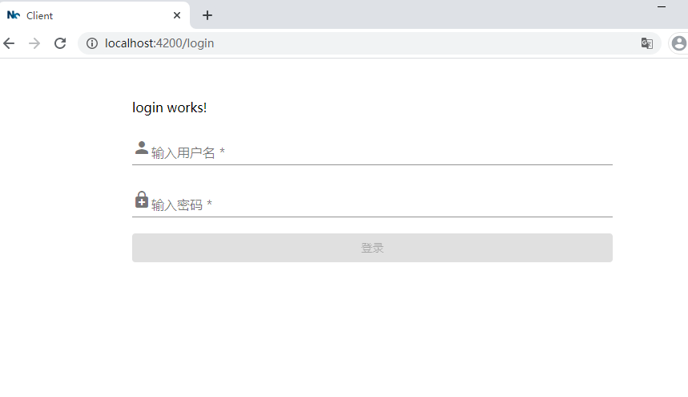
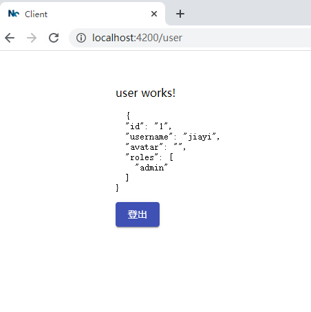

# Angular 与 AuthModule

保护单页应用程序是其实现中非常重要的部分，但有时会带来很多混乱，尤其是在有多种实现方法的情况下。 在项目中，我们将重点介绍利用`JSON Web Token（JWT）`作为传达用户权限的机制的方法。 此外，我们还将介绍基`JWT`的安全性的好处和潜在的陷阱。

做一个`AuthModule`需要实现功能：

- 使用`Router Guards`限制对`Angular`应用程序给定部分的访问限制
- 拦截`HTTP`调用，并根据服务器的需要添加访问令牌
- 需要一个刷新令牌，让用户透明地使用它
- 对角色访问进行区分，特定角色显示对应功能
- 登录成功后重定向到登录来源页面

让我们考虑一个常见的用例，其中应用程序中的某些页面（路由）仅对授权用户具有访问权限。成功认证之后（例如，通过登录表单），将授予用户访问系统某些受限部分（例如管理页面）的权限。

> `Authentication` 是证明自己身份的过程。 如果我们讨论登录表单，那么我们假设如果某人拥有与给定用户名关联的密码，那么该人必须是该用户名所属的人。
> `Authorization` 在成功认证之后发生，并确定是否授权给定用户访问给定资源（例如 SPA 中的子页面）。

为简单起见，假设我们有一个带有登录页面的应用程序，该页面在`/login`路由下可用，而一个显示用户登录页面在`/user`下可用。 用户登录页应仅对授权用户可用。 如果我们手动尝试访问`/user`，则应将其重定向回登录页面。

我们先来创建几个页面：

```bash
ng g module auth --project=client
ng g guard auth/guards/auth --project=client
ng g guard auth/guards/account --project=client
ng g guard auth/guards/role --project=client
ng g interceptor auth/auth --project=client
ng g service auth/auth --project=client
ng g component auth/containers/login --project=client
ng g component auth/containers/user --project=client
```

我们先弄个本地效果：

登录界面 `/login`



用户界面 `/user`



## Router Guards

为了实现限制访问`/user`并重定向回登录页面的目标，以防万一用户未登录，我们可以利用 Angular 的内置机制[Router Guards](http://angular.cn/guide/router#milestone-5-route-guards)。 这些保护措施使我们能够在 Angular 应用程序中实施管理可能的路由跳转的策略。想象一下一种情况，当用户尝试打开一个他没有访问权限的页面时。在这种情况下，应用程序不应允许此路由跳转。为了实现这个目标，我们可以使用 `CanActivate` 保护器。由于 `Router Guards` 只是简单的类提供程序，因此我们需要实现适当的接口。让我们看一下呈现`AuthGuard`的以下代码段。

```ts
@Injectable({
  providedIn: 'root',
})
export class AuthGuard implements CanActivate {
  constructor(private authService: AuthService, private router: Router) {}

  canActivate(): Observable<boolean> {
    return this.authService.isAuthenticated().pipe(
      tap((isLoggedIn) => {
        if (isLoggedIn) {
          this.router.navigate([this.authService.INITIAL_PATH]);
        }
      }),
      map((isLoggedIn) => !isLoggedIn),
    );
  }
}
```

`AuthGuard`实现`canActivate()`，它告诉`Angular Router`是否可以激活特定路由。要将给定的守卫附加到它应保护的路由，我们只需要将其引用放置在该路由的`canActivate`属性中，如下所示。在我们的情况下，我们要保护`/login`路由。我们希望只在用户未登录时允许他们打开此路由。否则，我们将重定向到`/user`。相同的方法适用于保护其他路由，对给定的路由实施不同的策略。另外，我们可以在下面的路由配置中注意到`canLoad`属性。这种保护措施使我们能够防止从服务器获取延迟加载的路由。通常，`canLoad`保护措施执行与`canActivate`保护措施相同的策略。

```ts
const routes: Routes = [
  {
    path: 'login',
    component: LoginComponent,
    canActivate: [AuthGuard],
  },
  {
    path: 'user',
    component: UserComponent,
    canActivate: [AccountGuard, RoleGuard],
    data: {
      expectedRole: 'admin',
    },
  },
];

@NgModule({
  imports: [RouterModule.forChild(routes)],
  exports: [RouterModule],
})
export class AuthRoutingModule {}
```

`AccountGuard` 验证用户是否登录状态，如果未登录时，

```ts
this.router.navigate([this.authService.LOGIN_PATH], {
  queryParams: {
    redirectUrl: state.url,
  },
});
```

记录当前 url，作为登录成功后，重定向跳转路径。

`RoleGuard` 验证用户角色是否允许进入当前页面，

```ts
@Injectable({
  providedIn: 'root',
})
export class RoleGuard implements CanActivate {
  constructor(private authService: AuthService, private router: Router) {}

  canActivate(route: ActivatedRouteSnapshot): Observable<boolean> {
    const { expectedRole } = route.data;
    return this.authService.isAuthenticated().pipe(
      switchMap((isLoggedIn) => {
        if (isLoggedIn && expectedRole) {
          return this.authService.getUserRole().pipe(map((roles) => roles.includes(expectedRole)));
        }
        return of(false);
      }),
    );
  }
}
```

我们预设 3 种角色：

- root 超级管理员
- admin 管理员
- user 普通用户

root 可以对 admin 和 user 进行操作，可以设置 user 为 admin 来管理博客。
admin 可以对 user 进行操作，例如禁用，删贴等操作。
user 可以对自己进行操作。

登录页面`/login`获取重定向的地址：

```ts
this.redirectUrl = this.route.snapshot.queryParamMap.get('redirectUrl') || this.authService.INITIAL_PATH;
```

登录页面登录成功以后处理方法：

```ts
this.authService.doLoginUser(
  {
    id: '1',
    username: 'jiayi',
    avatar: '',
    roles: ['admin'],
  },
  null,
);
this.router.navigateByUrl(this.redirectUrl);
```

> 在这里，我们使用`navigationByUrl()`处理重定向导航。 这将使用原始 URL 并将其路由到该 URL，而不是使用采用路径数组的典型`navigate()`方法。

## Http interceptor

在用户登录到应用程序后，一旦我们的访问令牌（JWT）持久存在，我们想使用它来授权发出请求。一种方法是简单地更新与 API 通信的每个服务，以通过其他 HTTP 标头丰富请求。与使用`HTTP Interceptor`的方法相比，这将导致很多重复的代码。`HTTP Interceptor`的目标是将一些处理逻辑应用于应用程序中的每个发出请求。

创建`HTTP Interceptor`与创建`Router Guard`非常相似。我们需要一个使用所需方法实现特定接口的类。在这种情况下，它是带有`Intercept`方法的`HttpInterceptor`。看一下我们示例应用程序中的拦截器的以下代码片段。首先，我们要使用`this.authService.getJwtToken()`检查令牌是否可用。如果有令牌，则设置适当的 HTTP 标头。此代码还包含错误处理逻辑，将在本文后面进行描述。

```ts
@Injectable()
export class AuthInterceptor implements HttpInterceptor {
  private isRefreshing = false;
  private refreshTokenSubject: BehaviorSubject<string> = new BehaviorSubject<string>(null);

  constructor(private authService: AuthService, private authApi: AuthApi) {}

  intercept(request: HttpRequest<unknown>, next: HttpHandler): Observable<HttpEvent<unknown>> {
    // 为api接口添加token
    if (request.url.startsWith('/api')) {
      const token = this.authService.getJwtToken();
      if (token) {
        request = this.addToken(request, token);
      }
    }
    return next.handle(request).pipe(
      catchError((error) => {
        if (error instanceof HttpErrorResponse && error.status === 401) {
          return this.handle401Error(request, next);
        } else {
          return throwError(error);
        }
      }),
    );
  }

  private addToken(request: HttpRequest<unknown>, token: string) {
    return request.clone({
      setHeaders: { Authorization: `Bearer ${token}` },
    });
  }

  private handle401Error(request: HttpRequest<unknown>, next: HttpHandler): Observable<HttpEvent<unknown>> {
    if (!this.isRefreshing) {
      this.isRefreshing = true;
      this.refreshTokenSubject.next(null);

      return this.authApi.refreshToken(this.authService.getRefreshToken()).pipe(
        switchMap((token: Tokens) => {
          this.isRefreshing = false;
          this.refreshTokenSubject.next(token.accessToken);
          this.authService.doLoginUser(null, token);
          return next.handle(this.addToken(request, token.accessToken));
        }),
      );
    } else {
      return this.refreshTokenSubject.pipe(
        filter((token) => token != null),
        take(1),
        switchMap((jwt) => {
          return next.handle(this.addToken(request, jwt));
        }),
      );
    }
  }
}
```

实现了我们的拦截器后，有必要在 Angular 模块中使用`HTTP_INTERCEPTORS`令牌将其注册为提供程序。

```ts
  providers: [
   ...,
   {
    provide: HTTP_INTERCEPTORS,
    useClass: AuthInterceptor,
    multi: true,
  },
 ]
```

> 你可能注意到，代码有一个请求`url`前缀判断(`request.url.startsWith('/api')`)，因为我们要排除特定请求，比如本地静态资源`/assets/`开头，或者其他`https?://`开头的，总之我们只处理我们后台的请求接口。

## Refresh Token

考虑到`JWT`是独立的，我们需要考虑另外一件事-无法使它无效！如果除我们以外的人拥有令牌，那么我们将无能为力。这就是为什么始终给令牌短的有效期是一个好主意的原因。对于令牌应保留多长时间没有严格的规定，它取决于系统要求。一个好的起点是拥有仅在 15 分钟内有效的令牌。在那之后，服务器将认为该令牌无效，并且不会使用该令牌授权请求。

因此，这又带来了另一个挑战-我们不想强迫用户每 15 分钟登录一次应用程序。解决此问题的方法是刷新令牌。这种令牌位于服务器端的某个位置（数据库，内存中的缓存等），并且与特定用户的会话相关联。重要的是要注意，此令牌在许多方面与`JWT`不同。首先，它不是独立的-可以像唯一的随机字符串一样简单。其次，我们需要将其存储以验证用户的会话是否仍然有效。这使我们能够通过简单地删除关联的`[user，refresh_token]`对来使会话无效。 当带有访问令牌的传入请求变得无效时，应用程序可以发送刷新令牌以获取新的访问令牌。如果用户的会话仍然存在，则服务器将以新的有效`JWT`进行响应。在我们的示例中，我们将为用户透明地发送“刷新令牌”，以使他不知道刷新过程。

让我们回到拦截器。如果还记得前面的代码片段，那么在`HTTP 401`错误`（Unauthorized）`的情况下，我们有一个特殊的方法`handle401Error`用于处理这种情况。这是一个棘手的部分-我们希望在刷新时将所有`HTTP`请求排队。这意味着，如果服务器响应“401 错误”，我们要开始刷新，阻止刷新期间可能发生的所有请求，并在刷新完成后释放它们。为了能够在刷新期间阻止和释放请求，我们将使用`BehaviorSubject`作为信号量。

首先，我们检查刷新是否尚未开始，并将`isRefreshing`变量设置为`true`并将`null`填充到`refreshTokenSubject`行为主题中。稍后，实际的刷新请求开始。如果成功，则将`isRefreshing`设置为`false`，并将接收到的`JWT`令牌放入`refreshTokenSubject`中。最后，我们使用`addToken`方法调用`next.handle`来告诉拦截器我们已经完成了处理此请求的过程。 如果刷新已经发生（if 语句的其他部分），我们要等到`refreshTokenSubject`包含非`null`的值。 使用`filter(token => token != null)`可以解决这个问题！ 一旦存在 null 以外的其他值（我们希望在其中包含新的 JWT），我们将调用`take(1)`来完成流。 最后，我们可以告诉拦截器使用`next.handle`完成此请求的处理。

如你所见，访问令牌和刷新令牌的组合是可伸缩性和安全性之间的折衷。限制访问令牌的有效时间会降低有害人员使用它的风险，但是使用刷新令牌需要服务器上的状态。

## AuthService

我们解决方案的最后一个缺少的部分是`AuthService`。在这里，我们将实现所有逻辑以处理登录和注销。可以在下面找到该服务的来源，我们将逐步对其进行分析。

```ts
@Injectable()
export class AuthService {
  readonly INITIAL_PATH = '/';
  readonly LOGIN_PATH = '/login';
  private readonly ACCESS_TOKEN = 'ACCESS_TOKEN';
  private readonly REFRESH_TOKEN = 'REFRESH_TOKEN';
  private readonly LOGGED_USER = 'LOGGED_USER';
  private readonly loggedUser$: BehaviorSubject<User> = new BehaviorSubject(null);

  constructor() {
    // 初始化获取用户信息
    let user: User = null;
    try {
      user = JSON.parse(localStorage.getItem(this.LOGGED_USER)) as User;
    } catch (_ignoreError) {}
    this.loggedUser$.next(user);
  }

  /**
   * 登录成功调用
   * @param user
   * @param token
   */
  doLoginUser(user: User | null, token: Tokens | null) {
    if (user) {
      this.storeUser(user);
    }
    if (token) {
      this.storeTokens(token);
    }
  }

  /**
   * 登出成功调用
   */
  doLogoutUser(): void {
    this.removeTokens();
    this.removeUser();
  }

  /**
   * 获取当前用户信息
   */
  getCurrentUser(): Observable<User> {
    return this.loggedUser$.asObservable();
  }

  /**
   * 获取当前用户角色
   */
  getUserRole(): Observable<Role[]> {
    return this.getCurrentUser().pipe(map((user) => user.roles));
  }

  /**
   * 是否通过身份认证
   */
  isAuthenticated(): Observable<boolean> {
    return this.getCurrentUser().pipe(
      map((user) => user != null),
      catchError(() => of(false)),
    );
  }

  /**
   * 获取 jwt token
   */
  getJwtToken() {
    return localStorage.getItem(this.ACCESS_TOKEN);
  }

  /**
   * 获取 refresh token
   */
  getRefreshToken() {
    return localStorage.getItem(this.REFRESH_TOKEN);
  }

  /**
   * 存储 用户基本信息
   */
  private storeUser(user: User) {
    // JSON.stringify 会出现错误 出错以后我们就不需要存入localStorage
    try {
      localStorage.setItem(this.LOGGED_USER, JSON.stringify(user));
      this.loggedUser$.next(user);
    } catch (_ignoreError) {}
  }

  /**
   * 存储 jwt token
   * @param tokens
   */
  private storeJwtToken(token: string) {
    localStorage.setItem(this.ACCESS_TOKEN, token);
  }

  /**
   * 存储 jwt 和 refresh token
   * @param tokens
   */
  private storeTokens(tokens: Tokens) {
    this.storeJwtToken(tokens.accessToken);
    localStorage.setItem(this.REFRESH_TOKEN, tokens.refreshToken);
  }

  /**
   * 删除用户信息
   */
  private removeUser() {
    this.loggedUser$.next(null);
    localStorage.removeItem(this.LOGGED_USER);
  }

  /**
   * 删除token信息
   */
  private removeTokens() {
    localStorage.removeItem(this.ACCESS_TOKEN);
    localStorage.removeItem(this.REFRESH_TOKEN);
  }
}
```

这里 `AuthService` 只是做 `user` 和 `token` 相关的存储，获取，删除操作。

```ts
@Injectable({
  providedIn: 'root',
})
export class AuthApi {
  constructor(private http: HttpClient) {}

  login(body: { username: string; password: string }) {
    return this.http.post('/api/login', body);
  }

  logout(refreshToken: string) {
    return this.http.post(`/api/logout`, {
      refreshToken,
    });
  }

  refreshToken(refreshToken: string) {
    return this.http.post(`/api/refresh`, {
      refreshToken,
    });
  }
}
```

让我们从登录方法开始。在这里，我们使用`HttpClient`执行对服务器的后调用，并使用方法应用一些运算符。

```ts
this.authApi.login(value).subscribe((data: { user: User; tokens: Tokens }) => {
  this.authService.doLoginUser(data.user, data.tokens);
  this.router.navigateByUrl(this.redirectUrl);
});
```

成功执行后方法后，我们应该用户信息、访问令牌和刷新令牌。我们要执行的是存储用户信息和令牌调用`doLoginUser`方法。我们利用了本地存储。 一旦存储，并且跳转到重定向地址。

除了登录之外，注销方法的实现基本相同，即在请求主体内部我们发送`refreshToken`。 服务器将使用它来识别谁在尝试注销。然后，服务器将删除一对`[user，refresh_token]`，并且将无法再进行刷新。但是，访问令牌在到期之前仍然有效，但是我们将其从本地存储中删除。

我们已经介绍了在 `Angular` 的前端设计授权机制的最重要部分。

将`JWT`用作访问令牌有很多好处，并且实现起来非常简单。但是，应该了解限制和可能的`XSS`攻击。最小化风险的方法是使用`HttpOnly Cookies`来存储令牌。
